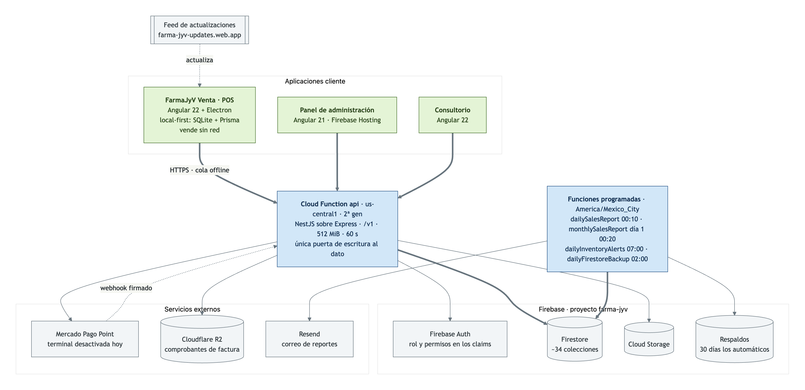
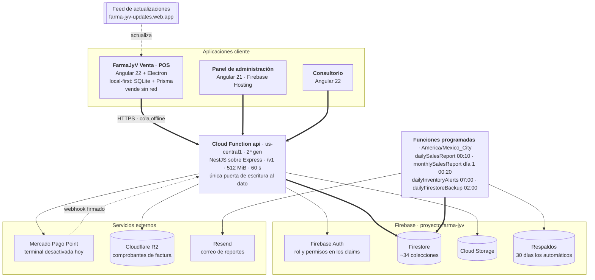
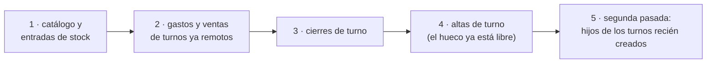

# Dosier técnico — FarmaJyV Venta (POS)

Punto de venta de escritorio para farmacia. Angular 22 + Electron 43 + PrimeNG 22, Firebase Auth y API REST NestJS (`backend-farma-jyv`), compartida con `farma-jyv-admin`.

Documento generado a partir del código en `cr/sqlite` (commit `78724cd`, 2026-09-16). Versión publicada: **1.0.1** (`environment.electron.version`: `vE1.0.1`).

---

## 0. El sistema alrededor

El POS es una de tres aplicaciones cliente contra la misma API. Nada escribe en
Firestore directamente: la Cloud Function `api` es la única puerta, y las reglas
de Firestore niegan toda escritura de cliente.



La fuente del diagrama vive en [`arquitectura.mmd`](arquitectura.mmd) y el PNG se
regenera desde ahí; GitHub también dibuja el bloque de abajo.



Lo que distingue al POS de las otras dos: **no depende de la red para vender**.
Escribe en su propia SQLite y sincroniza después. Todo lo demás de este
documento sale de esa decisión.

---

## 1. Panorama

| Dato | Valor |
|---|---|
| Tipo | App de escritorio (Electron) + web SPA (mismo bundle) |
| Idioma UI | Español (`es` default, `en` presente en `public/i18n/en.json`) |
| Autenticación | Firebase Auth (email/password), SDK modular directo |
| Autorización | `GET /auth/me` → rol (documento `roles`) + permisos por área |
| Persistencia local | **SQLite + Prisma** en el proceso principal (ventas, turnos, movimientos, catálogo, cola de sincronización). `localStorage` solo para el ticket en curso y las ventas en pausa |
| Impresión | `window.print()` sobre componentes montados al vuelo; cajón por ESC/POS vía IPC |
| Pago tarjeta | Mercado Pago Point (órdenes + polling) a través del backend |
| Tamaño | ~24.500 líneas (`src` + `electron`), 123 archivos fuente |
| Pruebas | Vitest: **942** casos en `src` (jsdom) + **238** en `electron/test` (Prisma falso en memoria); 66 archivos de prueba |
| Distribución | DMG/ZIP por `electron-builder`; feed propio en Firebase Hosting (`farma-jyv-updates.web.app`) |

### Alcance funcional implementado

**Mostrador**: venta (búsqueda, escaneo, ticket, descuentos con tope por rol,
pausa), servicios de farmacia con prestador y comisión, cobro en efectivo,
tarjeta y mixto, cumplimiento COFEPRIS (grupos I–VI, receta, retención, libro de
control), desglose fiscal IVA/IEPS, impresión de ticket, corte y etiqueta,
anulación (solo con permiso).

**Caja**: turno con apertura, gastos y movimientos, cierre con corte Z,
auto-cierre al cambiar el día, caja de la farmacia (movimientos sin turno) y
auditoría de cortes y gastos para admin.

**Almacén y catálogo**: entrada de stock contra factura, alta y edición de
producto, categorías, proveedores y facturas.

**Plataforma**: todo local-first sobre SQLite con cola de sincronización
idempotente, sincronización manual con tope de 15 minutos para el cajero,
actualización automática en Windows y manual en macOS.

No implementado (ver `GOALS.md`): timbrado CFDI, devoluciones en caja, lectura X,
reportes de servidor, multi-caja con selección al login, pantalla de cliente.
Oculto tras bandera: cobro directo sin venta (`directChargeEnabled`) y terminal
Point (`terminalEnabled`).

---

## 2. Estructura del repositorio

```
electron/           main.js (ventana, IPC, auto-update, cajón), preload.js (contextBridge)
public/i18n/        es.json, en.json
public/brand/       logo.png (original), isotipo.png (barra), logo-completo.png (login)
src/app/
  core/             api/ auth/ audio/ firebase/ health/ layout/ notifications/ theme/
  features/pos/     sale/ checkout/ direct-charge/ stock-entry/ cash-session/ history/ reports/
                    controlled-ledger/ ticket/ services/
  shared/           models/index.ts,
                    utils/{money,tender,taxes,controlled,session-expiry,date-range,point-order}.ts
  testing/          setup.ts (rellenos de jsdom para las pruebas)
src/environments/   environment{,.development,.prod,.electron}.ts
```

Regla de dependencia: `features` → `core` y `shared`; `shared` no importa de `features`; `core` es singleton transversal.

---

## 3. Arranque y configuración

### `app.config.ts`

- `provideRouter(routes)` + `withHashLocation()` **solo** cuando `environment.isElectron` — Electron carga `index.html` por `file://` y el router de path rompe.
- `provideHttpClient(withInterceptors([authInterceptor]))`.
- `provideTranslateService` con loader HTTP; prefijo `./i18n/` en Electron, `/i18n/` en web.
- `provideFirebase()` — `InjectionToken`s propios (ver 4.1).
- `providePrimeNG` con preset `PosPreset` y `darkModeSelector: false` (caja siempre en claro).

### Entornos

Los cuatro archivos comparten proyecto Firebase, `apiUrl` y credenciales de Mercado Pago (`storeId: 79584227`, `posId: 136088410`). Diferencias:

| Archivo | `production` | `isElectron` |
|---|---|---|
| `environment.ts` | false | false |
| `.development.ts` | false | false |
| `.prod.ts` | true | false |
| `.electron.ts` | true | true |

Claves de configuración operativa: `printTicketOnSale` (auto-imprime al cerrar venta), `expiryWarningDays: 30`, `soundsEnabled`, `promos: []` (reglas locales NxM/%), `cashDrawer.printerName` (vacío = cajón deshabilitado), `pharmacy.{name,address,phone,rfc}` (encabezado de tickets), `mercadoPago.terminalId` (terminal de **esta** caja; vacío = usar la primera que devuelva la API).

Variables del backend que condicionan al POS (`backend-farma-jyv/functions/.env`):

| Variable | Efecto si falta |
|---|---|
| `MERCADOPAGO_WEBHOOK_SECRET` | En producción se **rechazan** las notificaciones de Mercado Pago: sin firma, cualquiera que conozca la URL podría marcar un cobro como aprobado. El POS sigue resolviendo por sondeo |
| `PUBLIC_API_URL` | La preferencia de Checkout Pro se crea sin `notification_url`; el cobro en línea solo se resuelve por sondeo |
| `MERCADOPAGO_RETURN_URL` | La preferencia se crea sin `back_urls` ni `auto_return`: el cliente se queda en Mercado Pago tras pagar |
| `MERCADOPAGO_PRINT_ON_TERMINAL` | Default `no_ticket`: la terminal no imprime porque el ticket lo imprime el POS |

> **Nota de seguridad.** `environment.ts` versiona la `apiKey` de Firebase (esperado: es pública y se protege por reglas del proyecto) y la licencia de PrimeNG. No hay secretos de servidor en el bundle; el Access Token de Mercado Pago vive en el backend.

### Comandos

```bash
npm start                 # ng serve → localhost:4200
npm run build             # producción → dist/farma-jyv-pos/browser
npm run electron:build    # configuración `electron` (baseHref ./, env.electron)
npm run electron:dev      # Electron contra el dev server
npm run electron:start    # build + Electron contra el bundle
npm run electron:dist[:mac|:win]   # electron-builder → /release
npm test                  # Vitest
```

Presupuesto de bundle inicial: aviso 1.2 MB, error 1.6 MB. Hoy son 1.12 MB en crudo y **258 kB transferidos**; el aviso estaba en 700 kB y saltaba en cada build, lo que tapaba regresiones reales. En una app de escritorio que carga desde disco, el crudo importa menos que el transferido.

`allowedCommonJsDependencies` declara `qrcode` y `dijkstrajs`: son CommonJS y avisan de bailout de optimización. Se acepta a sabiendas porque el QR se importa de forma diferida (`import('qrcode')` dentro del cobro directo) y queda en su propio chunk.

---

## 4. Core

### 4.1 Firebase sin `@angular/fire`

`core/firebase/firebase.providers.ts` expone `FIREBASE_APP` y `FIREBASE_AUTH` como `InjectionToken`s creados con `initializeApp`/`getAuth` del SDK modular. Motivo: `@angular/fire` no soportaba Angular 22 al crear el proyecto. Consumo idéntico al de `@angular/fire` salvo el token inyectado. Migración futura: reemplazar `provideFirebase()` por `provideFirebaseApp`/`provideAuth`.

### 4.2 `AuthService`

- `user` — signal desde `onAuthStateChanged`.
- `profile` — signal desde `GET /auth/me`, parseado con `parseStaffProfile` (tolera `role` como string o `{slug}`). Deduplicado con `shareReplay(1)` + `finalize` que limpia la petición en vuelo, y **cacheado por sesión** (5 min de TTL, atado al `uid`): `shareReplay` solo deduplica lo que está en vuelo, así que cada `permissionGuard` disparaba un `GET /auth/me` y navegar entre pantallas costaba un viaje de red por cambio de ruta. `refreshProfile()` invalida a mano; el backend sigue siendo la autoridad y responde 403 aunque la caché diga otra cosa.
- `role`, `roleName`, `permissions`, `isAuthenticated`, `isAdmin` (`role === 'admin'`, exacto porque `assertCanVoidSale` en el backend exige ese slug), `canSell` (`sales:write`).
- `can(area, level)` delega en `hasPermission`, que replica la función homónima del backend **incluido el atajo de `admin`**: una UI más estricta que la API bloquearía acciones permitidas.
- **Expiración de sesión**: `effect` que, al cambiar el usuario, lee `authTime` del ID token y programa `endExpiredSession()` para el instante que devuelve `getSessionExpiryMs`. El `setTimeout` se acota a 2.147.483.000 ms para no desbordar.

### 4.3 Guards

- `authGuard` — espera `authStateReady()`, exige `currentUser`; si no, `UrlTree` a `/login`.
- `permissionGuard(area, level)` — resguarda cada pantalla del POS por permiso (ver 5). Al denegar, avisa y manda a `/pos`.
- `guestGuard` — en `/login`: si ya hay usuario, resuelve el rol; **sin rol útil hace `signOut` y deja entrar al login** (evita el limbo de un usuario de Firebase sin staff en el backend).

### 4.4 `authInterceptor`

1. Pasa de largo cualquier URL que no empiece con `environment.apiUrl`, y también `/health`.
2. Espera `authStateReady()`, adjunta `Authorization: Bearer <idToken>`.
3. Ante 401: notifica con el mensaje real del backend (que distingue "sesión expiró a las 24:00" de "no autorizado"), hace `signOut`, navega a `/login` y re-lanza el error. Flag módulo-global `isLoggingOut` evita cascadas cuando varias peticiones fallan a la vez.
4. `/auth/me` queda exento del manejo de 401 — de otro modo el propio arranque del perfil dispararía el logout.

### 4.5 `api.utils.ts`

`unwrapEntity` / `unwrapList(response, key?)` absorben las formas inconsistentes del backend (`data`, `items`, `products`, array plano). `toDate` normaliza `Timestamp` de Firestore, `Date`, epoch, ISO y `{_seconds}`. `getApiErrorMessage` prioriza `error.error.message`. `ApiRequestError` y `getApiErrorStatus` para errores propios.

### 4.6 `ApiHealthService`

`browserOnline` (eventos `online`/`offline`), `apiOk` (GET `/health` cada 30 s), `degraded = !browserOnline || !apiOk`. El shell pinta banner rojo (sin internet) o ámbar (API caída).

### 4.7 Otros

- `NotificationService` — wrapper de `MessageService` de PrimeNG; `sessionExpired()` con copy explícito y `life: 10 s`.
- `ScanSoundService` — WebAudio: `ok()` 880 Hz seno, `warn()` 440 Hz triángulo, `error()` 220 Hz cuadrada. Falla en silencio si el navegador bloquea audio sin gesto previo.
- `PosPreset` — preset de tema PrimeNG con la rampa verde de la marca (ver 16.1).

---

## 5. Rutas y navegación

```
/login                       guestGuard
/                            authGuard → Shell
  ''                         → redirect /pos
  /pos                       Sale                 (F1)
  /pos/historial             SaleHistory          (F3)
  /pos/gastos                ExpenseForm
  /pos/entrada-stock         StockEntry
  /pos/productos             ProductCatalog
  /pos/categorias            Categories
  /pos/proveedores           Suppliers
  /pos/facturas              Invoices
  /pos/cobro-directo         DirectChargeScreen   (oculto: directChargeEnabled)
  /pos/reportes              PosReports
  /pos/efectivo              CashBox
  /pos/cortes                CashSessionAudit
  /pos/gastos-auditoria      ExpenseAudit
  /pos/libro-control         ControlledLedger
**                           → /
```

Todo lazy (`loadComponent`/`loadChildren`).

**Dos capas, no una.** `NAV_ITEMS` decide si se *ofrece* el camino (el shell filtra con `AuthService.can()`) y `permissionGuard(area, level)` decide si se *abre*. Antes solo existía la primera: escribir la URL a mano entraba igual. Ambas deben declarar el mismo permiso.

| Pantalla | Permiso | Por qué ese |
|---|---|---|
| `/pos` (venta) | — | Sin guard a propósito: es el destino al que redirige el guard al denegar, y cerrarla crearía un rebote infinito. Se autoprotege por dentro: sin `sales:write`, `ensureShiftOpen()` corta el cobro con un mensaje explícito |
| `/pos/historial` | `sales:read` | Mismo que exige `GET /sales` |
| `/pos/cobro-directo` | `directCharges:write` | Área **propia**, no `sales`: cobrar fuera del ticket mueve dinero sin venta que lo respalde, así que es atribución de supervisión. Con `sales:write` cualquier cajero podría hacerlo |
| `/pos/entrada-stock` | `stockEntry:write` | Área **propia**, no `inventory`: recibir mercancía es del mostrador, pero `inventory:write` abriría además conteos, salidas y el libro de control |
| `/pos/reportes` | `dashboard:read` | Analítica; misma área que los reportes del backend |
| `/pos/libro-control` | `inventory:write` | Más estricto que el `inventory:read` del endpoint **a propósito**: `read` es el permiso con el que el cajero consulta lotes y caducidades al vender, así que gatearlo con `read` se lo mostraría a todo el mostrador |
| `/pos/gastos` | `pos:write` | Es operación de caja: el gasto sale del cajón del turno |
| `/pos/efectivo` | `cashSessions:write` | Mueve efectivo sin venta detrás; supervisión |
| `/pos/cortes` | `cashSessions:read` | Auditoría de todos los turnos |
| `/pos/gastos-auditoria` | `expenses:read` | Gastos de todas las cajas |
| `/pos/productos` | `products:write` | Alta y edición de catálogo |
| `/pos/categorias` | `categories:write` | |
| `/pos/proveedores` | `suppliers:write` | |
| `/pos/facturas` | `invoices:write` | Requisito para recibir mercancía |

En la barra, las pantallas se agrupan por `group` (`inventory`, `catalog`,
`admin`) en menús desplegables: con catorce entradas, una fila plana ya no cabía
en 1024 px.

`permissionGuard` resuelve con `fetchProfile()` y no con la señal `profile`: al recargar la app dentro de una pantalla, el perfil aún no ha llegado y una lectura síncrona negaría el acceso a quien sí lo tiene.

### Roles del sistema

Definidos en `backend-farma-jyv/functions/src/constants/permissions.ts` y sembrados en Firestore por `seedSystemRoles` (`npm run migrate:roles`, que además sube `permissionsVersion` y reemite los claims: cambiar la definición sin reemitir dejaría a los usuarios con el alcance viejo mientras su token siguiera vivo).

**`pos` y `sales` son áreas distintas.** `pos:write` es *operar la caja* —levantar la venta, cobrar con la terminal, mover y cerrar turno, dar de alta al cliente en mostrador— y `sales` es *administrar lo vendido*: leer el historial (`read`), anular, devolver y reembolsar (`write`). Con una sola área, habilitar la caja le daba al cajero el poder de cancelar y reembolsar sus propias ventas. En el POS, `AuthService.canSell` es `pos:write`.

| Rol | Alcance en el POS |
|---|---|
| `cashier` | Venta, historial, gastos, entrada de stock y el catálogo del mostrador. `pos:write`, `sales:read`, `products:write`, `categories:write`, `suppliers:write`, `invoices:write`, `uploads:write`, `inventory:read` (lote y caducidad al vender), `stockEntry:write`, `pharmacyServices:read` |
| `manager` | Todo menos reportes (`dashboard` está excluido de su definición) |
| `admin` | Todo, por el atajo de slug en `hasPermission` |
| `doctor` | Solo la pantalla de venta, y sin poder cobrar |

**Los roles se editan en el panel, no en el código.** `SYSTEM_ROLE_DEFINITIONS`
es la semilla; un administrador puede cambiar los permisos de un rol después, y
entonces manda Firestore. Al depurar un "no veo la pantalla", la fuente de
verdad es `GET /auth/me`, no esta tabla. **Anular es de mostrador** desde
2026-09-05: lo cubre `pos:write` y queda firmado con `voidedBy`/`voidedAt`.

---

## 6. Modelo de dominio (`shared/models/index.ts`)

Entidades: `Product` (con `controlledGroup`, banderas fiscales `hasIva`/`hasIvaZero`/`hasIeps`/`iepsRate`), `ProductBatch` (lote + caducidad), `CartLine`, `Sale`/`SaleItem`/`SaleItemTaxes`/`SaleTaxSummary`, `SalePrescription`, `SaleBilling`, `Customer`, `CashSession`/`CashSessionSummary`/`CashSessionCut`, `CashMovement`, `HeldSale`, `DirectCharge`/`DirectChargePoint`/`DirectChargeOnline`, `StaffProfile`/`RoleSummary`/`RolePermission`.

`DirectCharge` vive **fuera** del modelo de venta a propósito: `channel` (`point` | `online`), `status` (`pending` | `approved` | `failed` | `canceled`), `point` u `online` según el canal, y folio propio `CD-000001`. No comparte nada con `Sale` porque no debe sumarse a ella en ningún cálculo.

Campos de `Sale` que importan para cuadrar caja:

- `cashAmount` — parte del total pagada en efectivo (lo que entra al cajón). `null` en ventas previas al split mixto y en tarjeta/transferencia.
- `cardAmount` — parte con tarjeta (monto de la orden Point).
- `amountReceived` / `change` — lo entregado por el cliente y su cambio.
- `taxSummary` — `null` en ventas anteriores al desglose.
- `controlledGroups`, `prescriptionRetained` — rastro COFEPRIS.
- `invoiceStatus: 'pending' | null` — el POS **no** timbra.

`PermissionArea` cubre `dashboard | users | sales | pos | stockEntry | categories | products | suppliers | inventory | invoices | uploads | doctor | patients | medicalRecords | appointments | directCharges`; `PermissionLevel` es `read | write`. Debe mantenerse igual a la del backend: un área que falte aquí es un permiso válido que la UI no sabe leer.

---

## 7. Reglas replicadas del backend (`shared/utils`)

Cuatro módulos puros que espejean lógica del servidor. **El backend sigue siendo la autoridad**; la copia existe para bloquear en el mostrador y para que el ticket offline sea correcto. Todos tienen spec.

### 7.1 `money.ts`

Aritmética en centavos enteros: `toCents`, `fromCents`, `roundMoney`, `addMoney`, `subtractMoney`, `compareMoney`, `isMoneyGreaterOrEqual`. Sin esto, el "faltan" de la caja se separa del total que valida la API por punto flotante.

### 7.2 `tender.ts` — reparto efectivo/tarjeta

`resolveTender({paymentMethod, total, amountReceived, cardAmount})` → `{cashDue, cashAmount, cardAmount, change, shortfall, cashSatisfied, error}`.

| Método | `cashDue` | Notas |
|---|---|---|
| `cash` | `total` | cambio = recibido − total |
| `card` / `transfer` | 0 | en `card`, `cardAmount = total` |
| `mixed` | `total − cardAmount` | **el cambio se calcula contra esa parte, nunca contra el total** |

Validaciones de `mixed`: `cardAmount` requerido, > 0, y estrictamente menor que el total (si cubre todo, es venta con tarjeta). Fuente única para checkout, ticket y cola offline.

### 7.3 `taxes.ts` — desglose con impuestos incluidos

El precio de catálogo es precio al público. Se calcula hacia atrás con el orden legal mexicano: IEPS sobre la base, IVA sobre (base + IEPS).

```
gross = base × (1 + iepsRate) × (1 + ivaRate)
```

`resolveIvaRate` — `hasIvaZero` gana sobre `hasIva` (medicina de patente 0%); `IVA_RATE = 0.16`. El residuo de redondeo se absorbe en la base para que `base + ieps + iva` sea exactamente el importe cobrado (un desglose que no suma se rechaza al timbrar). `prorateDiscount` reparte el descuento de venta proporcionalmente **antes** de calcular impuestos, con los centavos sobrantes cargados a la partida mayor. `previewTaxSummary` es la secuencia completa que usa el checkout y el ticket offline.

### 7.4 `controlled.ts` — grupos COFEPRIS (art. 226 LGS)

| Grupo | Receta | Folio obligatorio | Se retiene | Libro de control |
|---|---|---|---|---|
| I estupefacientes | sí | sí | sí | sí |
| II psicotrópicos | sí | sí | sí | sí |
| III psicotrópicos menor riesgo | sí | sí | sí | sí |
| IV antibióticos y otros de receta | sí | no | no | sí |
| V venta en farmacia sin receta | no | no | no | no |
| VI venta libre | no | no | no | no |

`resolveControlledRequirements(products)` agrega el ticket completo. Si un producto **no** trae `controlledGroup`, cae al flag heredado `requiresPrescription` (deuda de catálogo, ver 13). `validatePrescription` devuelve el primer motivo de bloqueo, con los mismos mensajes del backend. `isValidDoctorLicense` — cédula de 7 u 8 dígitos.

### 7.5 `session-expiry.ts`

El backend rechaza cualquier token cuyo `auth_time` sea de un día anterior en `America/Mexico_City`: la sesión muere a las **24:00 locales**, no a las 24 h de haber entrado. `getSessionExpiryMs` calcula el inicio del día siguiente por búsqueda binaria en ±14 h sobre `Intl.DateTimeFormat` — sin offset hardcodeado, sobrevive al horario de verano.

---

## 8. Flujo de venta (`features/pos/sale`)

### Estado

Signals: `searchTerm`, `results`, `cart`, `heldSales`, `manualDiscounts`, `lastSale`, más los `*Visible` de cada diálogo. Derivados: `subtotal`, `discountTotal`, `total`, `itemCount`, `lastLineId`.

### Búsqueda y escaneo

`Subject` con `debounceTime(500)` + `distinctUntilChanged()` + `switchMap` a `GET /products?search=`. `Enter` en el buscador:

1. Parsea el prefijo `N*código` (`/^(\d+)\*(.+)$/`), cantidad acotada a 1–999.
2. Busca y toma coincidencia exacta por `sku` o `barcode`; si hay un solo resultado, ese.
3. Sin coincidencia → sonido de error + mensaje distinto para "no encontrado" vs "varios resultados".

### Catálogo: qué se consulta y qué se guarda

**El POS no guarda el catálogo en local.** Lo único que persiste en `localStorage` es el ticket en curso, las ventas en pausa y la cola offline —los tres con la foto del producto que ya está en el ticket, no el catálogo—. Cada búsqueda es una consulta acotada al servidor.

`ProductService` acota el costo de esas consultas, que no es trivial: el backend resuelve una búsqueda de texto leyendo hasta 500 documentos de Firestore y filtrando en memoria, y **sin `search` lee la colección entera**.

- **Término vacío: no sale a la red.** Devuelve lista vacía. Antes, limpiar el buscador disparaba el caso "sin `search`", es decir, una lectura del catálogo completo por cada vez que el cajero borraba el campo.
- **Mínimo dos caracteres** (`MIN_SEARCH_LENGTH` en `sale.ts`). Con una letra el servidor recorre el catálogo para devolver medio mostrador.
- **`limit=25`.** La lista se recorre con la vista, no con scroll infinito.
- **Caché en memoria de 30 s** por término normalizado, máximo 40 entradas (se descarta la más vieja). Corta a propósito: el stock cambia con cada venta. `invalidate()` se llama al cerrar una venta, para no volver a pintar el stock que se acaba de descontar.
- **Deduplicado de peticiones en vuelo**: dos disparos del mismo término comparten una sola petición.
- `clearSearch()` empuja un término vacío al `Subject`, que cancela por `switchMap` la búsqueda que quedó en el debounce. Tras escanear, esa consulta ya no le sirve a nadie.

`CustomerService.search` sigue la misma regla: sin término no consulta, porque listar clientes sin filtro también lee la colección completa.

### Alta al ticket — `addToCart` → `commitAdd`

1. `ensureShiftOpen()`: verifica `sales:write` y turno abierto (si no, abre el diálogo de turno).
2. `stock < 1` → sonido de error + diálogo de **sustitutos** por principio activo.
3. `GET /inventory/batches?productId=` → `sellableBatches`: descarta `quantity <= 0` y vencidos, ordena por caducidad ascendente (**FEFO**).
   - Suma vendible 0 → "El stock disponible está vencido" + sustitutos.
   - Lote más próximo a ≤ `expiryWarningDays` (30) días → sonido de aviso + fecha y días restantes.
   - Si la llamada a lotes falla, se degrada a `product.stock`.
4. Tope por `min(sellableQty, product.stock)`.
5. Producto controlado nuevo en el ticket → `warnIfControlled`: sonido + grupo + si se retiene la receta. Se avisa **al agregar**, no al cobrar.
6. `setCart` pasa siempre por `PromoService.apply`.

### Servicios de farmacia

La pantalla de venta tiene dos pestañas —Medicamentos (`Alt+M`) y Servicios
(`Alt+S`)— y la segunda solo se monta si el catálogo local trae servicios. Un
servicio entra al **mismo ticket** que la mercancía: el cliente paga una vez.

Diferencias con una partida de producto:

- **No toca inventario.** `productItemsOf()` filtra por `kind`, y esa regla vive
  en un solo lugar (`electron/db/sales.js`): `createLocal`, `voidLocal`,
  `discard` y la traducción de ids la consultan, ninguna la reimplementa.
- **Puede exigir prestador.** Si `requiresPerformer`, el diálogo *¿Quién lo
  realizó?* bloquea el cobro hasta elegirlo: de ahí sale la comisión.
- **La comisión se congela** al cobrar (`commissionRate`, `commissionAmount`):
  la tarifa del catálogo puede cambiar después, lo devengado no.
- **El corte los separa.** La venta guarda `pharmacyTotal`/`servicesTotal` y su
  reparto de efectivo, así que el cierre muestra las dos ramas aunque el cajón
  sea uno solo — y el efectivo esperado suma ambas.

### Descuentos

`updateLineDiscount` reparte el importe capturado entre promo (calculada) y manual (`manualDiscounts[productId]`), acota al total de línea, y **rechaza > 20 % si el usuario no es `admin`**.

### Autoguardado y pausa

- `CartStorageService` — `effect` que persiste ticket + descuentos manuales en `pos.current-cart.<uid>` en cada cambio; se restaura al entrar (solo si el carrito está vacío) con aviso al cajero. Existe porque la sesión muere a las 24:00 y un 401 cierra sesión: sin esto se reescanea todo.
- `HeldSaleStorageService` — `pos.held-sales.<uid>`; F6 pausa (etiqueta con hora), botón para retomar. Retomar exige carrito vacío. Clave por `uid` para no mezclar tickets de cajeros en el mismo equipo.

### Atajos (host bindings en `document`)

`F2` buscar · `F4` foco en cantidad de la última línea · `F6` pausar · `F9` cobrar · `Esc` limpiar búsqueda, luego vaciar ticket (con `confirm`) · `Del`/`Backspace` quitar última línea · `+`/`-`/`=` ajustar cantidad de la última línea.

Getter privado `dialogOpen` cortocircuita **todos** los atajos cuando hay cualquier diálogo abierto. Sin él, `Esc` cerraba el cobro **y** vaciaba el ticket. `isTypingTarget` protege los campos de texto de `Del` y `+/−`.

---

## 9. Cobro (`features/pos/checkout`)

Diálogo de 58 rem en dos columnas: izquierda lo que se teclea (total, método, efectivo/tarjeta), derecha cumplimiento y datos fiscales.

### Idempotencia

`idempotencyKey` (uuid v4, con fallback `pos-<base36>-<random>` para WebViews viejos) se genera **al abrir el diálogo** y se reusa en cada reintento de "Confirmar". La referencia enviada a la terminal es `sale-<idempotencyKey>-<intento>`: la orden queda trazable a la venta y el sufijo distingue reintentos, porque una orden muerta sigue ocupando su referencia en Mercado Pago.

### Métodos

`cash` · `card` · `mixed` (la UI ofrece tres; el modelo también admite `transfer`). `selectPaymentMethod` protege dos casos: con orden **aprobada** no se cambia de método (dejaría dinero cobrado fuera de la venta; el reembolso debe ser explícito), y con orden viva sin aprobar se cancela antes de cambiar. `mixed` arranca a mitades y mueve el foco al campo que toca teclear.

### Tarjeta — Mercado Pago Point

`GET /payments/mercadopago/devices?storeId&posId` lista terminales; `MercadoPagoService.preferredDevice` selecciona la de **esta** caja (`environment.mercadoPago.terminalId`) y solo cae a la primera de la lista si no está configurada o no aparece — con varias terminales en la misma cuenta, tomar la primera podía mandar el cobro a otra sucursal. Si `operatingMode === 'STANDALONE'` aparece "Activar PDV" (`PATCH .../devices/operating-mode`). `POST .../orders` crea el cobro por `cardChargeAmount` (total, o solo la parte con tarjeta en mixto) y arranca polling `interval(2000)` + `takeWhile(pending, true)` sobre `GET .../orders/:id`.

El `POST` viaja con llave de idempotencia (la propia referencia externa, ya única por intento) en cuerpo y header `Idempotency-Key`: sin ella, un reintento de red creaba una **segunda** orden en la terminal.

El polling usa `takeUntilDestroyed(this.destroyRef)` con `DestroyRef` inyectado. Sin el argumento explícito, Angular exige contexto de inyección y `pollOrder` —que arranca dentro de un `subscribe`— lanzaba NG0203: el sondeo moría al arrancar y el cobro con tarjeta se quedaba sin seguimiento.

Estados: `created`, `at_terminal`, `action_required` (pendientes) → `processed` (aprobado), `failed`, `expired`, `canceled`, `refunded`. `cardAmountLocked` congela el monto con tarjeta mientras la orden vive (pendiente o aprobada) y lo libera si falló/expiró, para reintentar con otro reparto sin cerrar el diálogo.

**Vigencia.** La orden se crea con `expiration_time: PT15M` explícito y el diálogo pinta la cuenta atrás (`cardCountdown`, `shared/utils/point-order.ts`). Antes el vencimiento se leía como que la terminal se había colgado, y el cajero remandaba el cobro a ciegas.

**Cancelación.** `retryCardPayment` no cancela (la orden ya está muerta). `cancelCardPayment` hace `DELETE .../orders/:id` y **solo limpia el estado local cuando Mercado Pago confirma**: limpiarlo antes dejaba una orden viva que el cajero ya no veía y que la terminal podía cobrar encima del cobro siguiente. Si la cancelación falla, el método de pago tampoco cambia. Mercado Pago solo acepta cancelar por API mientras la orden está en `created`; una vez `at_terminal` se cancela **en la terminal**, y el backend traduce el error a esas palabras.

### Bloqueos

`blockers()` lista, **en el orden en que el cajero los resuelve**, por qué no se puede cobrar: receta → reparto inválido → terminal sin aprobar → falta efectivo → RFC/razón social. Se renderiza con `role="alert"` junto al botón. `F9` inválido notifica el primero. Regla de diseño: nunca un botón deshabilitado sin motivo visible.

`canConfirm`: `cash` exige `cashSatisfied`; `card` exige orden aprobada; `mixed` exige **ambos** — con uno solo la venta quedaría cobrada a medias.

### Cumplimiento y fiscal

Panel COFEPRIS lista qué partida es controlada y su grupo; campos de receta (médico, cédula, folio) con obligatoriedad dinámica; casilla de retención en I–III. Cliente y facturación **plegados** por defecto (la venta típica es público general). `usoCfdi`: G03, D01, S01. Facturar solo marca `invoiceStatus: pending` — el POS no timbra. Desglose base/IEPS/IVA/total visible antes de cobrar.

### Teclado y foco

`F9` cobra desde cualquier campo (escuchado en `document` porque el diálogo de PrimeNG monta fuera del componente). `Enter` sobre el monto también cobra. `Alt+1/2/3` cambia método — con `Alt` para no comerse los dígitos. Al abrir, el foco va al campo que bloquea: receta si el grupo la exige, efectivo si no. `focusInput` resuelve el `input` real tanto de `pInputText` como del wrapper de `p-inputnumber`.

### Confirmación

`SaleService.buildPayload(...)` → `POST /sales`. `prescriptionRetained` se envía **solo** cuando el grupo lo exige. Los datos de receta se envían aunque el grupo no la pida (V/VI) si el cajero los capturó: trazabilidad ya escrita a mano. Éxito con efectivo o mixto → `CashDrawerService.open()`.

---

## 9 bis. Cobro directo (`features/pos/direct-charge`)

Pantalla propia (`/pos/cobro-directo`, permiso `sales:write`) para el dinero que entra por Mercado Pago **sin venta detrás**: servicios, abonos, cobros de terceros. Vive en la colección `directCharges` del backend y **por diseño no toca nada más**: no genera ticket, no descuenta inventario, no entra al arqueo de caja ni a los reportes de ventas. Es un registro paralelo, solo para trazabilidad.

Dos canales en pestañas (`p-tabs`), con el mismo formulario (monto + concepto):

- **Terminal** — `POST /direct-charges` con `deviceId`. El backend crea la orden Point y devuelve el cobro en `pending`.
- **Link de pago** — `POST /direct-charges/online`. El backend crea una preferencia de Checkout Pro (vigencia 30 min, `binary_mode`) y devuelve `online.initPoint`; la pantalla pinta el link, su **QR** (librería `qrcode`, generado en el cliente) y botones de copiar/abrir.

Cambiar de pestaña con un cobro vivo se rechaza: dejaría una orden o un link cobrando por su cuenta.

**Estados y sondeo.** `pending` → `approved` | `failed` | `canceled`. La pantalla consulta `GET /direct-charges/:id` cada 2 s; el backend es quien pregunta a Mercado Pago (orden Point o pago del link) y persiste el cambio. `POST /direct-charges/:id/cancel` cancela la orden o vence el link; un cobro **aprobado** no se cancela desde aquí —ese dinero ya se cobró y devolverlo es un reembolso explícito (pendiente DC6).

**Idempotencia.** Llave por cobro reusada en cada reintento. El backend reserva la llave **antes** de tocar Mercado Pago (`directChargeIdempotencyKeys`, doc id `<cajero>:<llave>`) y la libera si Mercado Pago rechaza, para que el cajero reintente sin esperar el TTL.

**Folio.** `CD-000001`, consecutivo propio en `counters/directCharges`, asignado dentro de una transacción para que dos cajas simultáneas no se peleen el mismo número.

**Webhook.** `POST /payments/mercadopago/webhooks` resuelve los avisos de `payment`, `merchant_order` y de orden (`order`, `orders`, `topic_orders`, `point_integration_wh`). Es lo único que cierra dos casos que el sondeo no ve: una cancelación hecha **en la terminal** (que la API no permite cancelar) y una aprobación posterior a que el cajero cerrara la pantalla. Los avisos se deduplican por `x-request-id` en `mercadoPagoWebhookEvents` —Mercado Pago reintenta cada 15 min hasta recibir 200— y esa misma colección sirve de bitácora de qué llegó y cómo se resolvió.

---

## 9 ter. Entrada de stock (`features/pos/stock-entry`)

Pantalla propia (`/pos/entrada-stock`, permiso `stockEntry:write`) para recibir mercancía **contra una factura ya registrada**. Cierra el hueco de que todo lo que entraba al almacén tenía que capturarse en el panel de administración, aunque la caja fuera quien recibía las cajas.

Flujo: elegir factura (últimas 10) → buscar el producto por SKU, nombre o principio activo → ver sus campos llenos (o darlo de alta si no existe) → capturar lote, caducidad, piezas y costo opcional → guardar. Las piezas se **suman** al stock; la pantalla muestra "12 → 36" antes de confirmar.

**Lote y caducidad son obligatorios** por diseño: de ellos dependen FEFO, el aviso de caducidad próxima y el libro de control. Un alta sin lote dejaría stock que el resto del sistema no sabe vender.

**Backend — módulo `stock-entries`.** Ninguno de los endpoints existentes servía: `POST /inventory/entries` exige factura pero no acepta crear producto, y `POST /inventory/direct-entries` crea producto pero no admite factura. El módulo nuevo orquesta los servicios que ya existen, sin duplicar lógica de inventario:

| Método | Ruta | Permiso |
|---|---|---|
| GET | `/v1/stock-entries/invoices?limit=10` | `stockEntry:read` |
| POST | `/v1/stock-entries` | `stockEntry:write` |

El `POST` recibe `invoiceId`, `lotNumber`, `expiryDate`, `quantity`, `costPrice?` y **exactamente uno** de `productId` (+ `productUpdate?`) o `product` (alta completa). El servicio verifica la factura **antes** de tocar el catálogo —dar de alta un producto para una factura inexistente dejaría basura sin nada que la respalde—, crea o actualiza el producto (`productsService`, que ya valida unicidad de SKU, categoría activa y reglas de IVA/IEPS, y **audita el cambio de precio**) y delega la entrada en `inventoryService.recordEntry`: de ahí salen el lote, el `stockMovement`, el proveedor en `products.suppliers` y el `increment` de `totalStock`, todo en la transacción que ya existía.

**Correcciones al producto**: la pantalla solo manda los campos que el cajero cambió. Enviar el producto completo dejaría una actualización —y un renglón de auditoría— en cada entrada, aunque nadie hubiera tocado nada.

**IEPS**: se captura en porcentaje y viaja como fracción (8 % → `0.08`), que es lo que espera el backend.

Al guardar se llama `ProductService.invalidate()` —el stock recién recibido debe verse en la siguiente búsqueda de venta— y el formulario queda listo para la siguiente partida **conservando la factura**: una factura trae varios productos y se capturan uno tras otro.

---

## 10. Local-first y sincronización

El POS **no escribe contra la API al cobrar**. Escribe en SQLite (proceso
principal, vía IPC) y sube después. La red deja de ser condición para vender.

### Qué vive en SQLite

`electron/db/`: `sales.js`, `cash-sessions.js`, `cash-movements.js`,
`products.js`, `pharmacy-services.js`, `sync-runs.js`. El esquema está en
`electron/prisma/schema.prisma` y las 12 migraciones se aplican solas al
arrancar (`migrate.js`), con respaldo previo de la base.

La base vive en `app.getPath('userData')`, **una por equipo**: el historial y los
turnos son de la caja, no del cajero. De ahí sale el filtro por `cashierId` del
historial.

### El ciclo de sincronización

`SyncScheduler.runPush()` impone un orden que no es estético — cada paso depende
del anterior:



Una venta de un producto recién dado de alta necesita que ese producto exista
arriba; una venta que consumió mercancía recién recibida necesita su entrada de
stock; un turno cerrado no acepta movimientos. Y el backend admite **un turno
abierto por cajero**, así que el cierre libera el hueco antes del alta del turno
nuevo. Las corridas se encadenan (`pushChain`): dos solapadas rompen ese orden.

### Envío de ventas

`POST /sales/bulk` en trozos de 100 (el backend rechaza el arreglo entero si
pasa de 200). Si un lote se rechaza en bloque, se **bisecta** hasta aislar la
venta culpable, en vez de condenar a las 200 que iban con ella.

Cada venta viaja con su `idempotencyKey` original: si el POST anterior llegó y
se perdió la respuesta, el backend devuelve la venta ya registrada.

### Los tres estados de una venta en cola

| Estado | Qué significa | Dónde se ve |
|---|---|---|
| Pendiente | Lista para subir en el ciclo siguiente | Chip ámbar de la barra de venta ("N sin sincronizar") y punto en el botón Sincronizar |
| Esperando | Su turno o alguno de sus productos aún no tiene `remoteId`; no se puede enviar todavía | Mismo chip, con el motivo: "Espera a que suba el turno" |
| Rechazada | El servidor dijo que no. No se reintenta sola | Insignia roja "Rechazados N" del shell, con Reintentar y Descartar |

La distinción importa: una venta *esperando* se resuelve sola cuando su turno
suba; una *rechazada* necesita que alguien lea el motivo. Antes las
*esperando* se omitían de las lecturas de UI y no aparecían en ningún lado —
el aviso del corte llegó a decir "Quedan 1" con dos movimientos sin subir.

`getPendingPush` acepta `contarIntentos`: **solo el push real** gasta cupo de
reintentos. Las 14 lecturas de UI que usan la misma consulta no lo consumen; al
sexto intento fallido la venta pasa a rechazada con un motivo accionable.

### Al cerrar sesión o salir

"Cerrar turno antes de salir" sincroniza primero, avisa cuántos movimientos
quedan sin subir y deja cortar igual. Cerrar la ventana no cierra el turno: la
sesión sigue iniciada y el turno puede retomarse el mismo día.

---

## 11. Turno de caja

`CashSessionService` sobre `/cash-sessions`: `current`, `POST /` (abrir con `openingAmount`), `GET :id/summary`, `POST :id/close` (`countedCashAmount`), `GET/POST :id/movements`.

`CashSessionDialog` tiene tres modos derivados: `open` (sin sesión; no cerrable con Esc ni clic afuera — sin turno no se vende), `close` (resumen + captura del efectivo contado + diferencia en vivo), `result` (turno cerrado, imprimir corte). El efectivo esperado sale de `expectedCashAmount` del backend con fallback a `summary.cashInDrawer`; el contado se precarga con el esperado.

Movimientos de caja (`deposit` / `withdrawal` / `expense`, con monto y motivo obligatorios) se capturan desde dos pantallas propias, no desde la venta: **Gastos** (`/pos/gastos`, `pos:write`, `type` fijo en `expense`) y **Efectivo de farmacia** (`/pos/efectivo`, ver abajo).

### Efectivo de farmacia (`/pos/efectivo`)

Entrada o salida de efectivo sin venta de por medio, tras `permissionGuard('cashSessions', 'write')` — área ya exclusiva de `admin`, y no el `pos:write` de los gastos: mover el efectivo de la farmacia no es tarea de mostrador. Antes esto era un diálogo dentro de la venta, protegido solo por un `@if (isAdmin())` de la plantilla y sin guard de ruta.

**`cashSessionId` es opcional en toda la cadena** (`CashMovement` local y remoto, migración `20260906000000_cash_movements_standalone` que reconstruye la tabla porque SQLite no afloja un `NOT NULL` con `ALTER`). El comportamiento es híbrido a propósito:

- **Con turno abierto** el movimiento se cuelga de ese turno y baja o sube su efectivo esperado. Es lo que evita que el cajero cuente un dinero que ya no está y cierre con un faltante sin explicación.
- **Sin turno** queda con `cashSessionId: null` y fuera de todo corte — `buildSummary` (local y backend) consulta los movimientos filtrando por sesión, así que los sueltos se excluyen solos.

Local-first como el resto: `CashMovementService.create()` escribe en SQLite y el push ocurre en `SyncScheduler`. `pushOne` elige destino según el origen: `POST /cash-sessions/:remoteId/movements` para los del turno, `POST /cash-sessions/movements` para los de la farmacia. Los de la farmacia **no** esperan a que ningún turno sincronice.

El saldo sale de `CashSessionService.cashOnHandDetail()` (IPC `cashSessions:getCashOnHand`): **lo contado en el último corte, más o menos los movimientos sin turno posteriores** — el mismo número con el que se precarga el fondo al abrir el siguiente turno, así que caja y apertura no pueden discrepar. Deliberadamente **no** es la suma de todos los movimientos: los de un turno ya entraron al conteo de su corte, y restarlos otra vez los contaba dos veces (con un solo gasto de $100 la pantalla llegó a mostrar −$100 con la caja llena). A diferencia de `cashOnHand()`, propaga el error: aquí un cero por fallo de lectura se lee como "no hay efectivo".

Debajo, los últimos movimientos paginados contra SQLite (`listPageLocal`, 50 por página). Ese historial es el de **ese equipo**; la vista global sigue siendo `/pos/gastos-auditoria`.

El backend audita cada uno (`cashMovement.created`, entidad `cashMovement`) — a diferencia de `addMovement`, que no auditaba: sacar efectivo sin ticket que lo respalde es justo lo que la bitácora existe para rastrear. Los gastos siguen exigiendo turno, porque su desglose por categoría solo tiene sentido dentro de un corte.

---

## 12. Pantallas

**Historial** (`/pos/historial`) — ventas del turno actual, o del día si no hay turno; `includeVoided: true`. Filtro local por folio o nombre de producto. Detalle en diálogo con el ticket embebido, reimpresión, y anulación (`POST /sales/:id/void`) solo para `admin` y con `confirm`.

**Reportes** (`/pos/reportes`) — alcance turno o día, calculados **en el cliente** sobre `listAll` (paginación recursiva de 100 en 100). Métricas: venta neta, ticket promedio, descuentos, anuladas, por método, por hora (con barra proporcional), top 10 por cantidad e importe. `cashCollected` suma con la misma regla del corte del backend: `cashAmount`, con fallback `recibido − cambio` para ventas viejas — sumar el total de una venta mixta contaría también lo de la tarjeta. Imprimible con `window.print()`.

**Libro de control** (`/pos/libro-control`) — `GET /inventory/controlled-ledger`, solo lectura (los renglones los escribe el backend dentro de la transacción de venta/anulación/devolución). Filtros por rango, rangos rápidos (hoy / 7 / 30 días) y grupo; `to` se envía como `<fecha>T23:59:59.999` porque el backend filtra por instante. Renglones con folio, movimiento, producto, grupo, cantidad **con signo**, lotes, receta y paciente. Resumen por grupo y piezas netas. Gateado por `inventory:read`, mismo permiso del endpoint. Se consulta desde la caja porque la visita de verificación ocurre en el mostrador.

---


**Gastos** (`/pos/gastos`, `pos:write`) — alta de gasto del turno con monto,
categoría (`salary`, `food`, `rent`, `contingency`, `electricity`, `supplies`,
`supplier`, `other`) y descripción. Exige turno abierto: un gasto sin turno no
tiene corte al cual restarse. Local-first como las ventas; debajo del formulario
se listan los gastos del turno en curso.

**Efectivo de farmacia** (`/pos/efectivo`, `cashSessions:write`) — entradas y
salidas de efectivo sin venta detrás. Pregunta por el turno abierto **del
equipo** (`getOpenLocalAnyUser`), no por el del usuario: la pantalla es de admin
y el admin no tiene turno propio, así que preguntando por el suyo el movimiento
se registraba sin turno y el cajero cerraba con un faltante por dinero que
autorizó otro. El aviso dice de quién es el turno al que se va a cargar.
Muestra el saldo en caja derivado del último corte más los movimientos
posteriores — el mismo número que se precarga como fondo del turno siguiente.

**Cortes de caja** (`/pos/cortes`, `cashSessions:read`) — auditoría de todos los
turnos cerrados contra `GET /cash-sessions`, paginado de 50 en 50 en el
servidor. Incluye la revisión de ajustes cuando un corte no cuadra
(`POST /cash-sessions/:id/adjustment/review`).

**Auditoría de gastos** (`/pos/gastos-auditoria`, `expenses:read`) — gastos de
todas las cajas vía `GET /cash-sessions/movements`, también paginado.

**Catálogo del mostrador** — `/pos/productos` (alta y edición sin recibir
mercancía), `/pos/categorias`, `/pos/proveedores` y `/pos/facturas`. Todas
local-first: escriben en SQLite y suben por la cola de catálogo
(`getPendingCatalogPush`). Un producto creado aquí y aún sin subir es
exactamente el caso que deja una venta en estado *esperando* (§10).

---

## 13. Impresión

`TicketPrintService.printHost` crea el componente con `createComponent`, lo adjunta al `ApplicationRef`, fuerza `detectChanges`, llama `window.print()` y limpia en `afterprint` o a los 1500 ms (idempotente por flag `cleaned`).

Tres plantillas: `SaleTicket` (encabezado de farmacia, partidas, reparto efectivo/tarjeta cuando aplica, desglose fiscal, folio de receta y retención, grupos COFEPRIS, leyenda de impuestos incluidos y nota del art. 226 LGS), `CashCutTicket` (corte Z con desglose por método y movimientos), `ProductLabel`.

`CashDrawerService` → IPC `open-cash-drawer` → `electron/main.js` escribe el pulso ESC/POS `1B 70 00 19 FA` a un archivo temporal y lo manda a la impresora: `copy /b` en Windows, `lp -d <cola> -o raw` en el resto. No-op si no es Electron o si `printerName` está vacío.

---

## 14. Electron

`main.js` — ventana única 1360×900 (mín. 1024×700), `contextIsolation: true`,
`nodeIntegration: false`, `webSecurity: true`. Carga el dev server con
`NODE_ENV=development` o `--dev`; si no, `dist/farma-jyv-pos/browser/index.html`
por `file://`. Locale forzado a `es-MX`. `setPermissionRequestHandler` solo
concede `geolocation`.

`preload.js` expone `window.electronAPI` por `contextBridge`. Ya no es un IPC
mínimo: por ahí pasan **todas** las operaciones de datos (`sales`,
`cashSessions`, `cashMovements`, `catalog`, `sync`), más `getDeviceInfo`
(MAC + hostname, identifica el equipo), `openCashDrawer` y el protocolo de
cierre de ventana.

### DevTools y menú

En producción, DevTools queda cerrado: `isDevToolsShortcut()` intercepta F12,
⌘⌥I y Ctrl+Shift+I/J/C, y un `devtools-opened` los cierra por si algo más los
abre. Además se instala un **menú propio**, porque el de Electron trae
"View → Toggle Developer Tools" y bloquear el atajo no bastaba. Se conservan
appMenu, Edición y Ventana: sin ellos macOS pierde ⌘Q, ⌘C y ⌘V, y el cajero no
puede ni pegar un código.

No es paranoia: desde la consola se reescribía el rol en memoria y se saltaban
los permisos de la UI.

### Content Security Policy

`src/index.html` declara `script-src 'self' file:` — `file:` porque el
empaquetado carga por `file://`, donde `'self'` no aplica. `style-src` lleva
`'unsafe-inline'` (Angular incrusta CSS crítico, PrimeNG inyecta estilos en
runtime). **`connect-src` queda fuera a propósito**: habría que enumerar API,
Firebase, dev server y emulador, y un host que falte no da error visible, deja
la caja sin vender.

Efecto colateral que descubrió la CSP: Angular inyectaba el CSS crítico con
`<link media="print" onload="this.media='all'">`, un manejador inline. Con CSP
ese `onload` no corre y la hoja se queda en `media="print"` — la app sin
estilos. Por eso `inlineCritical: false` en las configuraciones `production` y
`electron` de `angular.json`.

### Empaquetado

`electron-builder` (clave `build` de `package.json`): `appId mx.farmajyv.pos`,
salida `/release`, asar con `@prisma/client` y `.prisma` desempacados.

⚠️ **El cliente de Prisma se declara con la forma `from`/`to`, no con glob.**
Los patrones de `files` no entran en carpetas ocultas: `node_modules/.prisma/**/*`
no incluía nada y el paquete salía sin el cliente generado. La app abría el
login y moría con `MODULE_NOT_FOUND` al primer acceso a la base. Ninguna prueba
lo ve, porque solo existe dentro del `.app`.

macOS dmg+zip arm64/x64 con `identity: null` (**sin firmar**): la instalación
pide "clic derecho → Abrir" y **no hay auto-actualización en Mac** —
`electron-updater` rechaza un paquete sin firma. En Windows (nsis) sí actualiza.

### Publicación

`npm run release:mac` compila, empaqueta, prepara `dist-updates/` y despliega a
Firebase Hosting (`farma-jyv-updates.web.app`). `scripts/publicar-actualizacion.mjs`
es el cuello de botella por el que pasa todo lo que se publica, y ahí vive la
verificación: si un `.app` no lleva `.prisma` desempacado, **aborta antes de
subir**. También genera la portada de descargas, leyendo la versión del feed
para no anunciar una que ya no está.

---

## 15. Superficie de API consumida

| Método | Ruta | Uso |
|---|---|---|
| GET | `/auth/me` | perfil, rol y permisos |
| GET | `/health` | banner de degradación |
| GET | `/products?search=` | búsqueda y escaneo |
| GET | `/inventory/batches?productId=` | lotes, FEFO, caducidad |
| GET | `/inventory/controlled-ledger` | libro de control |
| GET/POST | `/customers` | búsqueda y alta rápida |
| GET | `/sales` | historial y reportes (paginado) |
| GET | `/sales/:id` | detalle |
| POST | `/sales` | registrar venta (idempotente) |
| POST | `/sales/:id/void` | anular (solo `admin`) |
| GET | `/cash-sessions/current` | turno vigente |
| POST | `/cash-sessions` | abrir turno |
| GET | `/cash-sessions/:id/summary` | resumen previo al corte |
| POST | `/cash-sessions/:id/close` | cerrar turno |
| GET/POST | `/cash-sessions/:id/movements` | entradas, salidas y gastos de un turno |
| POST | `/cash-sessions/movements` | efectivo de farmacia, con turno o sin él (`cashSessions:write`) |
| GET | `/payments/mercadopago/devices` | terminales Point |
| PATCH | `/payments/mercadopago/devices/operating-mode` | activar PDV |
| POST | `/payments/mercadopago/orders` | enviar cobro a la terminal |
| GET | `/payments/mercadopago/orders/:id` | polling del cobro |
| DELETE | `/payments/mercadopago/orders/:id` | cancelar cobro |
| POST | `/direct-charges` | cobro directo con terminal |
| POST | `/direct-charges/online` | cobro directo por link de pago (Checkout Pro) |
| GET | `/direct-charges` | cobros directos recientes |
| GET | `/direct-charges/:id` | estado del cobro (el backend consulta a Mercado Pago) |
| POST | `/direct-charges/:id/cancel` | cancelar cobro directo pendiente |
| GET | `/stock-entries/invoices` | últimas facturas para recibir mercancía |
| POST | `/stock-entries` | entrada de stock (crea o actualiza el producto) |
| GET | `/categories` | categorías para el alta de productos |
| GET | `/inventory/controlled-ledger/export` | CSV del periodo completo, sin paginar (entregable de COFEPRIS) |

Endpoints ya disponibles en el backend y **no** consumidos aún: recibos (`/sales/:id/receipt`, `/sale-returns/:id/receipt`), devoluciones (`/sale-returns`), reembolso Point, lectura X (`/cash-sessions/:id/x-report`), reportes de servidor (`/reports/*`), alertas de inventario (`/inventory/alerts`), auditoría (`/audit-logs`).

### Paginación

Las respuestas de lista traen `{ data, meta }` con `meta = { page, limit, total, totalPages }`. `unwrapList` **descarta** el `meta`; usa `unwrapListWithMeta` cuando la pantalla necesite saber que el servidor tiene más renglones de los que mandó — sin eso, un listado truncado es indistinguible de uno completo.

El tope por defecto es 100 (`MAX_PAGE_LIMIT` en el backend). El libro de control admite hasta 1000 (`CONTROLLED_LEDGER_MAX_LIMIT`) porque se entrega por periodo completo.

### Desfase entre el backend desplegado y su repositorio (2026-08-07)

Verificado durante la auditoría: la API desplegada **está atrasada** respecto a `backend-farma-jyv`. Evidencia concreta: `GET /inventory/controlled-ledger?limit=101` responde `400 — "El límite no puede ser mayor a 100"`, mensaje que `parsePagination` solo emite cuando **no** recibe la opción `maxLimit`; el código commiteado sí la pasa (`CONTROLLED_LEDGER_MAX_LIMIT = 1000`).

Consecuencia práctica: antes de dar por bueno cualquier comportamiento contra la API, comprueba si lo que estás viendo es el código del repositorio o una versión anterior. Varias funciones que el POS aún no consume (recibos, devoluciones, lectura X, reportes) pueden estar en la misma situación.

---

## 16. Convenciones de código

Standalone por defecto (sin `standalone: true`), `ChangeDetectionStrategy.OnPush` en todo componente, signals para estado y `computed` para derivados (nunca mutación directa), `input()`/`output()` en lugar de decoradores, objeto `host` en lugar de `@HostBinding`/`@HostListener`, control de flujo nativo `@if`/`@for`/`@switch`, bindings `class`/`style` en lugar de `ngClass`/`ngStyle`, `inject()` sobre constructor, servicios `providedIn: 'root'`, plantillas y estilos externos junto al `.ts`.

`@ngx-translate` v18: `TranslatePipe`/`TranslateDirective` standalone, **no** `TranslateModule`. PrimeNG `p-table`: `#header`/`#body`, no `pTemplate`.

### 16.1 Utilidades compartidas de API

`core/api/api.utils.ts` es el único lugar donde se interpreta la forma de las respuestas del backend: `unwrapEntity`, `unwrapList`, `unwrapListWithMeta` (con `ApiListMeta`), `toDate`, `getApiErrorMessage` y `toHttpParams`.

Regla: **ningún servicio lee `response.data` a pelo ni arma sus `HttpParams` a mano.** Los servicios de administración (categorías, proveedores, facturas) lo hacían y además declaraban su propio `PageMeta`, copia de `ApiListMeta`, importándolo unos de otros; se unificó. `toHttpParams` descarta `undefined`, `null` y cadena vacía, pero deja pasar `false` y `0`, que son filtros legítimos (`activeOnly=false`).

### 16.1 Identidad visual y tokens de color

La paleta sale del logo (`public/brand/logo.png`): verde de las manos y la cruz `#4CA820`, verde del wordmark `#17601F`, azul del corazón `#0078C8` y azul profundo `#003C6C`. La traducción a interfaz es deliberada: **el verde manda** (acción, confirmación, identidad), el **azul acompaña** (información y datos), los neutros son grises azulados para no ensuciar el verde, y ámbar/rojo quedan reservados a aviso y error —un color de alarma usado como decoración deja de alarmar.

- `src/styles.css` define las rampas (`--brand-green-*`, `--brand-blue-*`, `--neutral-*`) y encima los **roles** que usan las pantallas (`--pos-primary`, `--pos-accent`, `--pos-border`, `--pos-danger`…). Las plantillas usan roles, nunca tonos crudos.
- Contraste: el verde de marca (500) con texto blanco da 3.03:1 y **no** cumple WCAG 1.4.3, así que todo relleno con texto usa el 700 (6.42:1) y el 500 queda para acentos, bordes y foco, donde basta 3:1.
- Un bloque `@theme` de Tailwind v4 reasigna las familias `slate`, `emerald`, `sky`/`blue`/`teal`/`violet` a la paleta de marca. Así las ~350 clases de color ya escritas en las plantillas pasan a la identidad nueva sin tocar el HTML: en este proyecto `emerald` significa "verde de marca", `sky` "azul de marca" y `slate` "neutro".
- `PosPreset` (PrimeNG) usa la misma rampa en literales, no `{emerald.*}`: el verde de la marca es más cálido que el emerald de Tailwind y mezclarlos dejaba dos verdes distintos según el componente.
- Assets: `public/brand/logo.png` (original), `isotipo.png` (manos + corazón, recortado con fondo transparente, va en la barra) y `logo-completo.png` (lockup con nombre y lema, va en el login).

---

## 17. Pruebas

| Suite | Comando | Casos |
|---|---|---|
| Angular (jsdom) | `npm test` | **942** |
| Proceso principal | `npm run test:electron` | **238** |
| Ambas | `npm run test:all` | 1 180 |

`test:electron` corre sobre `electron/db/*.js` con un **Prisma falso en
memoria** (`electron/test/fake-prisma.mjs`): es la capa donde aparecieron los
bugs de dinero, y el builder de Angular ni la mira. Incluye `e2e-real-sqlite`,
que sí abre una base de verdad.

Qué cubre, por capas:

- **Utilidades**: `money`, `taxes`, `tender`, `controlled`, `date-range`,
  `session-expiry`, `point-order`, `api.utils`, `models` — las reglas
  replicadas del backend, que es donde un error se convierte en dinero mal
  cobrado.
- **Datos locales**: ventas (cola, intentos, traducción de ids remotos,
  anulación), turnos, movimientos, catálogo, migraciones. Incluye un guardián
  que compara los `@@index` del schema contra los `CREATE INDEX` de las
  migraciones: un índice declarado y nunca creado ya pasó inadvertido.
- **Servicios y pantallas**: venta, cobro, historial, reportes, libro de
  control, caja, gastos, facturas, catálogo, shell y login.
- **Seguridad**: `security.spec.mjs` cubre navegación permitida, destino de
  impresora y los atajos de DevTools (incluido que ⌘C y F9 **no** se confundan
  con ellos).

**Sin cobertura automatizada**: el pago mixto con TPV física (no hay terminal
vinculada) y el auto-cierre a las 24:00 (requiere mover el reloj). La pasada de
QA de septiembre sí ejercitó la app empaquetada con un rol `cashier` real y un
proxy que bloqueaba toda escritura — ver `GOALS.md`.

---

## 18. Riesgos y deuda técnica

Estado a 2026-09-16. El detalle vivo, con su historia, está en `GOALS.md`.

**Cumplimiento y dinero**

1. **Catálogo sin `controlledGroup`**: el POS cae al flag heredado
   `requiresPrescription`, que no exige folio ni retención ni deja renglón en el
   libro de control. Es la brecha de cumplimiento más directa y se cierra
   capturando el grupo en el catálogo (panel), no en el POS.
2. **Point sin prueba física**: el código está completo y `terminalEnabled`
   está en `false`; la tarjeta se registra sin mandar nada a la terminal. Falta
   emparejar la TPV y hacer una venta real.
3. **CFDI**: se captura `billing` y se marca `pending`; sin PAC elegido no hay
   timbrado. No prometer facturación en caja.
4. **Sin devoluciones ni lectura X en caja**: ambas existen en el backend
   (`POST /sale-returns`, `GET /cash-sessions/:id/x-report`); en el mostrador
   solo hay anulación total.
5. **`catalogUnitPrice` se escribe y nadie lo lee**: el backend marca la partida
   cobrada a un precio distinto del catálogo, y ninguna pantalla lo muestra. El
   vigilante natural es un reporte del panel: el POS es la parte interesada.

**Equipo y datos locales**

6. **SQLite local sin cifrar** con recetas, folios y RFC. Prisma no habla
   SQLCipher y cifrar con una llave que vive en el mismo equipo no protege de
   quien tiene el equipo. El control es **cifrado de disco obligatorio**
   (FileVault / BitLocker), a verificar caja por caja antes de instalar.
7. **Sin firma de código en macOS** (`identity: null`): instalación manual con
   "clic derecho → Abrir" y **sin auto-actualización**. Se resuelve con un Apple
   Developer ID.
8. **Impresora y datos del ticket compilados**: `cashDrawer.printerName` y los
   datos de la farmacia viven en `environment.electron.ts`. Dos cajas con
   impresoras distintas hoy exigen dos builds; conviene moverlo a un ajuste
   guardado en el equipo.
9. **Multi-caja**: `storeId`/`posId`/`terminalId` son fijos en el entorno; no
   hay selección de caja al iniciar sesión.

**Técnicos**

10. `window.confirm`/`window.alert` nativos en varios flujos (vaciar ticket,
    anular, descartar venta pendiente, sincronizar) — en Electron son diálogos
    del sistema, inconsistentes con el resto de la UI.
11. **Reportes calculados en el cliente**: la API ya expone `/reports/*`, pero
    el rol `cashier` no tiene `dashboard:read`, así que la pantalla agrega en
    memoria desde la base local.
12. `en.json` está completo y no hay selector de idioma en la UI.
13. `PromoService` lee reglas de `environment.promos`: cambiar una promo exige
    recompilar y redistribuir el instalador.
14. **La primera pasada de cierres puede condenar un hijo** cuando hay un alta
    esperando el hueco del cajero. Es una decisión consciente —entre condenar un
    gasto y dejar la caja sin poder abrir, se elige lo segundo— y solo se paga
    en ese caso concreto.

**Mercado Pago**

15. **`MERCADOPAGO_WEBHOOK_SECRET` vacío**: el backend ya rechaza notificaciones
    sin firma en producción, pero hasta pegar el secreto del panel todo depende
    del sondeo.
16. **Sin conciliación diaria**: una orden aprobada sin venta detrás solo queda
    en el log del backend.
17. **Cobro directo oculto**: `directChargeEnabled: false`. El módulo y la
    pantalla siguen completos; esto solo quita la entrada del menú.

---

## 19. Referencias

- `CLAUDE.md` — guía de arquitectura para agentes.
- `GOALS.md` — backlog priorizado (P0–P3) y bitácora de lo hecho.
- `README.md` — comandos y stack.
- `graphify-out/` — grafo de conocimiento del código (`graphify query`, `path`, `explain`).
- `docs/INSTALACION_CAJA.md` — poner el POS en una caja nueva.
- `docs/SETUP.md` — preparar una máquina de desarrollo.
- `docs/MANUAL_USUARIO.md` — manual del cajero.
- `docs/arquitectura.mmd` / `docs/arquitectura.png` — diagrama del sistema.
- `backend-farma-jyv/docs/DOSSIER_TECNICO.md` — la API que consume este POS.
- `backend-farma-jyv/RUNBOOK.md` — operación en producción.
