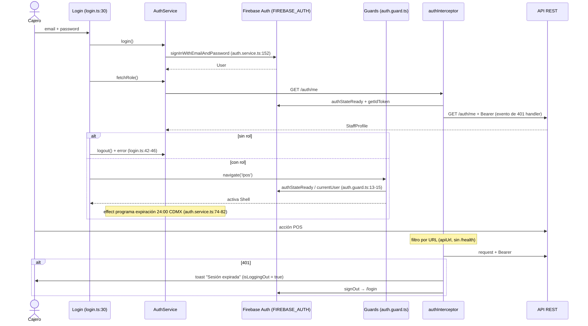

# Core y bootstrap

Alcance: arranque de la aplicación (`src/main.ts` → `appConfig` → rutas) y todo `src/app/core/**` (autenticación, capa HTTP, Firebase, layout, salud del API, notificaciones, audio, tema), más los cuatro archivos de entorno.

## 1. Propósito y archivos principales

El `core` concentra lo transversal: quién es el usuario, cómo se habla con el API, cómo se pinta el shell y qué configuración aplica según el destino de build (navegador o Electron). Las features (`src/app/features/pos/**`) consumen estos servicios y no duplican lógica de auth ni de parseo de respuestas.

| Archivo | Ruta:línea | Rol |
|---|---|---|
| Bootstrap | `src/main.ts:5` | `bootstrapApplication(App, appConfig)` |
| Componente raíz | `src/app/app.ts:14` | `<router-outlet />` + `<p-toast position="top-right" />` (`src/app/app.ts:10`) |
| Providers | `src/app/app.config.ts:15` | router, HTTP + interceptor, i18n, Firebase, PrimeNG |
| Rutas | `src/app/app.routes.ts:5` | `/login` (guest) y `''` (auth) → `Shell` → `POS_ROUTES` |
| Firebase | `src/app/core/firebase/firebase.providers.ts:10` | `provideFirebase()` con `InjectionToken`s |
| Auth | `src/app/core/auth/auth.service.ts:33` | signals de sesión, perfil, permisos y expiración |
| Guards | `src/app/core/auth/auth.guard.ts:9` y `:18` | `authGuard` / `guestGuard` |
| Login | `src/app/core/auth/login/login.ts:16` | formulario reactivo + validación de rol |
| Interceptor | `src/app/core/api/auth.interceptor.ts:54` | Bearer token y manejo de 401 |
| Utilidades API | `src/app/core/api/api.utils.ts:27,46,59,66` | `toDate`, `getApiErrorMessage`, `unwrapEntity`, `unwrapList` |
| Salud del API | `src/app/core/health/api-health.service.ts:10` | polling `/health` + estado `degraded` |
| Shell | `src/app/core/layout/shell.ts:19` / `shell.html:1` | header, nav filtrada, banner, hotkeys |
| Navegación | `src/app/core/layout/nav.config.ts:12` | `NAV_ITEMS` con permiso opcional |
| Notificaciones | `src/app/core/notifications/notification.service.ts:5` | `success` / `error` / `sessionExpired` |
| Audio | `src/app/core/audio/scan-sound.service.ts:6` | pitidos de escaneo vía `AudioContext` |
| Tema | `src/app/core/theme/pos.preset.ts:4` | preset PrimeNG sobre Aura (emerald) |

## 2. Cadena de arranque

1. `src/main.ts:5` llama `bootstrapApplication(App, appConfig)` y solo loguea el error en `catch`.
2. `App` (`src/app/app.ts:5-14`) es standalone, `OnPush`, con plantilla inline: outlet del router y toast de PrimeNG (destino de `NotificationService`).
3. `appConfig` (`src/app/app.config.ts:15-39`) registra, en orden:
   - `provideBrowserGlobalErrorListeners()` (`:17`) y `MessageService` de PrimeNG (`:18`, requerido por `NotificationService`).
   - `provideRouter(routes, ...(environment.isElectron ? [withHashLocation()] : []))` (`:19`).
   - `provideHttpClient(withInterceptors([authInterceptor]))` (`:20`).
   - `provideTranslateService` con loader HTTP, `fallbackLang: 'es'`, `lang: 'es'` (`:21-28`); el prefijo también depende de Electron (`:23`).
   - `provideFirebase()` (`:29`) y `providePrimeNG` con `PosPreset`, `darkModeSelector: false` y licencia del entorno (`:30-38`).

### Por qué `withHashLocation()` solo en Electron

En Electron la app no se sirve por HTTP: `electron/main.js` carga `dist/farma-jyv-pos/browser/index.html` con `file://`, y la configuración `electron` de `angular.json:64-72` fija `baseHref: "./"` y reemplaza `environment.ts` por `environment.electron.ts` (`isElectron: true`, `src/environments/environment.electron.ts:3`). Con `PathLocationStrategy` una URL como `file:///…/pos/historial` se resolvería contra el sistema de archivos y daría 404, porque no hay servidor que reescriba a `index.html`. `withHashLocation()` mueve la ruta al fragmento (`index.html#/pos/historial`), que nunca sale al file system. En navegador (`environment.isElectron: false` en los otros tres entornos) se conservan URLs limpias. El mismo flag decide el prefijo de i18n: `./i18n/` relativo para Electron, `/i18n/` absoluto para web (`src/app/app.config.ts:23`).

## 3. Autenticación y autorización

### `AuthService` (`src/app/core/auth/auth.service.ts:33`)

Envuelve `onAuthStateChanged` en un `Observable` (`:28-30`) y lo expone como signals:

- `user` (`:42`) — `User | null` de Firebase, vía `toSignal`.
- `profile` (`:49-54`) — se dispara con cada cambio de `user`; llama `fetchProfile()` (`:132`), que hace `GET ${apiUrl}/auth/me`, aplica `unwrapEntity` + `parseStaffProfile` y en error devuelve `null` (`:135-136`). La petición se comparte con `shareReplay(1)` y se libera en `finalize` (`:138-140`), evitando ráfagas duplicadas.
- `role` (`:56`) — `profile()?.role.slug`; `roleName` (`:57`) — nombre legible del documento `roles`.
- `permissions` (`:58`) — `RolePermission[]` efectivos.
- `isAuthenticated` (`:60`), `isAdmin` (`:62`, comparación literal contra `'admin'` porque el backend ata la anulación de ventas a ese slug), `canSell` (`:63` = `can('sales','write')`).
- `can(area, level = 'write')` (`:85-87`) delega en `hasPermission` (`src/app/shared/models/index.ts:57-72`), que replica la regla del backend: `admin` pasa siempre; si no hay permiso del área, `false`; `read` acepta cualquier nivel, `write` exige `write`.
- `sessionExpiresAt` (`:66`), `login` (`:151`), `logout` (`:155`), `getLoginErrorMessage` (`:159`, hoy todos los casos devuelven la misma clave `auth.login.error`).

### Guards (`src/app/core/auth/auth.guard.ts`)

| Guard | Línea | Comportamiento |
|---|---|---|
| `authGuard` | `:9-16` | Espera `authStateReady()` y solo comprueba `auth.currentUser !== null`; si no, `UrlTree` a `/login`. **No valida rol ni permisos.** |
| `guestGuard` | `:18-39` | Si no hay usuario, deja entrar a `/login`. Si lo hay, llama `authService.fetchRole()`: sin rol (o error) hace `signOut` y permite ver el login; con rol redirige a `/pos`. |

Diferencia clave: `authGuard` es barato y solo mira la sesión de Firebase; `guestGuard` es el único que consulta el backend y el que limpia sesiones de Firebase válidas pero sin staff asociado. El rol también se revalida en el login (`src/app/core/auth/login/login.ts:41-46`): sin rol, `logout()` y mensaje de error.

### Expiración a las 24:00 de `America/Mexico_City`

El backend rechaza cualquier token cuyo `auth_time` sea de un día anterior en hora del centro de México; la sesión muere a medianoche local, no a las 24 h de haber entrado (`src/app/shared/utils/session-expiry.ts:1-11`). El POS replica el cálculo:

- `getSessionExpiryMs(authTimeMs)` (`session-expiry.ts:46-48`) = inicio del día siguiente en esa zona, resuelto por búsqueda binaria ±14 h (`:31-43`) para no hardcodear offset y sobrevivir al horario de verano.
- Un `effect` en el constructor (`auth.service.ts:74-82`) reprograma el temporizador con cada cambio de `user`.
- `scheduleSessionExpiry` (`:97-113`) lee `authTime` del `IdTokenResult` (`:115-123`), fija `sessionExpiresAt`, cierra ya si `isSessionExpired`, y si no arma un `setTimeout` acotado a `2_147_483_000 ms` para evitar overflow.
- `endExpiredSession` (`:90-95`) notifica (`NotificationService.sessionExpired`, `notification.service.ts:20-29`), hace `logout()` y navega a `/login`. El temporizador se limpia en `DestroyRef.onDestroy` (`:69`).

## 4. Capa HTTP

### `authInterceptor` (`src/app/core/api/auth.interceptor.ts:54-84`)

- **Filtro por URL** (`:55-57`): pasa de largo si la URL no empieza con `environment.apiUrl` o contiene `/health`. Así los assets, `i18n/*.json` y el polling de salud (`api-health.service.ts:29`) nunca cargan token ni disparan logout.
- **Bearer** (`:65-76`): espera `auth.authStateReady()`, y si hay `currentUser` clona la request con `Authorization: Bearer <idToken>`. Sin usuario, la request sale sin cabecera (`:68-70`).
- **`/auth/me` exento** (`:63`, `:77-79`): esa ruta se llama precisamente para *averiguar* si hay staff válido, y `guestGuard`/`login` ya manejan el caso "sin rol". Si pasara por `handleUnauthorized`, un 401 de `/auth/me` produciría un toast de "sesión expirada" y una redirección durante el propio login.
- **401** (`handleUnauthorized`, `:20-52`): ante `HttpErrorResponse` con status 401 muestra `notifications.sessionExpired(getApiErrorMessage(error))` — se repite el mensaje del backend porque distingue "expiró a las 24:00" de "no autorizado" (`:36-38`) —, hace `signOut`, navega a `/login` y re-lanza el error.
- **`isLoggingOut`** (`:18`, `:32-35`): flag a nivel de módulo (global, compartido por todas las requests). Con varias peticiones en vuelo, solo la primera dispara el cierre de sesión; las demás propagan el error sin duplicar toast ni navegación. Se resetea tanto en el camino feliz (`:42`) como en el de error (`:46`).

### `api.utils.ts`

| Función | Línea | Qué resuelve |
|---|---|---|
| `toDate` | `:27-44` | Normaliza `Timestamp` de Firestore, `Date`, string/number y el objeto serializado `{_seconds}`; fallback `new Date()`. |
| `getApiErrorMessage` | `:46-57` | Extrae `error.error.message` del body del API, si no `Error.message`, si no un texto genérico en español. |
| `unwrapEntity<T>` | `:59-64` | Devuelve `response.data` si existe, si no la respuesta cruda. |
| `unwrapList<T>` | `:66-83` | Acepta array directo, o `key` explícita, o `data`, o `items`; nunca lanza, devuelve `[]`. |

Complementos: `ApiRequestError` (`:8-15`) y `getApiErrorStatus` (`:17-25`) para errores no `HttpErrorResponse`.

## 5. Firebase sin `@angular/fire`

`@angular/fire` no soportaba Angular 22 al crear el proyecto (máximo `21.0.0-rc.0`), y bajar Angular no era opción (motivo documentado en `CLAUDE.md`). En su lugar, `provideFirebase()` (`src/app/core/firebase/firebase.providers.ts:10-22`) inicializa el SDK modular a mano:

- `FIREBASE_APP` (`:7`) → `initializeApp(environment.firebase)` (`:14`).
- `FIREBASE_AUTH` (`:8`) → `getAuth(app)` con `deps: [FIREBASE_APP]` (`:18-19`).

Los consumidores inyectan el token en vez de la clase `Auth` de `@angular/fire`: `AuthService` (`auth.service.ts:34`), ambos guards (`auth.guard.ts:10`, `:19`) y el interceptor (`auth.interceptor.ts:59`). Las APIs usadas (`onAuthStateChanged`, `signInWithEmailAndPassword`, `signOut`, `authStateReady`, `getIdTokenResult`) son las del SDK modular, idénticas a las que envuelve `@angular/fire`.

Para migrar cuando haya soporte: sustituir `provideFirebase()` por `provideFirebaseApp(() => initializeApp(...))` + `provideAuth(() => getAuth())`, cambiar los cuatro `inject(FIREBASE_AUTH)` por `inject(Auth)` de `@angular/fire/auth` y borrar `firebase.providers.ts`. `Timestamp` en `api.utils.ts:2` seguiría importándose de `firebase/firestore` salvo que se adopte `@angular/fire/firestore`.

## 6. Layout y navegación

`Shell` (`src/app/core/layout/shell.ts:19`) es el componente protegido por `authGuard` (`app.routes.ts:13-14`) y contiene el outlet de las features.

- **Nav filtrada por permiso, con dos grupos** (rediseño de header, 2026-08-30):
  `navItems` sigue siendo un `computed` que filtra `NAV_ITEMS` por `can(area, level)`, pero
  ahora cada `NavItem` declara `group?: 'primary' | 'secondary'`. `primary` (default) va
  directo en la barra — Venta, Historial, Cobro directo, Entrada de stock—; `secondary`
  cuelga de un `p-menu` "Más" en el header — Reportes, Libro de control, y los tres módulos
  administrativos nuevos: Categorías, Proveedores, Facturas—. El menú de usuario/rol también
  se consolidó en un único `p-menu` (antes eran controles sueltos). El comentario del código
  lo sigue justificando igual: un enlace que devuelve 403 no es navegación.
- **Rutas ya con guard propio**: a diferencia de una versión anterior de este documento,
  `POS_ROUTES` (`pos.routes.ts`) hoy declara `canActivate: [permissionGuard(area, level)]` en
  cada ruta salvo `/pos` — el filtrado ya no es solo cosmético en el nav, también cierra la
  puerta por URL directa. Ver `docs/arquitectura/pos.md` §1 para la tabla completa.
- **Etiqueta de rol**: usa `roleName()` del backend porque los slugs ya no son un enum cerrado y traducir por clave dejaría textos como `shell.role.manager` a la vista. Se pinta con color distinto si `isAdmin()`.
- **Hotkeys globales** vía objeto `host`: F1 → `/pos`, F3 → `/pos/historial`.
- **Banner de degradación**: visible cuando `degraded()`. `ApiHealthService` mantiene
  `browserOnline` (eventos `online`/`offline`) y `apiOk`; `degraded = !browserOnline || !apiOk`.
  **Cambio 2026-08-30**: se quitó el polling periódico de `setInterval` — `apiOk` ya solo se
  refresca con `checkNow()` al abrir la app o durante una acción de sync (login, horario fijo,
  botón manual), no cada 30 s. El banner sigue siendo rojo sin red y ámbar si la red está pero
  el API no responde.
- **Botón de sync manual**: en el header, con punto indicador cuando hay ventas/altas
  pendientes de subir; pide confirmación (`window.confirm`) antes de disparar `SyncScheduler.syncNow()`.
- **Logout**: `AuthService.logout()` + navegación a `/login`.

## 7. Entornos

Los cuatro archivos son **idénticos salvo dos flags**; el resto (apiUrl, licencia PrimeNG, configuración de farmacia, Mercado Pago, credenciales Firebase, `printTicketOnSale`, `expiryWarningDays: 30`, `soundsEnabled`, `promos: []`, `cashDrawer.printerName: ''`, `version: 'v1.0.0'`) coincide byte a byte.

| Archivo | `production` | `isElectron` | Se activa en |
|---|---|---|---|
| `src/environments/environment.ts:1-33` | `false` (`:2`) | `false` (`:3`) | Base; `ng serve`/build sin reemplazo |
| `src/environments/environment.development.ts:1-33` | `false` (`:2`) | `false` (`:3`) | configuración `development` (`angular.json:57-62`) |
| `src/environments/environment.prod.ts:1-33` | `true` (`:2`) | `false` (`:3`) | configuración `production` (`angular.json:33-38`, default) |
| `src/environments/environment.electron.ts:1-33` | `true` (`:2`) | `true` (`:3`) | configuración `electron` (`angular.json:64-72`, con `baseHref: "./"`) |

Efectos reales de `isElectron`: `withHashLocation()` (`app.config.ts:19`) y prefijo de i18n `./i18n/` (`app.config.ts:23`). `soundsEnabled` lo consulta `ScanSoundService.play` (`scan-sound.service.ts:22-24`); `apiUrl` lo usan interceptor (`auth.interceptor.ts:55`), `AuthService` (`auth.service.ts:38`) y `ApiHealthService` (`api-health.service.ts:29`).

## 8. Flujo login → guard → interceptor → API

## 9. Riesgos y deuda técnica

1. **Credenciales y licencia versionadas.** `apiKey` de Firebase y la licencia de PrimeNG están hardcodeadas en los cuatro entornos (`src/environments/environment.ts:6-7`, `:26`). La `apiKey` de Firebase Web no es secreta, pero la licencia sí es un token con `exp` (1817081917 ≈ 2027) y está en el repo.
2. **Los cuatro entornos son el mismo entorno.** `apiUrl` apunta al mismo proyecto de producción en dev, prod y Electron (`environment.development.ts:5`). No hay separación staging/producción: una sesión de desarrollo escribe ventas reales.
3. **`authGuard` no verifica rol ni permisos** (`auth.guard.ts:9-16`). Un usuario de Firebase sin staff asociado entra al `Shell`; solo se corrige cuando el API responde 401/403 o al pasar por `guestGuard`. **Actualización 2026-09-03**: la autorización de pantallas ya no descansa solo en el filtrado cosmético de `NAV_ITEMS` — `POS_ROUTES` ahora sí declara `canActivate: [permissionGuard(...)]` por ruta (ver `pos.routes.ts`); el punto sigue abierto únicamente a nivel de `authGuard` (entra al `Shell` sin rol) y de la nav en sí, no de las rutas hijas.
4. **`isLoggingOut` es estado global de módulo** (`auth.interceptor.ts:18`). Sobrevive entre tests y entre instancias de la app; si `signOut` o `router.navigate` fallan de forma que ninguno de los dos `catch` corra, queda en `true` y suprime todos los 401 siguientes.
5. **`fetchProfile` traga el error** (`auth.service.ts:136`): cualquier fallo (red caída, 500) se vuelve `null`, indistinguible de "usuario sin rol". `guestGuard` reacciona haciendo `signOut` (`auth.guard.ts:31,35`), es decir un API caído puede desloguear a un cajero con sesión válida.
6. **`ApiHealthService` — resuelto el polling, sigue el resto.** El `setInterval` de 30 s se quitó (2026-08-30): ahora solo checa al abrir la app o durante una acción de sync. Pendiente real: `checkNow()` no cancela una llamada anterior en vuelo (sin `switchMap`), así que dos invocaciones casi simultáneas (evento `online` + sync) pueden resolver fuera de orden y dejar `apiOk` desactualizado hasta el siguiente chequeo. Los listeners de `window` (`online`/`offline`) tampoco se remueven, y el constructor sigue tocando `navigator`/`window` directo (incompatible con SSR/prerender, sin impacto real porque este POS no usa SSR).
7. **`getLoginErrorMessage` es un `switch` inerte** (`auth.service.ts:159-171`): los tres casos y el `default` devuelven `'auth.login.error'`. El cajero no distingue credenciales inválidas de bloqueo por `auth/too-many-requests`.
8. **`toDate` nunca falla, silenciosamente** (`api.utils.ts:43`): ante un valor irreconocible devuelve la fecha actual. En reportes o en el libro de control esto puede producir registros fechados "hoy" sin ninguna señal de error.
9. **Temporizador de expiración atado al `authTime` del token** (`auth.service.ts:97-113`): si la máquina se suspende, `setTimeout` no dispara puntualmente y el cierre ordenado se retrasa hasta que despierta; el respaldo real sigue siendo el 401 del interceptor.
10. **`main.ts` solo hace `console.error`** (`src/main.ts:6`): un fallo de bootstrap deja pantalla en blanco sin mensaje, escenario poco diagnosticable en un equipo de mostrador con Electron.
11. **`Auth` de Firebase sin persistencia explícita**: no se configura `setPersistence` en ningún punto (`firebase.providers.ts:18`), se depende del default `localStorage` del SDK — relevante en Electron con `file://`.
