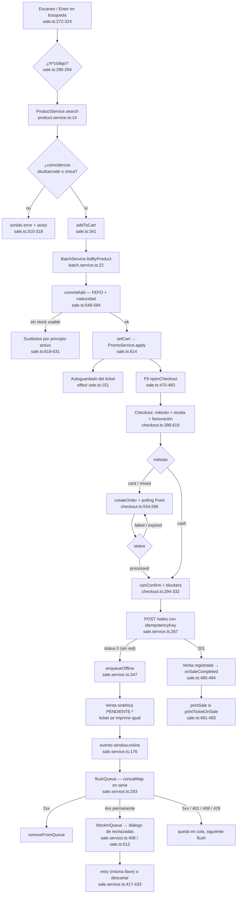

# Arquitectura — `features/pos` (la caja)

Alcance: `src/app/features/pos/**`. Es el corazón funcional del POS: venta, cobro,
turno de caja, consulta e impresión. Todo lo afirmado aquí está anclado a `ruta:línea`.

---

## 1. Mapa de pantallas y rutas

`POS_ROUTES` se monta lazy bajo el shell autenticado
(`src/app/app.routes.ts:18-21`), y todo el árbol está protegido por `authGuard`
(`src/app/app.routes.ts:12`).

| Ruta | Componente | Archivo | Guard de ruta | Permiso efectivo |
| --- | --- | --- | --- | --- |
| `/pos` | `Sale` | `src/app/features/pos/pos.routes.ts:4-7` | solo `authGuard` | `sales:write` verificado en runtime por `ensureShiftOpen()` (`sale/sale.ts:666-679`) |
| `/pos/historial` | `SaleHistory` | `pos.routes.ts:8-11` | solo `authGuard` | ninguno declarado; anular exige `isAdmin` (`history/sale-history.ts:105`) |
| `/pos/reportes` | `PosReports` | `pos.routes.ts:12-15` | solo `authGuard` | ninguno declarado |
| `/pos/libro-control` | `ControlledLedger` | `pos.routes.ts:16-20` | solo `authGuard` | `inventory:read`, comprobado en el componente (`controlled-ledger/controlled-ledger.ts:63,131-135`) |

El menú se filtra por permiso, no las rutas: `Shell.navItems` descarta los ítems cuyo
`permission` no cumple el perfil (`src/app/core/layout/shell.ts:25-29`), y el único ítem
con permiso declarado es el libro de control (`src/app/core/layout/nav.config.ts:16-23`).
Atajos globales: F1 → venta, F3 → historial (`shell.ts:14-17,42-50`).

Diálogos (no son rutas, son componentes montados desde `sale.html`): checkout
(`sale.html:377`), turno de caja, movimiento de caja, sustitutos y ventas rechazadas
(`sale.html:402-415`).

---

## 2. Flujo de venta — `sale/sale.ts`

### Estado (signals)

Estado base en `sale.ts:96-116`: `searchTerm`, `results`, `cart`, `heldSales`,
`manualDiscounts`, banderas de diálogos, `lastSale`, y los sustitutos
(`substitutesVisible`, `substitutesSource`, `substitutes`). Los derivados son
`computed`: `subtotal`, `discountTotal`, `total`, `itemCount`, `lastLineId`
(`sale.ts:117-128`). Señales reexpuestas desde servicios: `isAdmin`, `canSell`,
`cashSessionOpen`, `pendingOfflineSales`, `blockedSales` (`sale.ts:110-115`).

Toda escritura del carrito pasa por `setCart()`, que recalcula promociones antes de
guardar (`sale.ts:614-616` → `PromoService.apply`, `services/promo.service.ts:24-35`).

### Búsqueda con debounce y escaneo `N*código`

- Tecleo: `onSearchChange()` empuja al `Subject` `search$` (`sale.ts:262-270`), que
  aplica `debounceTime(500) + distinctUntilChanged() + switchMap` contra
  `ProductService.search` (`sale.ts:131-138`). Con el turno cerrado no se consulta nada
  (`sale.ts:263-267`).
- Enter (pistola de códigos): `onSearchKeydown()` no espera el debounce. Interpreta el
  prefijo de cantidad con `/^(\d+)\*(.+)$/`, acotado a 1..999 (`sale.ts:290-294`), busca
  de inmediato y resuelve la coincidencia por `sku` o `barcode` exacto, o por resultado
  único (`sale.ts:300-308`). Sin coincidencia: sonido de error y aviso, distinguiendo
  "no encontrado" de "varios resultados" (`sale.ts:310-318`).

### `addToCart` → `commitAdd`: FEFO y caducidad

`addToCart()` (`sale.ts:341-356`) exige turno abierto, rechaza stock 0 abriendo
sustitutos, y pide los lotes del producto (`BatchService.listByProduct`,
`services/batch.service.ts:22-35`). Éxito o error, siempre continúa en `commitAdd`
(con `batches = null` si la petición falló).

`commitAdd()` (`sale.ts:548-594`):

1. `sellableBatches()` filtra lotes con cantidad > 0 y no vencidos, y los ordena por
   `expiryDate` ascendente — selección **FEFO** (`sale.ts:633-638`).
2. Si el disponible vendible es 0, abre sustitutos con "El stock disponible está
   vencido" (`sale.ts:558-562`).
3. Aviso de caducidad próxima cuando el lote más cercano vence dentro de
   `environment.expiryWarningDays` (30 días, `src/environments/environment.ts:9`):
   sonido de advertencia + mensaje con lote y fecha (`sale.ts:563-570`).
4. Valida que la cantidad acumulada no supere ni el vendible ni `product.stock`
   (`sale.ts:573-579`).
5. Agrega o incrementa la partida y, si es nueva, `warnIfControlled()` avisa que el
   producto exige receta —en el mostrador, no al cobrar— e indica si además se retiene
   la receta o se registra en el libro de control (`sale.ts:596-612`).

El POS **no reserva lote**: solo usa los lotes para validar y avisar; la asignación
real la hace el backend al registrar la venta.

### Sustitutos por principio activo

`openSubstitutes()` (`sale.ts:618-631`) se dispara cuando no hay stock usable: busca por
`product.activeIngredient` y ofrece los resultados con stock, excluyendo el producto
original. `selectSubstitute()` reinicia el flujo con `addToCart` (`sale.ts:358-362`). La
UI es `sale/substitutes-dialog.ts:8-58`.

### Descuentos y tope del 20 %

`updateLineDiscount()` (`sale.ts:397-413`) acota el descuento al total de la línea,
resta la promo para obtener la parte manual y calcula el porcentaje sobre el total de la
línea. Si supera 20 % y el usuario no es admin, rechaza con
"Descuento mayor a 20% requiere autorización de un administrador" (`sale.ts:407-410`).
El porcentaje se mide sobre el descuento **total** (promo + manual), no solo el manual.

### Autoguardado del ticket y ventas en pausa

- Autoguardado: un `effect` persiste líneas y descuentos manuales por `uid` en cada
  cambio (`sale.ts:151-155` → `CartStorageService.save`,
  `services/cart-storage.service.ts:61-79`). Motivo documentado en el código: la sesión
  del backend muere a medianoche y el interceptor cierra sesión ante 401, y el cajero no
  debe reescanear (`cart-storage.service.ts:5-12`, `sale.ts:149-150`). `restoreCart()`
  recupera el ticket al entrar y avisa cuántas partidas devolvió (`sale.ts:640-654`).
- Ventas en pausa: `holdSale()` (F6) mueve el carrito completo a `heldSales` con label
  por hora y lo persiste (`sale.ts:428-445`, `services/held-sale-storage.service.ts`).
  `resumeHeldSale()` exige carrito vacío, reconstruye los descuentos manuales restando
  la promo y quita la venta de la lista (`sale.ts:447-468`).

### El guard `dialogOpen`

`sale.ts:186-194` (documentado en `sale.ts:181-185`). Devuelve `true` si hay cualquier
diálogo abierto: checkout, turno, movimiento, ventas bloqueadas o sustitutos. Existe
porque los atajos están registrados en `document`
(`sale.ts:68-77`) y se dispararían **por debajo** del diálogo: `Esc` cerraría el diálogo
y además vaciaría el ticket que se estaba cobrando, `Del`/`Backspace` borrarían la
última partida y `+`/`-` cambiarían cantidades. Cada handler lo consulta primero:
`holdSaleFromHotkey` (174), `onEscape` (197), `onDeleteLine` (212), `onSignedQtyKey`
(233), `focusLastQty` (251), `focusSearch` (327) y `openCheckout` (472) — este último con
la nota de que F9 con el diálogo abierto lo maneja el propio checkout.

---

## 3. Cobro — `checkout/checkout.ts`

### Idempotencia

`idempotencyKey` se genera **al abrir el diálogo** (`reset()`, `checkout.ts:685`) y se
reusa en cada reintento de "Confirmar venta" (`checkout.ts:120-124`, enviado en
`checkout.ts:653`). Un timeout seguido de reintento no duplica la venta: el backend
reconoce la llave. Es también el `queueId` de la cola offline
(`services/sale.service.ts:351`).

### Los tres métodos

`paymentMethods` = `cash` | `card` | `mixed` (`checkout.ts:109-113`); se seleccionan con
Alt+1/2/3 (`checkout.ts:385-396`). `selectPaymentMethod()` (`checkout.ts:398-430`) bloquea
el cambio si la terminal ya aprobó un cobro —reembolsar debe ser explícito— y cancela
una order viva sin aprobar. En `mixed` arranca a mitades y recalcula el efectivo.

El reparto efectivo/tarjeta lo resuelve `resolveTender`
(`checkout.ts:241-248` → `src/app/shared/utils/tender.ts:71-97`), espejo del backend:
en `mixed` el efectivo debido es `total − cardAmount` y el cambio se calcula contra esa
parte, nunca contra el total (`tender.ts:41-51,88-96`).

### Mercado Pago Point

- Terminales: `loadDevices()` (`checkout.ts:509-531`) sobre
  `MercadoPagoService.listDevices` (`services/mercado-pago.service.ts:43-55`), con
  mensaje explícito cuando no hay ninguna vinculada. `activatePdv()` conmuta el modo
  operativo (`checkout.ts:533-552`).
- Crear orden: `startCardPayment()` (`checkout.ts:554-577`) manda
  `cardChargeAmount()` (total, o solo la parte con tarjeta en mixto,
  `checkout.ts:256-258`) con referencia `sale-<idempotencyKey>-<intento>`; el sufijo
  distingue reintentos porque una order muerta sigue ocupando su referencia.
- Polling: `pollOrder()` (`checkout.ts:596-617`) consulta cada 2 s con
  `takeWhile(status ∈ pendientes, true)`. Estados en
  `services/mercado-pago.service.ts:8-18`; pendientes = `created`, `at_terminal`,
  `action_required`. `processed` = aprobada (`checkout.ts:259`); `failed`/`expired`
  notifican error (`checkout.ts:613-615`). `retryCardPayment()` limpia y reintenta sin
  cancelar (`checkout.ts:580-584`); `cancelCardPayment()` cancela la order viva
  (`checkout.ts:586-594`).
- `cardAmountLocked()` (`checkout.ts:265-271`): mientras la order esté aprobada o
  pendiente, el monto con tarjeta lo fija la terminal y `setCardAmount()` no lo deja
  mover (`checkout.ts:436-443`). Si falló o expiró se libera para reintentar con otro
  reparto sin cerrar el diálogo. `cardAmount()` usa `order.amount` solo cuando está
  bloqueado (`checkout.ts:226-238`).

### `blockers()` y `canConfirm()`

`blockers()` (`checkout.ts:294-317`) devuelve los motivos legibles en el orden en que el
cajero los resuelve: error de receta, error de tender, "falta que la terminal apruebe el
cobro", faltante de efectivo con monto, y RFC/razón social para facturar. F9 sin poder
cobrar muestra el primer bloqueador en vez de no hacer nada (`checkout.ts:366-379`).

`canConfirm()` (`checkout.ts:319-332`): no se puede si hay envío en curso, receta
inválida, facturación inválida o error de tender; `cash` exige `cashSatisfied`, `card`
exige order aprobada, y `mixed` exige **ambas** (aprobada y efectivo cubierto), porque
con una sola la venta quedaría cobrada a medias.

### Receta y facturación

- Receta: `doctorName`, `doctorLicense`, `prescriptionFolio`, `prescriptionRetained`
  (`checkout.ts:136-140`). Los requisitos COFEPRIS salen de
  `resolveControlledRequirements` sobre los productos del carrito (`checkout.ts:172-189`)
  y la validación de `validatePrescription` (`checkout.ts:190-197`). Al abrir, el foco va
  al campo de receta si el grupo la exige (`checkout.ts:357-363`). Los datos de receta se
  envían aunque el grupo no los exija, si el cajero los capturó (`checkout.ts:277-279`,
  `635-641`); `prescriptionRetained` solo cuando el grupo lo exige (`checkout.ts:644`).
- Facturación: `requiresInvoice`, `billingRfc`, `billingName`, `billingUsoCfdi` (G03,
  D01, S01) y `billingEmail` (`checkout.ts:155-166`). `billingOk()` pide RFC ≥ 12 y razón
  social (`checkout.ts:280-285`). Se prellena desde el cliente seleccionado
  (`checkout.ts:497-507`). Cliente y facturación arrancan plegados
  (`customerPanelOpen`, `checkout.ts:149-153`).
- `confirm()` (`checkout.ts:619-677`) arma el payload con `SaleService.buildPayload`,
  crea la venta y abre el cajón en `cash`/`mixed` (`CashDrawerService.open`,
  `services/cash-drawer.service.ts:17-23`, solo en Electron y con impresora configurada).
- Desglose fiscal previo (base, IVA 16/0 %, IEPS) con `previewTaxSummary`
  (`checkout.ts:204-211`); el valor definitivo lo calcula el backend.

---

## 4. Cola offline — `services/sale.service.ts`

- **Encolado solo con status 0**: `create()` captura el error y encola únicamente si
  `isOffline(error)`, es decir `HttpErrorResponse.status === 0` (`sale.service.ts:267-277`,
  `329-331`). Cualquier otro error se propaga al checkout. `enqueueOffline()`
  (`sale.service.ts:347-401`) guarda la venta en `localStorage`
  (`pos.pending-sales`, `sale.service.ts:110`) con `queueId = idempotencyKey` y devuelve
  una venta sintética con folio `PENDIENTE-<ts>`, desglose fiscal calculado en cliente y
  el cambio resuelto con `resolveTender` sobre la parte en efectivo.
- **Flush en serie**: `flushQueue()` (`sale.service.ts:293-327`) se protege con la
  bandera `flushing`, toma la cola sin las bloqueadas y envía con `concatMap` —en serie—
  para no perder el orden de folios ni abrir N peticiones al recuperar la red. Cada
  venta viaja con su `idempotencyKey` original. Único disparador registrado: el evento
  `window.online` (`sale.service.ts:176`).
- **Bloqueo ante 4xx y sus excepciones**: `isPermanentFailure()` (`sale.service.ts:334-345`)
  considera permanente todo 4xx **excepto** 401 (auth), 408 (timeout) y 429 (rate limit).
  Un fallo permanente marca `blockedReason` en la cola (`blockInQueue`,
  `sale.service.ts:408-414`) y deja de reintentarse; los 5xx y las excepciones caen en
  `EMPTY` y quedan en cola para el siguiente flush.
- **Reintento / descarte**: `retryBlockedSale()` limpia `blockedReason` y vuelve a hacer
  flush con la misma llave (`sale.service.ts:426-433`); `discardBlockedSale()` la elimina
  (`sale.service.ts:417-419`). La UI son el badge y el diálogo de la pantalla de venta
  (`sale.html:39-51,402-415`) sobre `reviewBlockedSales/retryBlockedSale/discardBlockedSale`
  (`sale.ts:512-535`), con confirmación explícita al descartar porque es una venta ya
  cobrada.
- Señales expuestas: `pendingCount` y `blockedSales`, recalculadas en cada `writeQueue`
  (`sale.service.ts:169-173,455-459`).

---

## 5. Turno de caja — `cash-session/`

`CashSessionDialog` tiene **tres modos** derivados en `cash-session-dialog.ts:40-45`:

| Modo | Condición | Qué hace |
| --- | --- | --- |
| `open` | no hay sesión | captura `openingAmount` y llama `POST /cash-sessions` (`cash-session-dialog.ts:82-94`) |
| `close` | hay sesión abierta | precarga el resumen y pide el efectivo contado (`cash-session-dialog.ts:96-113,144-157`) |
| `result` | ya se cerró en este diálogo | muestra el corte y permite imprimirlo (`cash-session-dialog.ts:115-134`) |

Cálculo del corte:

- **Esperado** = `cut.expectedCashAmount ?? cut.summary.cashInDrawer`
  (`cash-session-dialog.ts:53-59`).
- **Contado** = `countedCashAmount`, precargado con el esperado al abrir el modo `close`
  (`cash-session-dialog.ts:149`).
- **Diferencia** = `contado − esperado` (`cash-session-dialog.ts:60`); al imprimir se usa
  la diferencia que devolvió el backend, con el cálculo local como respaldo
  (`cash-session-dialog.ts:127`).

La sesión abierta al entrar a la venta se consulta en el constructor de `Sale`; si no hay
turno, el diálogo se abre solo (`sale.ts:140-147`).

`CashMovementDialog` registra depósito / retiro / gasto: exige tipo, monto > 0 y motivo
(`cash-movement-dialog.ts:34-38,51-56`) y llama
`POST /cash-sessions/{id}/movements` (`services/cash-session.service.ts:154-161`).

---

## 6. Consulta

### Historial — `history/sale-history.ts`

Carga las ventas del turno actual, o del día si no hay turno, siempre con
`includeVoided: true` (`sale-history.ts:60-88`). El texto de búsqueda se filtra **en
cliente** sobre folio y nombres de producto (`sale-history.ts:71-80`). Detalle en diálogo
con `SaleTicket` en modo preview, reimpresión (`sale-history.ts:100-102`) y anulación
solo para admin y solo si no está ya anulada, con confirmación (`sale-history.ts:104-121`).

### Reportes — `reports/reports.ts`

Dos alcances: turno o día (`reports.ts:13,54,149-174`); si no hay turno cae a `day`
(`reports.ts:136-141`). Toda la **agregación es en cliente** sobre `listAll`:
`validSales` excluye anuladas (`reports.ts:66`), `netTotal`, `discountTotal`,
`ticketAverage` (`reports.ts:69-78`), `byMethod` (`reports.ts:96-110`), `byHour` con
porcentaje relativo al máximo (`reports.ts:112-126`) y top 10 por cantidad e importe
sobre `aggregateProducts()` (`reports.ts:128-133,180-196`).

Regla de **`cashCollected`** (`reports.ts:80-94`): solo cuentan ventas `cash` y `mixed`;
por venta se toma `sale.cashAmount`, y si falta (ventas anteriores al split mixto) se
reconstruye como `amountReceived − change`. Sumar el total de una venta mixta contaría
también lo que pagó la tarjeta.

### Libro de control — `controlled-ledger/controlled-ledger.ts`

Solo lectura: los renglones los escribe el backend dentro de la transacción de venta,
anulación o devolución (`controlled-ledger.ts:36-43`). Filtros por rango (rápidos: hoy /
7 / 30 días), grupo con `requiresLedger`, límite 200 (`controlled-ledger.ts:65-70,96-117,
138-145`); el `to` se envía con `T23:59:59.999` para no perder el último día
(`controlled-ledger.ts:141-142`). Totales: `netQuantity` (salidas menos reingresos,
cantidades con signo) y resumen `byGroup` (`controlled-ledger.ts:72-94`). Se protege con
`canRead()` = `inventory:read` antes de consultar (`controlled-ledger.ts:63,131-135`).
Endpoint: `GET /inventory/controlled-ledger` (`services/controlled-ledger.service.ts:66-67`).

---

## 7. Impresión — `ticket/`

`TicketPrintService.printHost()` (`ticket/ticket-print.service.ts:51-81`) es el mecanismo
común:

1. Crea un `
` y lo cuelga de `document.body`.
2. Instancia el componente con `createComponent()` sobre ese host, aplica los `setInput`
   y lo adjunta a `ApplicationRef` forzando `detectChanges()`.
3. En un `queueMicrotask` llama `window.print()`.
4. Limpia (detach + destroy + remove) con guardia de idempotencia, ya sea por el evento
   `afterprint` o por un `setTimeout` de 1.5 s.

El CSS de impresión oculta todo el `body` y deja visible solo `.pos-print-root`
(`src/styles.css:130-145`), por lo que el mismo mecanismo sirve tanto para el host
dinámico como para las pantallas que ya usan esa clase (reportes y libro de control, que
imprimen con `window.print()` directo: `reports.ts:176-178`,
`controlled-ledger.ts:158-160`).

Las tres plantillas:

| Plantilla | Componente | Uso |
| --- | --- | --- |
| Ticket de venta | `SaleTicket` (`ticket/sale-ticket.ts:15-45`, `sale-ticket.html`) | `printSale()`; muestra el reparto efectivo/tarjeta cuando existe (`sale-ticket.ts:36-38`) y los grupos COFEPRIS (`sale-ticket.ts:40-44`). También se reusa como preview en el historial |
| Corte de caja | `CashCutTicket` (`ticket/sale-ticket.ts:47-70`, `cash-cut-ticket.html`) | `printCashCut()`, con apertura/cierre, esperado, contado, diferencia y totales por método |
| Etiqueta de producto | `ProductLabel` (`ticket/product-label.ts:7-18`, `product-label.html`) | `printProductLabel()`, disparado desde los resultados de búsqueda (`sale.ts:503-505`, `sale.html:151`) |

---

## 8. Servicios

| Servicio | Archivo | Endpoint(s) | Responsabilidad |
| --- | --- | --- | --- |
| `ProductService` | `services/product.service.ts:14-18` | `GET /products?search=` | Búsqueda de producto por texto, sku o código de barras |
| `BatchService` | `services/batch.service.ts:22-35` | `GET /inventory/batches?productId=` | Lotes con fecha de caducidad, insumo de la selección FEFO |
| `SaleService` | `services/sale.service.ts:221-283` | `GET /sales`, `GET /sales/{id}`, `POST /sales`, `POST /sales/{id}/void` | Construcción del payload, alta de venta, listado paginado (`listAll`), anulación y **cola offline** |
| `CashSessionService` | `services/cash-session.service.ts:114-161` | `GET /cash-sessions/current`, `POST /cash-sessions`, `GET /…/{id}/summary`, `POST /…/{id}/close`, `GET/POST /…/{id}/movements` | Estado del turno (`current`, `isOpen`), apertura, corte y movimientos de caja |
| `CustomerService` | `services/customer.service.ts:14-28` | `GET /customers`, `POST /customers` | Búsqueda y alta rápida de cliente desde el cobro |
| `MercadoPagoService` | `services/mercado-pago.service.ts:43-86` | `GET/PATCH /payments/mercadopago/devices…`, `POST/GET/DELETE /payments/mercadopago/orders…` | Terminales Point, modo PDV, crear/consultar/cancelar order de cobro |
| `ControlledLedgerService` | `services/controlled-ledger.service.ts:59-78` | `GET /inventory/controlled-ledger` | Libro de control COFEPRIS con filtros y cantidades con signo |
| `PromoService` | `services/promo.service.ts:24-75` | — (reglas locales en `environment.promos`) | Promociones N×M y % por cantidad; recalcula `discountAmount` por línea |
| `CartStorageService` | `services/cart-storage.service.ts:33-85` | — (`localStorage` `pos.current-cart.<uid>`) | Autoguardado y recuperación del ticket en curso |
| `HeldSaleStorageService` | `services/held-sale-storage.service.ts:22-66` | — (`localStorage` `pos.held-sales.<uid>`) | Persistencia de ventas en pausa por cajero |
| `CashDrawerService` | `services/cash-drawer.service.ts:17-23` | — (IPC `window.electronAPI.openCashDrawer`) | Abre el cajón tras cobros con efectivo; no-op fuera de Electron |
| `TicketPrintService` | `ticket/ticket-print.service.ts:20-81` | — (DOM + `window.print`) | Renderiza e imprime ticket de venta, corte de caja y etiqueta |

---

## 9. Recorrido: escanear → ticket → cobrar → venta registrada

---

## 10. Riesgos y deuda técnica

1. **`takeUntilDestroyed()` fuera de contexto de inyección** — `checkout.ts:602` se
   ejecuta dentro de `pollOrder()`, llamado desde el `subscribe` de `createOrder`
   (`checkout.ts:570-573`), es decir de forma asíncrona. Sin `DestroyRef` explícito, el
   operador exige contexto de inyección; conviene inyectar un `DestroyRef` y pasarlo.
   Mismo camino en `retryCardPayment()` (`checkout.ts:580-584`).
2. **Rutas sin guard de permiso** — `pos.routes.ts` no declara ningún guard por ruta.
   Historial y reportes son accesibles por URL para cualquier usuario autenticado; el
   libro de control depende de una comprobación en el componente
   (`controlled-ledger.ts:131-135`) y de que el enlace se oculte (`nav.config.ts:22`).
3. **La cola offline solo se vacía con el evento `online`** — `sale.service.ts:176`. Si la
   app arranca con ventas encoladas y la red ya está disponible (caso típico tras
   reiniciar el equipo), nada dispara `flushQueue()` hasta la siguiente transición de
   red. Falta un flush al iniciar y/o un reintento periódico.
4. **Errores 5xx en el cobro no se encolan** — `create()` solo encola con `status === 0`
   (`sale.service.ts:271`). Un 502/504 del gateway deja al cajero con el cobro hecho en
   la terminal y sin venta ni cola; depende de que reintente manualmente (la llave sí es
   estable, `checkout.ts:124`).
5. **Polling de Point sin límite de tiempo** — `interval(2000)` (`checkout.ts:598`) sigue
   indefinidamente mientras la order quede en un estado pendiente; no hay timeout ni
   límite de intentos.
6. **Tope de descuento solo en cliente** — `sale.ts:407` valida el 20 % en la UI; la
   autorización real debe estar en el backend. Además el porcentaje se mide sobre
   promo + manual, así que una promo agresiva puede bloquear un descuento manual mínimo.
7. **Fallback de lotes silencioso** — si `listByProduct` falla, `commitAdd` corre con
   `batches = null` (`sale.ts:354`) y se valida solo contra `product.stock`: se pierden
   el FEFO y el aviso de caducidad sin que el cajero lo note.
8. **Búsqueda del historial en cliente y sin debounce** — `onSearch()` recarga con
   `listAll` en cada pulsación (`sale-history.ts:90-93`) y filtra localmente
   (`sale-history.ts:71-80`), pese a que `ListSalesParams` ya soporta `search`
   (`sale.service.ts:70`). Con volumen alto se traen todas las páginas por tecla.
9. **Reportes agregan en cliente** — `listAll` pagina de 100 en 100
   (`sale.service.ts:249-259`) y toda la aritmética corre en el navegador
   (`reports.ts:96-196`). No escala a rangos amplios; conviene un endpoint de agregación.
10. **Limpieza de impresión por temporizador** — `setTimeout(cleanup, 1500)`
    (`ticket-print.service.ts:79`) destruye el componente aunque el diálogo nativo de
    impresión siga abierto en navegadores donde `afterprint` no llega a tiempo.
11. **`voidLastSale` sin verificación local** — `sale.ts:537-546` no comprueba `isAdmin()`
    ni pide confirmación, a diferencia del historial (`sale-history.ts:105-108`); depende
    del 403 del backend.
12. **Estado de la cola solo en `localStorage`** — `pos.pending-sales`
    (`sale.service.ts:110`) no está namespaceado por `uid`, a diferencia del carrito y de
    las ventas en pausa; en un equipo compartido las ventas encoladas de un cajero se
    mezclan con las del siguiente. Limpiar datos del navegador pierde ventas cobradas.
13. **Fallback de `idempotencyKey` con `Math.random`** — `sale.service.ts:113-118`; menor,
    pero es la única defensa contra duplicados en WebViews viejos de Electron.
