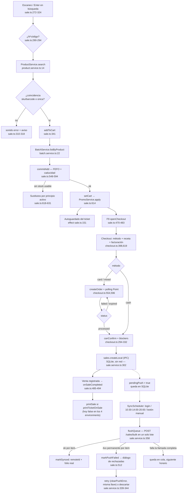

# Arquitectura — `features/pos` (la caja)

Alcance: `src/app/features/pos/**`. Es el corazón funcional del POS: venta, cobro,
turno de caja, consulta e impresión. Todo lo afirmado aquí está anclado a `ruta:línea`.

---

## 1. Mapa de pantallas y rutas

`POS_ROUTES` se monta lazy bajo el shell autenticado (`src/app/app.routes.ts`), y todo el
árbol está protegido por `authGuard`. **Actualización 2026-09-03**: cada ruta (salvo `/pos`)
ahora lleva `canActivate: [permissionGuard(area, level)]` con el mismo permiso que exige su
endpoint — el estado anterior ("pos.routes.ts no declara ningún guard") quedó resuelto.

| Ruta | Componente | Guard | Permiso |
| --- | --- | --- | --- |
| `/pos` | `Sale` | sin guard (destino de rebote del guard; se autoprotege con `ensureShiftOpen()`) | `sales:write` verificado en runtime |
| `/pos/historial` | `SaleHistory` | `permissionGuard('sales','read')` | anular exige además `isAdmin` en el componente |
| `/pos/cobro-directo` | `DirectChargeScreen` | `permissionGuard('directCharges','write')` | área propia, no `sales` — mover dinero sin ticket es atribución de supervisión |
| `/pos/entrada-stock` | `StockEntryScreen` | `permissionGuard('stockEntry','write')` | área propia, distinta de `inventory` |
| `/pos/reportes` | `PosReports` | `permissionGuard('dashboard','read')` | mismo área que el dashboard del backend |
| `/pos/libro-control` | `ControlledLedger` | `permissionGuard('inventory','write')` | a propósito `write` y no el `read` del endpoint (ver `pos.routes.ts`) |
| `/pos/categorias[/nuevo\|/:id/editar]` | `CategoryList`/`CategoryForm` | `permissionGuard('categories','write')` | módulo nuevo (2026-08-30), online (sin SQLite) |
| `/pos/proveedores[/nuevo\|/:id/editar]` | `SupplierList`/`SupplierForm` | `permissionGuard('suppliers','write')` | módulo nuevo, online |
| `/pos/facturas[/nuevo\|/:id]` | `InvoiceList`/`InvoiceForm`/`InvoiceDetail` | `permissionGuard('invoices','write')` | módulo nuevo, online, sube archivo vía `/uploads` |
| `/pos/productos[/nuevo\|/:id/editar]` | `ProductList`/`ProductForm` | `permissionGuard('products','write')` | módulo nuevo (2026-09-03), **local-first** — ver §10 |
| `/pos/gastos` | `ExpenseForm` | `permissionGuard('pos','write')` | mismo permiso que operar la caja — cualquier cajero con turno abierto, ver §5 |
| `/pos/cortes` | `CashSessionAudit` | `permissionGuard('cashSessions','read')` | exclusiva de `admin`; auditoría de todas las cajas, ver §5 |
| `/pos/gastos-auditoria` | `ExpensesAudit` | `permissionGuard('expenses','read')` | exclusiva de `admin`; auditoría de todos los gastos, ver §5 |

El menú (`nav.config.ts`) también se filtra por permiso y ahora tiene dos grupos (rediseño de
header, 2026-08-30): `primary` (default sin declarar `group`) va directo en la barra —
Venta, Historial, Cobro directo, Entrada de stock—; `secondary` cuelga del menú "Más" del
header — Reportes, Libro de control, Categorías, Proveedores, Facturas, Productos— para que la barra no
crezca con cada módulo nuevo. Atajos globales: F1 → venta, F3 → historial.

Diálogos (no son rutas, son componentes montados desde `sale.html`): checkout
(`sale.html:377`), turno de caja, movimiento de caja, sustitutos y ventas rechazadas
(`sale.html:402-415`).

---

## 2. Flujo de venta — `sale/sale.ts`

### Estado (signals)

Estado base en `sale.ts:96-116`: `searchTerm`, `results`, `cart`, `heldSales`,
`manualDiscounts`, banderas de diálogos, `lastSale`, y los sustitutos
(`substitutesVisible`, `substitutesSource`, `substitutes`). Los derivados son
`computed`: `subtotal`, `discountTotal`, `total`, `itemCount`, `lastLineId`
(`sale.ts:117-128`). Señales reexpuestas desde servicios: `isAdmin`, `canSell`,
`cashSessionOpen`, `pendingOfflineSales`, `blockedSales` (`sale.ts:110-115`).

Toda escritura del carrito pasa por `setCart()`, que recalcula promociones antes de
guardar (`sale.ts:614-616` → `PromoService.apply`, `services/promo.service.ts:24-35`).

### Búsqueda con debounce y escaneo `N*código`

- Tecleo: `onSearchChange()` empuja al `Subject` `search$`, que aplica
  `debounceTime(500) + switchMap` contra `ProductService.search`. Con el turno cerrado no se
  consulta nada. **Sin `distinctUntilChanged()` a propósito (corregido 2026-09-03)**: lo tenía
  antes, pero borrar el término a menos del mínimo y volver a teclear el mismo de antes (ej.
  "para" → "p" → "para") lo descartaba como duplicado y la búsqueda no volvía a dispararse —
  bug real, encontrado en pruebas, mismo patrón en `stock-entry.ts` (ahí además dejaba el
  spinner "Buscando…" colgado). El catálogo es local (SQLite vía IPC), repetir la consulta no
  cuesta nada, así que se quitó el operador en vez de parchear el reseteo.
- Enter (pistola de códigos): `onSearchKeydown()` no espera el debounce. Interpreta el
  prefijo de cantidad con `/^(\d+)\*(.+)$/`, acotado a 1..999 (`sale.ts:290-294`), busca
  de inmediato y resuelve la coincidencia por `sku` o `barcode` exacto, o por resultado
  único (`sale.ts:300-308`). Sin coincidencia: sonido de error y aviso, distinguiendo
  "no encontrado" de "varios resultados" (`sale.ts:310-318`).

### `addToCart` → `commitAdd`: FEFO y caducidad

`addToCart()` (`sale.ts:341-356`) exige turno abierto, rechaza stock 0 abriendo
sustitutos, y pide los lotes del producto (`BatchService.listByProduct`,
`services/batch.service.ts:22-35`). Éxito o error, siempre continúa en `commitAdd`
(con `batches = null` si la petición falló).

`commitAdd()` (`sale.ts:548-594`):

1. `sellableBatches()` filtra lotes con cantidad > 0 y no vencidos, y los ordena por
   `expiryDate` ascendente — selección **FEFO** (`sale.ts:633-638`).
2. Si el disponible vendible es 0, abre sustitutos con "El stock disponible está
   vencido" (`sale.ts:558-562`).
3. Aviso de caducidad próxima cuando el lote más cercano vence dentro de
   `environment.expiryWarningDays` (30 días, `src/environments/environment.ts:9`):
   sonido de advertencia + mensaje con lote y fecha (`sale.ts:563-570`).
4. Valida que la cantidad acumulada no supere ni el vendible ni `product.stock`
   (`sale.ts:573-579`).
5. Agrega o incrementa la partida y, si es nueva, `warnIfControlled()` avisa que el
   producto exige receta —en el mostrador, no al cobrar— e indica si además se retiene
   la receta o se registra en el libro de control (`sale.ts:596-612`).

El POS **no reserva lote**: solo usa los lotes para validar y avisar; la asignación
real la hace el backend al registrar la venta.

### Sustitutos por principio activo

`openSubstitutes()` (`sale.ts:618-631`) se dispara cuando no hay stock usable: busca por
`product.activeIngredient` y ofrece los resultados con stock, excluyendo el producto
original. `selectSubstitute()` reinicia el flujo con `addToCart` (`sale.ts:358-362`). La
UI es `sale/substitutes-dialog.ts:8-58`.

### Descuentos y tope del 20 %

`updateLineDiscount()` (`sale.ts:397-413`) acota el descuento al total de la línea,
resta la promo para obtener la parte manual y calcula el porcentaje sobre el total de la
línea. Si supera 20 % y el usuario no es admin, rechaza con
"Descuento mayor a 20% requiere autorización de un administrador" (`sale.ts:407-410`).
El porcentaje se mide sobre el descuento **total** (promo + manual), no solo el manual.

### Autoguardado del ticket y ventas en pausa

- Autoguardado: un `effect` persiste líneas y descuentos manuales por `uid` en cada
  cambio (`sale.ts:151-155` → `CartStorageService.save`,
  `services/cart-storage.service.ts:61-79`). Motivo documentado en el código: la sesión
  del backend muere a medianoche y el interceptor cierra sesión ante 401, y el cajero no
  debe reescanear (`cart-storage.service.ts:5-12`, `sale.ts:149-150`). `restoreCart()`
  recupera el ticket al entrar y avisa cuántas partidas devolvió (`sale.ts:640-654`).
- Ventas en pausa: `holdSale()` (F6) mueve el carrito completo a `heldSales` con label
  por hora y lo persiste (`sale.ts:428-445`, `services/held-sale-storage.service.ts`).
  `resumeHeldSale()` exige carrito vacío, reconstruye los descuentos manuales restando
  la promo y quita la venta de la lista (`sale.ts:447-468`).

### El guard `dialogOpen`

`sale.ts:186-194` (documentado en `sale.ts:181-185`). Devuelve `true` si hay cualquier
diálogo abierto: checkout, turno, movimiento, ventas bloqueadas o sustitutos. Existe
porque los atajos están registrados en `document`
(`sale.ts:68-77`) y se dispararían **por debajo** del diálogo: `Esc` cerraría el diálogo
y además vaciaría el ticket que se estaba cobrando, `Del`/`Backspace` borrarían la
última partida y `+`/`-` cambiarían cantidades. Cada handler lo consulta primero:
`holdSaleFromHotkey` (174), `onEscape` (197), `onDeleteLine` (212), `onSignedQtyKey`
(233), `focusLastQty` (251), `focusSearch` (327) y `openCheckout` (472) — este último con
la nota de que F9 con el diálogo abierto lo maneja el propio checkout.

---

## 3. Cobro — `checkout/checkout.ts`

### Idempotencia

`idempotencyKey` se genera **al abrir el diálogo** (`reset()`, `checkout.ts:685`) y se
reusa en cada reintento de "Confirmar venta" (`checkout.ts:120-124`, enviado en
`checkout.ts:653`). Un timeout seguido de reintento no duplica la venta: el backend
reconoce la llave. Es también el `queueId` de la cola offline
(`services/sale.service.ts:351`).

### Los tres métodos

`paymentMethods` = `cash` | `card` | `mixed` (`checkout.ts:109-113`); se seleccionan con
Alt+1/2/3 (`checkout.ts:385-396`). `selectPaymentMethod()` (`checkout.ts:398-430`) bloquea
el cambio si la terminal ya aprobó un cobro —reembolsar debe ser explícito— y cancela
una order viva sin aprobar. En `mixed` arranca a mitades y recalcula el efectivo.

El reparto efectivo/tarjeta lo resuelve `resolveTender`
(`checkout.ts:241-248` → `src/app/shared/utils/tender.ts:71-97`), espejo del backend:
en `mixed` el efectivo debido es `total − cardAmount` y el cambio se calcula contra esa
parte, nunca contra el total (`tender.ts:41-51,88-96`).

### Mercado Pago Point

- Terminales: `loadDevices()` (`checkout.ts:509-531`) sobre
  `MercadoPagoService.listDevices` (`services/mercado-pago.service.ts:43-55`), con
  mensaje explícito cuando no hay ninguna vinculada. `activatePdv()` conmuta el modo
  operativo (`checkout.ts:533-552`).
- Crear orden: `startCardPayment()` (`checkout.ts:554-577`) manda
  `cardChargeAmount()` (total, o solo la parte con tarjeta en mixto,
  `checkout.ts:256-258`) con referencia `sale-<idempotencyKey>-<intento>`; el sufijo
  distingue reintentos porque una order muerta sigue ocupando su referencia.
- Polling: `pollOrder()` (`checkout.ts:596-617`) consulta cada 2 s con
  `takeWhile(status ∈ pendientes, true)`. Estados en
  `services/mercado-pago.service.ts:8-18`; pendientes = `created`, `at_terminal`,
  `action_required`. `processed` = aprobada (`checkout.ts:259`); `failed`/`expired`
  notifican error (`checkout.ts:613-615`). `retryCardPayment()` limpia y reintenta sin
  cancelar (`checkout.ts:580-584`); `cancelCardPayment()` cancela la order viva
  (`checkout.ts:586-594`).
- `cardAmountLocked()` (`checkout.ts:265-271`): mientras la order esté aprobada o
  pendiente, el monto con tarjeta lo fija la terminal y `setCardAmount()` no lo deja
  mover (`checkout.ts:436-443`). Si falló o expiró se libera para reintentar con otro
  reparto sin cerrar el diálogo. `cardAmount()` usa `order.amount` solo cuando está
  bloqueado (`checkout.ts:226-238`).

### `blockers()` y `canConfirm()`

`blockers()` (`checkout.ts:294-317`) devuelve los motivos legibles en el orden en que el
cajero los resuelve: error de receta, error de tender, "falta que la terminal apruebe el
cobro", faltante de efectivo con monto, y RFC/razón social para facturar. F9 sin poder
cobrar muestra el primer bloqueador en vez de no hacer nada (`checkout.ts:366-379`).

`canConfirm()` (`checkout.ts:319-332`): no se puede si hay envío en curso, receta
inválida, facturación inválida o error de tender; `cash` exige `cashSatisfied`, `card`
exige order aprobada, y `mixed` exige **ambas** (aprobada y efectivo cubierto), porque
con una sola la venta quedaría cobrada a medias.

### Receta y facturación

- Receta: `doctorName`, `doctorLicense`, `prescriptionFolio`, `prescriptionRetained`
  (`checkout.ts:136-140`). Los requisitos COFEPRIS salen de
  `resolveControlledRequirements` sobre los productos del carrito (`checkout.ts:172-189`)
  y la validación de `validatePrescription` (`checkout.ts:190-197`). Al abrir, el foco va
  al campo de receta si el grupo la exige (`checkout.ts:357-363`). Los datos de receta se
  envían aunque el grupo no los exija, si el cajero los capturó (`checkout.ts:277-279`,
  `635-641`); `prescriptionRetained` solo cuando el grupo lo exige (`checkout.ts:644`).
- Facturación: `requiresInvoice`, `billingRfc`, `billingName`, `billingUsoCfdi` (G03,
  D01, S01) y `billingEmail` (`checkout.ts:155-166`). `billingOk()` pide RFC ≥ 12 y razón
  social (`checkout.ts:280-285`). Se prellena desde el cliente seleccionado
  (`checkout.ts:497-507`). Cliente y facturación arrancan plegados
  (`customerPanelOpen`, `checkout.ts:149-153`).
- `confirm()` (`checkout.ts:619-677`) arma el payload con `SaleService.buildPayload`,
  crea la venta y abre el cajón en `cash`/`mixed` (`CashDrawerService.open`,
  `services/cash-drawer.service.ts:17-23`, solo en Electron y con impresora configurada).
- Desglose fiscal previo (base, IVA 16/0 %, IEPS) con `previewTaxSummary`
  (`checkout.ts:204-211`); el valor definitivo lo calcula el backend.

---

## 4. Local-first — `services/sale.service.ts` (breaking change, 2026-08-30/31)

**El POS dejó de cobrar contra HTTP.** `SaleService.create()` ya no manda `POST /sales`: arma
el objeto completo y lo escribe directo en el SQLite de Electron vía IPC
(`window.electronAPI.sales.createLocal`, resuelto en el proceso principal por
`electron/db/sales.js`). El cobro es una transacción local, sin red, punto. Igual de
local es el alta de producto/stock (`entrada-stock`, ver `docs/arquitectura/shared-y-electron.md`
§4 para la capa Electron/Prisma completa). La sincronización con el backend ocurre solo en
tres momentos: al hacer login, a 3 horarios fijos del día (10:30 / 14:00 / 20:00, ver
`SyncScheduler`), o al pulsar el botón manual de sync del header.

- **Ids local vs. remoto**: cada `Product`/`Sale` tiene `id` (uuid local de SQLite) y
  `remoteId` (id de Firestore, `null` hasta que sincroniza). `buildPayload()` construye el
  `items[].productId` con `line.product.remoteId ?? line.product.id` a propósito —el backend
  solo conoce el `remoteId`—, mientras que la escritura local (`createLocal`) usa el `id`
  local en todo lo demás. **Este patrón ya causó 3 bugs reales** por confundir cuál id va a
  cada lado (ventas, entrada de stock, `upsertMany`) y en la auditoría de 2026-09-03 apareció
  un **cuarto caso, sin corregir**: `stock-entry.ts` reutiliza el mismo campo `payload.productId`
  tanto para el push remoto como para la escritura local, y `recordStockEntry` en
  `electron/db/products.js` lo usa tal cual como `where:{id: productId}` de Prisma — para
  cualquier producto ya sincronizado (tiene `remoteId`), la entrada de stock revienta con
  "Record to update not found". Ver §10, hallazgo #1.
- **Cola de push, no de HTTP directo**: cada venta/entrada de stock queda marcada
  `pendingPush: true` en SQLite con el payload completo serializado. `flushQueue()` en
  `SaleService` (y su equivalente en `StockEntryService`) es lo único que de verdad habla con
  el backend: manda **todo** el lote pendiente en una sola llamada (`POST /sales/bulk` /
  `POST /stock-entries` por item) y marca cada fila como sincronizada o rechazada según la
  respuesta.
- **Bloqueo ante rechazo permanente**: un 4xx (salvo 401/408/429) marca `pushError` en la fila
  y debería dejar de reintentarse hasta que el cajero lo revise (`retryBlockedSale()` limpia el
  error explícitamente). **Hallazgo de la auditoría**: la consulta de "pendientes por subir"
  (`getPendingPush`/`getPendingStockEntries`) no excluye las que ya tienen `pushError`, así que
  en la práctica se reintentan solas en cada uno de los 3 horarios fijos, contradiciendo el
  diseño — ver §11, hallazgo #3.
- **Anular una venta local vs. una ya sincronizada**: `void(sale)` toma la rama local
  (`sales.voidLocal` por IPC) si `sale.pendingPush || !sale.remoteId`; si ya sincronizó, anula
  primero en el backend (`POST /sales/:id/void`) y refleja el resultado en local. **Hallazgo**:
  hay una ventana de carrera entre "se está subiendo" y "se anula localmente" donde una venta
  puede terminar marcada `voidedAt` en local pero activa (sin anular) en el servidor — ver §11,
  hallazgo #2.
- **Fuera de línea real**: al no depender de HTTP para cobrar, no hay "modo offline" que activar
  ni banderas de conexión que vigilar en el flujo de venta — el POS funciona igual con o sin
  internet; solo el `flushQueue()` de los 3 horarios (o el botón manual) requiere red, y si
  falla, la cola simplemente espera al siguiente intento.
- Señales expuestas: `pendingCount`, `pendingSales` y `blockedSales`, recalculadas en cada
  `refreshPending()` tras cualquier escritura local.

---

## 5. Turno de caja — `cash-session/` (reforma local-first, 2026-09-05)

**Rehecho de punta a punta**: abrir/cerrar turno y ver el efectivo esperado ya no pasan
por HTTP en el instante de la acción — son 100% SQLite vía IPC, mismo patrón que venta y
catálogo (§4). El push al backend (`POST /cash-sessions`, `POST /…/close`) ocurre solo en
`CashSessionService.flushQueue()`, orquestado por `SyncScheduler`.

`CashSessionDialog` sigue con **tres modos** (`cash-session-dialog.ts:49-54`), pero
`open`/`close` ya no llaman HTTP directo: llaman `CashSessionService.openLocal()` /
`liveSummary()` / `closeLocal()`, resueltos por IPC contra SQLite.

| Modo | Condición | Qué hace |
| --- | --- | --- |
| `open` | no hay sesión | captura `openingAmount` y escribe local vía `openLocal()` — sin red |
| `close` | hay sesión abierta | `liveSummary()` trae el efectivo esperado **en vivo** (fondo + acumulado del turno) y precarga el campo contado con ese valor |
| `result` | ya se cerró en este diálogo | muestra el corte y permite imprimirlo, con leyenda de ajuste pendiente si aplica |

### Cierre siempre procede — ajuste asíncrono

El cierre **nunca se bloquea** por una diferencia. `requestClose()` compara
`countedCashAmount − expectedCash`:

- Diferencia < $0.01: cierra directo (`confirmClose()`).
- Diferencia ≥ $0.01: muestra un paso de confirmación **in-dialog**
  (`confirmingDifference`, ya no `window.confirm`) explicando que el turno cerrará igual y
  quedará pendiente de revisión — el cajero solo confirma la intención, nunca corrige el
  monto para "cuadrar".

Al cerrar con diferencia, el turno queda `hasPendingAdjustment: true`,
`adjustmentStatus: 'pending'` (calculado en el backend al procesar el push, nunca en el
cliente). La aprobación/rechazo vive **solo en el backend**: el POS local nunca decide —
`CashSessionService.pullAdjustmentStatus()` (llamada por `SyncScheduler`) solo hace pull
del estado ya resuelto por un admin, para turnos locales que quedaron `pending`.

### Auto-cierre a las 24:00 (`AuthService.endExpiredSession()`)

Si el turno sigue abierto cuando expira la sesión (medianoche CDMX, §B4 de `GOALS.md`),
`CashSessionService.autoCloseForExpiry(userId, userLabel)` cierra el turno **antes** de
completar el logout: cuenta el efectivo esperado en vivo y cierra con
`countedCashAmount = expectedCashAmount`, `autoClosedByExpiry: true` — nunca genera ajuste
pendiente, porque no hay cajero presente para contar. Es best-effort total (try/catch
completo): un fallo aquí nunca debe impedir el logout por expiración.
`CashSessionService` **no inyecta `AuthService`** a propósito (evita el ciclo); quien
llama pasa `userId`/`userLabel` explícitos, igual que `SaleService.buildPayload`.

### Cierre al hacer logout (`Shell.logout()`)

Si hay turno abierto, `Shell.logout()` pregunta (todavía `window.confirm`, mismo patrón
que el resto del POS) si se quiere cerrar antes de salir. Si acepta, se muestra el mismo
`CashSessionDialog` embebido en el shell (`logoutCashSessionDialogVisible`) — con su flujo
de ajuste in-dialog ya resuelto — y el logout continúa al cerrarse el diálogo. Si
rechaza, el turno queda abierto y el logout procede igual (antes nunca preguntaba nada).

### Push: create + close (caso delicado)

`CashSessionService.flushQueue()` sube en dos fases porque un turno puede necesitar ambas
en el mismo ciclo (se abrió y cerró local antes del primer sync):

1. **Create**: si `remoteId` es `null`, primero `GET /cash-sessions/current` (defensa
   anti-duplicado — `POST /cash-sessions` no tiene llave de idempotencia propia, mismo
   patrón que `findExistingBySku` en `product-catalog.service.ts`). Si ya hay un turno
   abierto remoto de este cajero, adopta su id; si no, `POST /cash-sessions`. El
   `remoteId` se persiste de inmediato (`markCreateSynced`), sin esperar al close.
2. **Close**: solo si ya hay `remoteId` y el turno está `closedAtLocal`/`pendingClosePush`:
   `POST /…/{remoteId}/close`. Un fallo aquí solo marca `closePushError` — el `remoteId`
   ya quedó guardado del paso 1, así que el reintento nunca duplica el alta.

### Módulo de gastos — `expenses/expense-form/`

Los gastos **son la misma entidad** que depósito/retiro (`CashMovement`, `type:
'expense'`) — no hay tabla/colección separada. Pantalla propia (`/pos/gastos`, cualquier
cajero con `pos:write`): monto + categoría (`p-select`, 8 opciones fijas: Sueldo, Comida,
Renta, Imprevistos, Luz, Insumos, Proveedor, Otros) + descripción, obligatoria solo si la
categoría es Insumos/Proveedor/Otros (`CATEGORIES_REQUIRING_DESCRIPTION` en
`expense-form.ts`, espejo de la validación del backend). Un gasto resta del efectivo
esperado del turno igual que un retiro — no requiere cambios en el cálculo de
`getLiveSummary`.

`CashMovementDialog` sigue existiendo solo para depósito/retiro (el gasto se sacó a su
propia pantalla por el flujo de categoría/descripción).

### Auditoría admin — `cash-session/audit/`, `expenses/audit/`

Dos pantallas exclusivas de `admin` (`cashSessions:read` / `expenses:read`), en el POS
**y** espejadas en `farma-jyv-admin` (`/cortes-caja`, `/gastos`):

- `CashSessionAudit` (`/pos/cortes`): lista **todas las cajas** vía
  `CashSessionService.listAudit()` (backend, no SQLite local — a diferencia de
  `listLocal()`, que solo ve el equipo actual), filtrable por `adjustmentStatus`. Botón
  "Revisar" solo sobre turnos `pending`, llama
  `CashSessionService.reviewAdjustment(remoteId, decision, note)`
  (`POST /cash-sessions/:id/adjustment/review`).
- `ExpensesAudit` (`/pos/gastos-auditoria`): lista todos los `CashMovement` con
  `type='expense'` vía `CashMovementService.listMovementsAudit()`
  (`GET /cash-sessions/movements`), filtrable por categoría.

Ninguna de las dos pasa por SQLite: son 100% online, como el resto de los módulos
administrativos (categorías, proveedores, facturas).

---

## 6. Consulta

### Historial — `history/sale-history.ts`

Carga las ventas del turno actual, o del día si no hay turno, siempre con
`includeVoided: true` (`sale-history.ts:60-88`). El texto de búsqueda se filtra **en
cliente** sobre folio y nombres de producto (`sale-history.ts:71-80`). Detalle en diálogo
con `SaleTicket` en modo preview, reimpresión (`sale-history.ts:100-102`) y anulación
solo para admin y solo si no está ya anulada, con confirmación (`sale-history.ts:104-121`).

### Reportes — `reports/reports.ts`

Dos alcances: turno o día (`reports.ts:13,54,149-174`); si no hay turno cae a `day`
(`reports.ts:136-141`). Toda la **agregación es en cliente** sobre `listAll`:
`validSales` excluye anuladas (`reports.ts:66`), `netTotal`, `discountTotal`,
`ticketAverage` (`reports.ts:69-78`), `byMethod` (`reports.ts:96-110`), `byHour` con
porcentaje relativo al máximo (`reports.ts:112-126`) y top 10 por cantidad e importe
sobre `aggregateProducts()` (`reports.ts:128-133,180-196`).

Regla de **`cashCollected`** (`reports.ts:80-94`): solo cuentan ventas `cash` y `mixed`;
por venta se toma `sale.cashAmount`, y si falta (ventas anteriores al split mixto) se
reconstruye como `amountReceived − change`. Sumar el total de una venta mixta contaría
también lo que pagó la tarjeta.

### Libro de control — `controlled-ledger/controlled-ledger.ts`

Solo lectura: los renglones los escribe el backend dentro de la transacción de venta,
anulación o devolución (`controlled-ledger.ts:36-43`). Filtros por rango (rápidos: hoy /
7 / 30 días), grupo con `requiresLedger`, límite 200 (`controlled-ledger.ts:65-70,96-117,
138-145`); el `to` se envía con `T23:59:59.999` para no perder el último día
(`controlled-ledger.ts:141-142`). Totales: `netQuantity` (salidas menos reingresos,
cantidades con signo) y resumen `byGroup` (`controlled-ledger.ts:72-94`). Se protege con
`canRead()` = `inventory:read` antes de consultar (`controlled-ledger.ts:63,131-135`).
Endpoint: `GET /inventory/controlled-ledger` (`services/controlled-ledger.service.ts:66-67`).

---

## 7. Impresión — `ticket/`

`TicketPrintService.printHost()` (`ticket/ticket-print.service.ts:51-81`) es el mecanismo
común:

1. Crea un `
` y lo cuelga de `document.body`.
2. Instancia el componente con `createComponent()` sobre ese host, aplica los `setInput`
   y lo adjunta a `ApplicationRef` forzando `detectChanges()`.
3. En un `queueMicrotask` llama `window.print()`.
4. Limpia (detach + destroy + remove) con guardia de idempotencia, ya sea por el evento
   `afterprint` o por un `setTimeout` de 1.5 s.

El CSS de impresión oculta todo el `body` y deja visible solo `.pos-print-root`
(`src/styles.css:130-145`), por lo que el mismo mecanismo sirve tanto para el host
dinámico como para las pantallas que ya usan esa clase (reportes y libro de control, que
imprimen con `window.print()` directo: `reports.ts:176-178`,
`controlled-ledger.ts:158-160`).

Las tres plantillas:

| Plantilla | Componente | Uso |
| --- | --- | --- |
| Ticket de venta | `SaleTicket` (`ticket/sale-ticket.ts:15-45`, `sale-ticket.html`) | `printSale()`; muestra el reparto efectivo/tarjeta cuando existe (`sale-ticket.ts:36-38`) y los grupos COFEPRIS (`sale-ticket.ts:40-44`). También se reusa como preview en el historial |
| Corte de caja | `CashCutTicket` (`ticket/sale-ticket.ts:47-70`, `cash-cut-ticket.html`) | `printCashCut()`, con apertura/cierre, esperado, contado, diferencia y totales por método |
| Etiqueta de producto | `ProductLabel` (`ticket/product-label.ts:7-18`, `product-label.html`) | `printProductLabel()`, disparado desde los resultados de búsqueda (`sale.ts:503-505`, `sale.html:151`) |

---

## 8. Servicios

| Servicio | Archivo | Endpoint(s) | Responsabilidad |
| --- | --- | --- | --- |
| `ProductService` | `services/product.service.ts` | IPC `catalog:search`/`catalog:getByBarcode` (local, SQLite) | Búsqueda de producto por texto, sku o código de barras — **ya no HTTP** |
| `BatchService` | `services/batch.service.ts` | IPC `catalog:getBatchesByProduct` (local) | Lotes con fecha de caducidad, insumo de la selección FEFO — local |
| `SaleService` | `services/sale.service.ts` | IPC `sales:createLocal`/`sales:list`/`sales:voidLocal`; `POST /sales/bulk` y `POST /sales/{id}/void` solo desde `flushQueue()`/`void()` de venta ya sincronizada | Construcción del payload, alta de venta **100% local**, listado, anulación y **push por lote** (ver §4) |
| `StockEntryService` | `services/stock-entry.service.ts` | IPC `catalog:recordStockEntry` (local); `POST /stock-entries` solo desde `flushQueue()`; `GET /stock-entries/invoices` sigue en línea | Alta/reabasto de producto **100% local**; push por lote |
| `CashSessionService` | `services/cash-session.service.ts` | IPC `cashSessions:createLocal`/`getOpenLocal`/`getLiveSummary`/`closeLocal` (local); `GET /cash-sessions/current`, `POST /cash-sessions`, `POST /…/{id}/close` solo desde `flushQueue()`; `GET /cash-sessions` y `POST /…/{id}/adjustment/review` para auditoría admin | Turno **100% local** (2026-09-05, ver §5): apertura, corte en vivo, cierre con ajuste asíncrono, auto-cierre a las 24h, auditoría admin — push por lote create+close |
| `CashMovementService` | `services/cash-movement.service.ts` | IPC `cashMovements:add`/`listForSession` (local); `POST /…/{id}/movements` solo desde `flushQueue()`; `GET /cash-sessions/movements` para auditoría admin | Depósito/retiro/gasto **100% local** (misma entidad que gastos, ver §5), push serial (`concatMap`) — depende de que `CashSession` ya tenga `remoteId` |
| `CustomerService` | `services/customer.service.ts` | `GET /customers`, `POST /customers` | Búsqueda y alta rápida de cliente desde el cobro — en línea |
| `MercadoPagoService` | `services/mercado-pago.service.ts` | `GET/PATCH /payments/mercadopago/devices…`, `POST/GET/DELETE /payments/mercadopago/orders…` | Terminales Point, modo PDV, crear/consultar/cancelar order de cobro |
| `ControlledLedgerService` | `services/controlled-ledger.service.ts` | `GET /inventory/controlled-ledger` | Libro de control COFEPRIS con filtros y cantidades con signo — en línea |
| `CategoryAdminService` / `SupplierService` / `InvoiceService` / `UploadsService` | `services/{category-admin,supplier,invoice,uploads}.service.ts` | `GET/POST/PATCH /categories`, `/suppliers`, `/invoices`, `POST /uploads` | Módulos administrativos nuevos (2026-08-30) — **en línea, sin SQLite**, replican `farma-jyv-admin` |
| `PromoService` | `services/promo.service.ts` | `electronAPI.promotions.listActive` (tabla `Promotion`, bajada por `GET /promotions/sync`) | Precio escalonado, N×M y % por cantidad con el motor `shared/utils/promotions.ts` (copia del backend); marca `line.promotion` y manda solo `promotionId`. El tope del 20 % aplica a la parte manual, sobre el precio ya con promo |
| `CartStorageService` | `services/cart-storage.service.ts` | — (`localStorage` `pos.current-cart.<uid>`) | Autoguardado y recuperación del ticket en curso |
| `HeldSaleStorageService` | `services/held-sale-storage.service.ts` | — (`localStorage` `pos.held-sales.<uid>`) | Persistencia de ventas en pausa por cajero |
| `CashDrawerService` | `services/cash-drawer.service.ts` | — (IPC `window.electronAPI.openCashDrawer`) | Abre el cajón tras cobros con efectivo; no-op fuera de Electron |
| `TicketPrintService` | `ticket/ticket-print.service.ts` | — (DOM + `window.print`) | Renderiza e imprime ticket de venta, corte de caja y etiqueta. **Impresión de ticket de venta oculta en UI desde 2026-08-30** (`environment.printTicketOnSale = false` en los 4 environments) — el código sigue intacto, solo la superficie está apagada |
| `ProductCatalogService` | `services/product-catalog.service.ts` | IPC `catalog:createCatalogProduct`/`updateCatalogProduct`/`getProductById` (local); `POST /products` y `PATCH /products/{id}` solo desde `flushQueue()` | Alta/edición de catálogo **100% local** (2026-09-03), push por producto — ver §10 |
| `SyncSchedulerService` | `src/app/core/sync/sync-scheduler.service.ts` | `GET /health`, `GET /products/sync`, `POST /sales/bulk`, `POST /stock-entries`, `POST /products`, `PATCH /products/{id}`, `POST /cash-sessions`, `POST /…/close`, `POST /…/movements` | Orquesta la sincronización: 3 horarios fijos (10:30/14:00/20:00), al login, o manual (botón del header). Orden de push: `CashSessionService` → `ProductCatalogService` → `StockEntryService` → `CashMovementService` (depende de 1) → `SaleService` (depende de 1 y 2); pull incluye `pullAdjustmentStatus()` |

---

## 9. Recorrido: escanear → ticket → cobrar → venta registrada

---

## 10. Edición de catálogo — `products/` (2026-09-03)

Alta y edición de producto **sin** lote/factura de por medio (a diferencia de "Entrada de
stock", que solo edita el producto como parte de recibir mercancía). Mismo patrón local-first
que venta y entrada de stock: escribe en SQLite vía IPC, sin red en el instante de la acción.

- **Búsqueda 100% local**: `ProductList` reusa `ProductService.search()` (el mismo IPC
  `catalog:search` que usa la venta) — no hay endpoint ni paginación de servidor, el catálogo
  local ya cabe en una sola consulta instantánea.
- **Dos flags de push separados a propósito**: `Product.pendingPush` sigue siendo exclusivo del
  alta embebida en `POST /stock-entries` (producto + lote juntos); este módulo usa
  `Product.pendingCatalogPush` / `catalogPushError`, para que ambas colas nunca compitan por el
  mismo producto y no se duplique la creación remota.
- **`ProductCatalogService.flushQueue()`** sube en serie (`concatMap`, uno a la vez — el
  catálogo no tiene el volumen de las ventas para justificar un endpoint bulk propio):
  - Alta nueva (`remoteId` null): antes de crear, hace `GET /products?search=<sku>` y compara
    el SKU exacto — `POST /products` **no tiene llave de idempotencia propia** en el backend
    (a diferencia de `/sales`), así que sin esta defensa un reintento tras una respuesta perdida
    por red crearía un producto duplicado. Si encuentra coincidencia, adopta ese id como
    `remoteId` sin crear de nuevo.
  - Edición (`remoteId` presente): `PATCH /products/{remoteId}`, idempotente por sí solo, sin
    defensa adicional.
  - Reutiliza `POST /products` y `PATCH /products/:id`, que ya existían para el panel de
    administración (`backend-farma-jyv/functions/src/modules/catalog/products.controller.ts`) —
    no se agregó ningún endpoint nuevo al backend.
- **Permiso**: `products:write`, concedido tanto a `admin` como a `cashier` (antes el cajero
  solo tenía `products:read`, suficiente para vender pero no para editar/dar de alta). Requiere
  correr `npm run migrate:roles` en el backend para que el rol `cashier` en Firestore refleje el
  cambio — hasta entonces, el guard de la ruta seguirá negando el acceso al cajero aunque el
  código ya lo declare.
- **Unidad como texto libre**: el campo "Unidad" usa un `<input>` nativo + `<datalist>`, no
  `p-select` en modo editable — ese control de PrimeNG reinicia el cursor del input en cada
  tecla (reescribe el DOM en cada `writeValue`), y en la práctica solo dejaba seleccionar de la
  lista, no escribir texto libre (bug real, encontrado y corregido el mismo día también en
  `stock-entry.html`).

---

## 11. Riesgos y deuda técnica

**Actualización 2026-09-03**: se re-auditó todo el flujo local-first tras el pivot a
SQLite/Prisma. Se retiran de esta lista los puntos ya resueltos por el pivot o por cambios
posteriores (guard de rutas, cola offline dependiente de `window.online`, errores 5xx sin
encolar — todo eso desapareció al dejar de cobrar por HTTP) y se agregan los hallazgos reales
de la auditoría, con severidad.

**Actualización 2026-09-03 (misma fecha, más tarde)**: los 7 hallazgos de "Alta prioridad" y
3 de "Media prioridad" (#8, #9, #10) de esta sección **ya están corregidos** — verificado con
`tsc --noEmit` limpio, `ng build --configuration electron` limpio, 423/423 tests, y (para el
P0) una prueba directa contra SQLite que reproduce el bug y confirma el fix. Se deja la
descripción original de cada hallazgo (útil como caso de regresión) con una nota `[Corregido]`
y el fix aplicado.

### Alta prioridad

1. **[Corregido] [P0] Alta de stock rota para cualquier producto ya sincronizado** —
   `stock-entry.ts` arma `payload.productId = existing.remoteId ?? existing.id` y reutiliza
   ese mismo `payload` tanto para el push remoto (necesita `remoteId`) como para la escritura
   local vía IPC (`recordStockEntry`, necesita el `id` local de SQLite). En
   `electron/db/products.js`, `recordStockEntry` usa ese `productId` tal cual en
   `prisma.product.update({ where: { id: productId } })` — para un producto con `remoteId` (es
   decir, cualquiera después de su primer sync), ese id no matchea ningún `Product.id` local:
   la actualización de stock final (`totalStock: { increment }`, que corre siempre, con o sin
   `productUpdate`) revienta con "Record to update not found". Es el mismo patrón id-local-vs-
   remoto que ya causó 3 incidentes previos en `sale.service.ts`/`upsertMany`, reaparecido sin
   blindar aquí. Fix: separar los dos ids como ya hace `SaleService.buildPayload` (id local
   para la escritura IPC, `remoteId` solo dentro del payload que se reenvía al sincronizar), o
   resolver remoto→local dentro de `electron/db/products.js` antes de escribir. **Fix
   aplicado**: `recordStockEntry` resuelve el id local buscando por `id` **o** `remoteId` antes
   de tocar la base.
2. **[Corregido] Ventas anuladas durante un sync en curso pueden "sanar" como sincronizadas sin anularse
   en el servidor** — `markSynced` (`electron/db/sales.js`) no comprueba `voidedAt` antes de
   escribir `remoteId`/`pendingPush: false`. Si el cajero anula una venta local justo mientras
   `flushQueue()` ya la había tomado y está esperando la respuesta de `POST /sales/bulk`, al
   llegar la respuesta la venta queda "anulada" en local pero **activa sin anular en el
   backend**, con potencial impacto contable/regulatorio (incluye ventas con sustancias
   controladas). Fix: que `markSynced` no pise el estado si `voidedAt` ya está seteado, y que
   dispare el void remoto automáticamente en el siguiente sync. **Fix aplicado**: nuevo campo
   `Sale.needsRemoteVoid`; `markSynced` detecta la carrera y lo marca; `SaleService.
   reconcileRemoteVoids()` dispara el `POST /sales/:id/void` remoto tras cada `flushQueue()`.
3. **[Corregido] Las ventas/altas "bloqueadas" (rechazo 4xx permanente) se reintentan solas igual** —
   `getPendingPush()`/`getPendingStockEntries()` no excluyen las filas con `pushError` ya
   seteado, así que `flushQueue()` las vuelve a mandar en cada uno de los 3 horarios fijos,
   contradiciendo el diseño (`retryBlockedSale()` existe justo para que el reintento sea una
   decisión explícita del cajero). Fix aplicado: `pushError: null` filtrado en ambas consultas.
4. **[Corregido] `getByBarcode` no filtra `isActive`** (`electron/db/products.js`) — a diferencia de
   `search()`, que sí excluye productos inactivos, escanear el código de barras de un producto
   dado de baja (p. ej. por retiro sanitario) lo sigue vendiendo. En farmacia esto es serio.
   Fix aplicado: `getByBarcode` ahora filtra `isActive: true`.
5. **[Corregido] `invoice-form.ts` — fecha por defecto en UTC en vez de local**: `new
   Date().toISOString().slice(0,10)` da el día siguiente en México (UTC-6) entre ~18:00 y
   23:59 hora local. El campo nace mal si el cajero no corrige el date-picker a mano. Fix
   aplicado: `todayLocalDateString()` arma el string con los componentes locales de `Date`.
6. **[Corregido] `invoice-form.ts` — `save()` sin `takeUntilDestroyed`**: si el cajero cancela o navega
   fuera mientras el `POST /invoices` sigue en vuelo y abre una segunda factura, la respuesta
   tardía de la primera puede expulsarlo de la segunda a medio llenar. Fix aplicado:
   `takeUntilDestroyed(destroyRef)` en `invoice-form.ts`, `category-form.ts` y
   `supplier-form.ts`.
7. **`takeUntilDestroyed()` fuera de contexto de inyección** en `checkout.ts` (`pollOrder()`,
   llamado async desde el `subscribe` de `createOrder`) y en `retryCardPayment()`: sin
   `DestroyRef` explícito pasado al operador, esto puede lanzar en runtime (NG0203).

### Media prioridad

8. **[Corregido] `abrirCajon` bloquea el proceso principal completo** — `execFileSync`/`copyFileSync`
   síncronos en el único hilo de Electron; una impresora/cajón que no responde congela toda la
   ventana (y el IPC) durante el cobro. Fix aplicado: `execFile`/`fs.promises` async + timeout
   de 5 s (`withTimeout`).
9. **[Corregido] `SyncScheduler.pullProducts()` sin guardia de reentrancia** (a diferencia de
   `flushQueue()`, que sí tiene `flushing`) — sync manual + horario fijo casi simultáneos
   duplican el fetch de `/products/sync` y la escritura SQLite (no corrompe, por ser upsert,
   pero desperdicia tráfico/tiempo). Fix aplicado: `pullInFlight` comparte una sola promesa
   entre llamadores concurrentes.
10. **[Corregido] `catalog:upsertMany` no es transaccional** — recorre productos uno por uno con varios
    awaits cada uno; para catálogos grandes es lento (bloquea el "sync antes de vender" del
    modal de login) y no atómico. Fix aplicado: cada producto+lotes corre en su propio
    `prisma.$transaction`.
11. **[Corregido] `shell.html` — el botón "Venta" queda resaltado como activo en toda la app** —
    `routerLinkActiveOptions: { exact: false }` aplicado también al item con `path: '/pos'`
    hace `startsWith` sobre toda la sección POS: en `/pos/historial` se ven "Venta" **e**
    "Historial" resaltados a la vez. Fix aplicado: `[routerLinkActiveOptions]="{ exact: item.path === '/pos' }"`.
12. **[Corregido] Formularios de Categorías/Proveedores/Facturas sin `maxLength` alineado al backend** —
    `name`/`description`/`contactName`/`address`/`notes`/`invoiceNumber` no tenían validador de
    longitud en el form pese a que el backend sí limita (120/300/500/60…); el error solo
    aparecía al guardar, vía el mensaje de la API. Fix aplicado: `Validators.maxLength` +
    atributo `maxlength` en los tres formularios.
13. **Tope de descuento solo en cliente** — `sale.ts` valida el 20 % en la UI; la autorización
    real debe estar en el backend. El porcentaje se mide sobre promo + manual.
14. **Fallback de lotes silencioso** — si `listByProduct` falla, `commitAdd` corre con
    `batches = null` y valida solo contra `product.stock`: se pierden FEFO y aviso de
    caducidad sin que el cajero lo note.
15. **Búsqueda del historial en cliente y sin debounce** — recarga con `listAll` en cada
    pulsación y filtra localmente, pese a que `ListSalesParams` ya soporta `search`.
16. **Reportes agregan en cliente** — toda la aritmética corre en el navegador; no escala a
    rangos amplios.
17. **Polling de Point sin límite de tiempo** — `interval(2000)` sigue indefinidamente
    mientras la order quede pendiente; sin timeout ni límite de intentos.
18. **[Corregido] `ApiHealthService.checkNow()` sin cancelar la petición anterior** (no usa `switchMap`):
    dos llamadas casi simultáneas pueden resolver fuera de orden y dejar `apiOk` desactualizado
    hasta el siguiente chequeo. Fix aplicado: `checkNow()` empuja a un `Subject` con `switchMap`
    en vez de suscribirse directo.

### Baja prioridad

19. **Limpieza de impresión por temporizador** — `setTimeout(cleanup, 1500)` puede destruir el
    componente aunque el diálogo nativo de impresión siga abierto en navegadores donde
    `afterprint` no llega a tiempo.
20. **`voidLastSale` sin verificación local** — no comprueba `isAdmin()` ni pide confirmación,
    a diferencia del historial; depende del 403 del backend.
21. **[Corregido] `sale-history.ts` — método `print()` sin ningún botón que lo invoque** en la plantilla
    actual: código público inalcanzable desde la UI real. Fix aplicado: botón "Reimprimir"
    conectado en el diálogo de detalle del historial.
22. **[Corregido] `flushQueue()` sin `catchError` sobre el `from(getPendingPush())`** — un fallo del IPC en
    sí (p. ej. SQLite bloqueada) no quedaba registrado. Fix aplicado: `catchError` que degrada a
    "nada pendiente" en ese intento.
23. **`splitStatements` del migration runner** (`electron/db/migrate.js`) parte SQL por regex;
    frágil ante un futuro `;` dentro de un string/trigger — documentar la restricción.
24. **Fallback de `idempotencyKey` con `Math.random`** — menor, única defensa contra
    duplicados en WebViews viejos de Electron.
