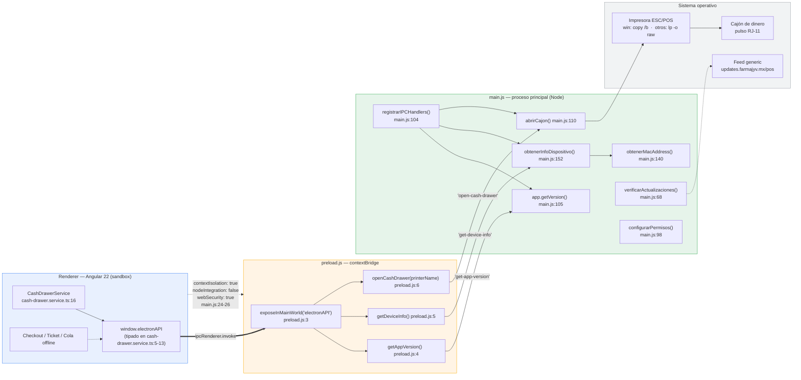

# Shared (reglas replicadas) y capa Electron

Cartografía de dos capas que no pertenecen a ningún feature: el **modelo de dominio + las reglas de
negocio replicadas del backend** (`src/app/shared/`) y la **capa de escritorio + empaquetado**
(`electron/`, `angular.json`, `package.json`).

El hilo conductor de la primera capa es una decisión explícita: el backend
(`backend-farma-jyv/functions`) es la autoridad, pero el POS **recalcula localmente** todo lo que el
cajero necesita ver antes de cobrar, con el paciente enfrente. Un `400` después de pasar la tarjeta
no es una opción de producto.

---

## 1. Modelo de dominio

Todo el modelo vive en un único barrel: `src/app/shared/models/index.ts`.

### 1.1 Campos que importan para cuadrar caja

`Sale` (`src/app/shared/models/index.ts:216`) — semántica de `null` por campo:

| Campo | Tipo | `ruta:línea` | Qué significa `null` |
|---|---|---|---|
| `amountReceived` | `number \| null` | `index.ts:226` | No hubo entrega de efectivo (tarjeta / transferencia). |
| `change` | `number \| null` | `index.ts:227` | Sin efectivo recibido, no aplica cambio. |
| `cashAmount` | `number \| null` | `index.ts:232` | Parte del total pagada en efectivo (**lo que entra al cajón**). `null` en dos casos distintos: (a) tarjeta/transferencia, y (b) **ventas anteriores al split mixto** — dato histórico ausente, no cero. |
| `cardAmount` | `number \| null` | `index.ts:234` | Parte pagada con tarjeta (monto de la order de Mercado Pago Point). `null` en `cash`/`transfer`. |
| `cardPaymentReference` | `string \| null` | `index.ts:235` | Sin referencia de terminal. |
| `taxSummary` | `SaleTaxSummary \| null` | `index.ts:224` | **Venta anterior al desglose de impuestos.** No es "sin impuestos": es "no se calculó". El ticket debe degradar, no imprimir ceros. |
| `controlledGroups` | `ControlledGroup[]` | `index.ts:244` | **No es nullable**: array vacío = nada controlado en el ticket. |
| `invoiceStatus` | `'pending' \| null` | `index.ts:246` | `null` = no se solicitó factura. El único estado positivo es `'pending'` — no existe `'invoiced'` en el modelo del POS. |
| `cashSessionId` | `string \| null` | `index.ts:237` | Venta fuera de sesión de caja (no cuadra contra ningún corte). |
| `voidedAt` | `Date \| null` | `index.ts:247` | Venta vigente; con fecha, cancelada. |
| `prescriptionRetained` | `boolean` | `index.ts:242` | No nullable — el cajero confirmó retención de receta (grupos I–III). |

Distinción crítica para el corte: **`amountReceived` ≠ `cashAmount`**. `amountReceived` es lo que
entregó el cliente; `cashAmount` es lo que se queda en el cajón después del cambio. El corte se
cuadra contra `cashAmount` (ver `resolveTender`, §3.2).

`CashSession` (`index.ts:306`) cierra el círculo: `expectedCashAmount` (`index.ts:310`),
`countedCashAmount` (`index.ts:311`) y `cashDifference` (`index.ts:312`) son `number | null` — `null`
mientras la sesión sigue abierta. `CashSessionSummary.cashInDrawer` (`index.ts:303`) es el
esperado calculado.

Desglose fiscal por partida: `SaleItemTaxes` (`index.ts:171`) y `SaleTaxSummary` (`index.ts:179`),
donde `total` debe coincidir **al centavo** con el total cobrado (`index.ts:184-185`).
En `SaleItem`, `taxes` es opcional (`index.ts:200`) por la misma razón histórica que `taxSummary`.

### 1.2 Permisos: `PermissionArea` / `hasPermission`

`StaffRole` ya **no es un enum**: es `string` (`index.ts:1`). El rol es un documento de la colección
`roles` con su propia lista de permisos, así que la UI debe preguntar por **permiso**, no por slug
(`index.ts:14-18`).

- `PermissionArea` (`index.ts:19`) — 10 áreas: `dashboard`, `users`, `sales`, `categories`,
  `products`, `suppliers`, `inventory`, `invoices`, `uploads`, `doctor`.
- `PermissionLevel` (`index.ts:31`) — `'read' | 'write'`.
- `StaffProfile` (`index.ts:45`) — lo que devuelve `GET /auth/me`.

`hasPermission(profile, area, level = 'write')` (`index.ts:57`) — tabla de decisión:

| Condición | Resultado | Línea |
|---|---|---|
| `profile === null` | `false` | `index.ts:62` |
| `profile.role.slug === 'admin'` | `true` (atajo, salta la lista) | `index.ts:65-67` |
| No existe permiso para el área | `false` | `index.ts:69-71` |
| Existe y `level === 'read'` | `true` (write implica read) | `index.ts:72` |
| Existe y `level === 'write'` | `permission.level === 'write'` | `index.ts:72` |

El default es `'write'`: preguntar sin nivel es preguntar por el permiso **más estricto**. La razón
de replicar el atajo de `admin` está documentada en `index.ts:53-56`: si la UI fuera más estricta
que la API, bloquearía acciones que el backend sí permite.

`parseStaffProfile` (`index.ts:75`) es defensivo: sin slug válido devuelve `null` (`index.ts:86-88`)
y filtra permisos malformados (`index.ts:94-102`). Sin perfil no hay sesión utilizable.

---

## 2. Las cinco reglas replicadas del backend

Las cinco viven en `src/app/shared/utils/` y las cinco son **funciones puras sin dependencias de
Angular**. Eso no es casualidad: el checkout, el ticket impreso y la **cola offline** tienen que
producir exactamente el mismo número, y la cola offline calcula sin backend disponible.

### 2.1 `money.ts` — aritmética en centavos

`src/app/shared/utils/money.ts`

El backend (`functions/src/utils/taxes.ts`) compara y suma en **centavos enteros**. Si el POS sumara
en flotante, el cambio y el "faltan" de la caja se separarían del total que valida la API por
errores de coma flotante clásicos (`0.1 + 0.2`) — documentado en `money.ts:1-8`.

| Función | Fórmula | Línea |
|---|---|---|
| `toCents(a)` | `Math.round((isFinite(a) ? a : 0) * 100)` — no-finito → `0` | `money.ts:11` |
| `fromCents(c)` | `Math.round(c) / 100` | `money.ts:15` |
| `roundMoney(a)` | `fromCents(toCents(a))` | `money.ts:20` |
| `addMoney(...a)` | suma en centavos, luego un solo `fromCents` | `money.ts:24` |
| `subtractMoney(m, s)` | `fromCents(toCents(m) - toCents(s))` | `money.ts:28` |
| `compareMoney(l, r)` | `-1 \| 0 \| 1` sobre la diferencia en centavos | `money.ts:33` |
| `isMoneyGreaterOrEqual(l, r)` | `compareMoney(l, r) >= 0` | `money.ts:41` |

Invariante de diseño: se convierte a centavos **al entrar**, se opera en enteros y se vuelve a pesos
**una sola vez al salir**. `addMoney` (`money.ts:25`) es el ejemplo: reduce todo en centavos y
aplica `fromCents` una vez, no por término.

`toCents` es "estable para valores negativos" (`money.ts:10`) porque `Math.round` se aplica al
producto ya escalado, no a cada operando.

**Por qué se replica:** no es validación, es *aritmética compartida*. El backend no puede "validar"
el cambio que el POS muestra en pantalla antes de que la venta exista.

### 2.2 `tender.ts` — reparto efectivo / tarjeta

`src/app/shared/utils/tender.ts` — espejo de `resolveTender` en
`backend-farma-jyv/functions/src/services/sales.service.ts` (`tender.ts:5-6`).

**Tabla por método** — `cashDueFor` (`tender.ts:41`):

| `paymentMethod` | `cashDue` | `cardAmount` resultante | Línea |
|---|---|---|---|
| `cash` | `total` | `null` | `tender.ts:43-44`, `86` |
| `card` | `0` | `input.total` (la tarjeta paga todo) | `tender.ts:45-47`, `82-83` |
| `transfer` | `0` | `null` | `tender.ts:46-47`, `86` |
| `mixed` | `total − cardAmount` | `input.cardAmount` | `tender.ts:48-49`, `84-85` |

`cashDue` se acota a no-negativo con `Math.max(0, ...)` (`tender.ts:78`).

**La regla del cambio en pago mixto** — es el punto delicado de todo el archivo:

> En `mixed`, la tarjeta paga `cardAmount` (el monto de la order Point) y el efectivo cubre el
> resto. **El cambio se calcula contra esa parte en efectivo, nunca contra el total**
> (`tender.ts:10-12`).

```
change = cashSatisfied ? max(0, recibido − cashDue) : 0        // tender.ts:92
shortfall = cashSatisfied ? 0 : max(0, cashDue − recibido)     // tender.ts:93
cashSatisfied = cashDue === 0 || recibido >= cashDue           // tender.ts:80
```

Calcularlo contra el total sería exigir el importe completo en efectivo pese a que la tarjeta ya
cobró una parte — el bug histórico que la prueba `tender.spec.ts:65` fija explícitamente.

`cashAmount` (lo que entra al cajón) es `cashDue > 0 ? cashDue : null` (`tender.ts:90`): **el
esperado, no el recibido**. El cambio ya salió del cajón.

**Validación** — `validate` (`tender.ts:53`), primer error gana:

| Condición | Mensaje | Línea |
|---|---|---|
| `mixed` y `cardAmount === null` | "El pago mixto requiere el monto cobrado con tarjeta." | `tender.ts:55-57` |
| `mixed` y `cardAmount <= 0` (en centavos) | "El monto cobrado con tarjeta debe ser mayor a cero." | `tender.ts:58-60` |
| `mixed` y `cardAmount >= total` | "La tarjeta cubre el total: registra la venta como pago con tarjeta." | `tender.ts:61-63` |
| `cashDue > 0` y `amountReceived === null` | "El monto recibido es requerido para este método de pago." | `tender.ts:65-67` |

Nótese que `mixed` con `cardAmount >= total` **no se degrada silenciosamente a `card`**: se rechaza
y se obliga al cajero a elegir el método correcto, para que el corte no vea un `mixed` con
`cashAmount = 0`.

Detalle de compatibilidad: `resolveTender` normaliza `undefined → null` (`tender.ts:72-77`) para las
**colas offline guardadas antes del split mixto**, que se persistieron sin esos campos.

**Por qué se replica:** el checkout necesita el cambio y el faltante *en vivo*, mientras el cajero
teclea; y la cola offline debe persistir el mismo reparto que el backend recalculará al sincronizar.

### 2.3 `taxes.ts` — desglose con impuestos incluidos

`src/app/shared/utils/taxes.ts` — espejo de `functions/src/utils/taxes.ts` (`taxes.ts:5-6`).

El precio de catálogo es **precio al público**: lo que dice la etiqueta es lo que se cobra, y el
desglose se calcula **hacia atrás** (`taxes.ts:8-9`).

**Orden legal en México (IEPS → IVA).** El IEPS va sobre la base y el IVA sobre (base + IEPS):

```
gross = base × (1 + iepsRate) × (1 + ivaRate)        // taxes.ts:13
```

Invertido, en centavos (`breakdownWithRates`, `taxes.ts:40`):

```
baseCents = round( grossCents / ((1 + iepsRate) × (1 + ivaRate)) )   // taxes.ts:48
iepsCents = round( baseCents × iepsRate )                            // taxes.ts:49
ivaCents  = round( (baseCents + iepsCents) × ivaRate )               // taxes.ts:50
```

**Absorción del residuo.** La base devuelta **no** es `baseCents`, sino el remanente:

```
base = fromCents(grossCents − iepsCents − ivaCents)                  // taxes.ts:53
```

Así `base + ieps + iva` es **exactamente** el importe cobrado. El residuo de los tres redondeos se
carga siempre a la base, nunca a un impuesto. La razón es dura: *un desglose que no suma el total es
rechazado al timbrar el CFDI* (`taxes.ts:16-18`). La prueba que lo fija es `taxes.spec.ts:70`.

**Tasas** — `resolveIvaRate` (`taxes.ts:29`) y `resolveIepsRate` (`taxes.ts:36`):

| Producto | Tasa IVA | Línea |
|---|---|---|
| `hasIvaZero` | `IVA_ZERO_RATE` = `0` — **gana sobre `hasIva`** (medicinas de patente) | `taxes.ts:24`, `30-32` |
| `hasIva` (sin `hasIvaZero`) | `IVA_RATE` = `0.16` | `taxes.ts:23`, `33` |
| ninguno | `0` | `taxes.ts:33` |

IEPS: `hasIeps ? (iepsRate ?? 0) : 0` (`taxes.ts:37`) — sin la bandera, la tasa es `0` **aunque el
producto traiga una** (`taxes.spec.ts:20`).

**Prorrateo del descuento** — `prorateDiscount` (`taxes.ts:96`). Debe prorratearse **antes** de
calcular impuestos: si no, se declara IVA sobre un importe que nunca se cobró (`taxes.ts:92-94`).

| Caso | Resultado | Línea |
|---|---|---|
| `discountCents <= 0` o `totalCents <= 0` | ceros | `taxes.ts:100-102` |
| `discountCents >= totalCents` | `[...lineAmounts]` — el descuento consume cada partida completa | `taxes.ts:103-105` |
| normal | `floor(lineCents × discountCents / totalCents)` por partida | `taxes.ts:107-109` |

Los centavos sobrantes (`remainder`, `taxes.ts:110`) se reparten recorriendo las partidas
**ordenadas de mayor a menor importe** (`taxes.ts:112-114`), sumando 1 centavo por vuelta y sin
exceder el importe de la partida (`taxes.ts:119-122`). Hay un tope de seguridad de
`order.length * 100` iteraciones (`taxes.ts:124-126`) para que un caso patológico no cuelgue la UI.

**Composición** — `previewTaxSummary` (`taxes.ts:142`) replica *la secuencia* de `createSale`:
prorratea primero (`taxes.ts:147-150`), resta la parte prorrateada en centavos
(`taxes.ts:154`) y suma con `sumTaxSummary` (`taxes.ts:71`), que acumula en centavos y convierte
una sola vez (`taxes.ts:83-88`).

**Por qué se replica** pese a que el backend calcula: en el POS se usa **solo para mostrar** el
desglose antes de cobrar y para el **ticket de una venta encolada sin conexión**. La venta
persistida siempre lleva el desglose que calculó el backend (`taxes.ts:19-21`). Es previsualización
y contingencia, no fuente de verdad.

### 2.4 `controlled.ts` — grupos COFEPRIS I–VI

`src/app/shared/utils/controlled.ts` — espejo de `functions/src/constants/controlled.ts` y de
`assertPrescriptionRules` (`controlled.ts:4-6`). Los grupos son los del **art. 226 de la Ley General
de Salud** (`models/index.ts:123`).

**Tabla completa** — `CONTROLLED_GROUP_RULES` (`controlled.ts:35`):

| Grupo | Descripción | Receta | Folio | Retención | Libro | Línea |
|---|---|:---:|:---:|:---:|:---:|---|
| **I** | Estupefacientes | ✅ | ✅ | ✅ | ✅ | `controlled.ts:36-44` |
| **II** | Psicotrópicos | ✅ | ✅ | ✅ | ✅ | `controlled.ts:45-53` |
| **III** | Psicotrópicos (menor riesgo) | ✅ | ✅ | ✅ | ✅ | `controlled.ts:54-62` |
| **IV** | Antibióticos y otros de receta | ✅ | ❌ | ❌ | ✅ | `controlled.ts:63-71` |
| **V** | Venta en farmacia sin receta | ❌ | ❌ | ❌ | ❌ | `controlled.ts:72-80` |
| **VI** | Venta libre | ❌ | ❌ | ❌ | ❌ | `controlled.ts:81-89` |

La frontera real está entre **III y IV**: I–III retienen la receta y exigen folio; IV se sella y se
devuelve al paciente (`controlled.ts:13-18`). El libro de control (`controlledSalesLedger`,
`controlled.ts:31`) cubre I–IV.

**Agregación por ticket** — `resolveControlledRequirements` (`controlled.ts:114`) toma el
**requisito más estricto** de todas las partidas: cada flag se acumula con `||`
(`controlled.ts:131-133`) y los grupos se juntan en `Set`s (`controlled.ts:117-118`, `140`, `144`).

**Fallback cuando falta `controlledGroup`** (`controlled.ts:124-129`):

```ts
const rule = getControlledRule(product.controlledGroup);
if (!rule) {
  // Sin grupo capturado se respeta el flag suelto heredado del catálogo viejo.
  requiresPrescription = requiresPrescription || Boolean(product.requiresPrescription);
  continue;
}
```

Es decir: sin grupo, el producto **cae al booleano legado `requiresPrescription`** y aporta
*únicamente* eso — no suma grupo, no exige folio, no exige retención y **no genera renglón en el
libro**. `getControlledRule(undefined)` devuelve `null` (`controlled.ts:94-96`). En el modelo, el
grupo **manda sobre el flag** cuando existe (`models/index.ts:136-140`).

**Validación de receta** — `validatePrescription` (`controlled.ts:166`), primer motivo gana:

| Orden | Condición | Mensaje | Línea |
|---|---|---|---|
| 0 | `!requiresPrescription` | `null` (cumple) | `controlled.ts:170-172` |
| 1 | `doctorName` vacío | "Esta venta incluye {grupos} y requiere datos de receta médica." (o genérico sin grupos) | `controlled.ts:173-180` |
| 2 | cédula inválida | "La cédula profesional debe tener 7 u 8 dígitos." | `controlled.ts:181-183` |
| 3 | `requiresFolio` y folio vacío | "Los medicamentos de los grupos I a III requieren el folio de la receta." | `controlled.ts:184-186` |
| 4 | `requiresRetention` y `!retained` | "Los grupos I a III exigen retener la receta: confirma la retención." | `controlled.ts:187-189` |

Cédula profesional mexicana: `/^\d{7,8}$/` con `trim()` (`controlled.ts:149`, `151-153`) — misma
validación que el backend.

**Por qué se replica:** está escrito sin ambigüedad en `controlled.ts:8-11` — se replica para
**bloquear en el mostrador**, no para reemplazar la validación del servidor. El cajero tiene que
enterarse *antes* de cobrar, con el paciente enfrente y la receta en la mano, no con un `400`
después de pasar la tarjeta. Los mensajes son idénticos a los del backend para que el cajero lea
siempre lo mismo (`controlled.ts:164`). **El backend sigue siendo la autoridad.**

### 2.5 `session-expiry.ts` — corte a las 24:00 de `America/Mexico_City`

`src/app/shared/utils/session-expiry.ts` — espejo de `functions/src/utils/session.ts`
(`session-expiry.ts:2`).

La regla del backend: rechaza cualquier token cuyo `auth_time` sea **de un día anterior en hora de
Ciudad de México**. La sesión muere **a las 24:00 locales, no a las 24 h de haber entrado**
(`session-expiry.ts:4-6`). Un cajero que entra a las 08:00 tiene 16 h; uno que entra a las 23:00
tiene 1 h.

```
expiry(authTime) = inicioDeDía( ymd(authTime) + 1 día )     // session-expiry.ts:47
isSessionExpired(authTime, now) = now >= expiry(authTime)   // session-expiry.ts:51
```

Piezas:

- `zonedYmd` (`session-expiry.ts:13`) — `Intl.DateTimeFormat('en-CA', { timeZone })` produce
  `YYYY-MM-DD` directamente ordenable como string.
- `addOneDayYmd` (`session-expiry.ts:22`) — suma vía `Date.UTC(y, m-1, d+1)`, que normaliza fin de
  mes y año sin lógica de calendario propia.
- `zonedStartOfDayMs` (`session-expiry.ts:31`) — **búsqueda binaria** en una ventana de **±14 h**
  alrededor de la medianoche UTC del día (`session-expiry.ts:32-33`), buscando el primer instante
  cuyo `zonedYmd` ya no es menor que el objetivo (`session-expiry.ts:34-41`).

**Por qué búsqueda binaria y no un offset fijo** — la razón está en `session-expiry.ts:29-30`:
evita hardcodear el offset y **sobrevive al horario de verano**. México cambió su régimen de DST y
el offset de CDMX no es constante (`-06:00` / `-05:00` históricamente); un `-6h` hardcodeado
desalinearía el corte del POS respecto al del backend justo en los días de transición, y en el día
del cambio la medianoche local no está a un número entero fijo de horas de la medianoche UTC. La
binaria pregunta a `Intl` —la única fuente que conoce la base de datos de zonas horarias del
sistema— en vez de asumir. La ventana de ±14 h cubre el offset máximo de cualquier zona.

**Por qué se replica:** para avisar y cerrar sesión **de forma ordenada, guardando el ticket**, en
vez de descubrirlo con un `401` a media venta (`session-expiry.ts:6-8`).

---

## 3. Cobertura de pruebas

`npx vitest run` → **34 pruebas en 4 archivos, todas en verde** (Vitest 4.1.10). Los 4 archivos son
los únicos `*.spec.ts` del proyecto.

| Spec | Casos | Qué fija |
|---|---:|---|
| `src/app/shared/utils/taxes.spec.ts` | **11** | Tasas (`:14` IVA 0% gana sobre 16%; `:20` sin `hasIeps` la tasa es 0). Desglose (`:28` hacia atrás con IVA incluido; `:41` IVA 0% → todo es base; `:53` orden IEPS→IVA; `:70` **residuo absorbido en la base**). Suma (`:83` en centavos, cuadra con las partidas). Prorrateo (`:97` proporcional; `:101` **sobrantes a la partida mayor**; `:108` descuento ≥ total consume cada partida). Composición (`:115` prorratea antes de calcular impuestos). |
| `src/app/shared/utils/controlled.spec.ts` | **12** | 10 bloques `it`, pero `:43` es un `it.each(['I','II','III'])` que expande a **3** casos. `resolveControlledRequirements`: `:25` sin controlados; `:34` grupo IV (receta y libro, sin folio ni retención); `:43` I/II/III folio + retención; `:51` ticket mixto toma lo más estricto; `:64` **fallback al flag heredado sin grupo**. `validatePrescription`: `:74`, `:87`, `:95` (cédula 7–8 dígitos), `:103` (folio y retención I–III), `:111` (IV no exige retención). |
| `src/app/shared/utils/tender.spec.ts` | **8** | `:6` cambio contra el total en efectivo; `:21` faltante sin dar cambio; `:34` tarjeta cubre el total; `:49` **mixto: el efectivo solo cubre lo que no pagó la tarjeta**; `:65` *"exigir el total en efectivo era el bug histórico"* — prueba de regresión nombrada; `:79` rechaza tarjeta en cero o cubriendo el total; `:90` pide el monto con tarjeta; `:101` opera en centavos sin residuos. |
| `src/app/shared/utils/session-expiry.spec.ts` | **3** | `:9` expira a las 00:00 del día siguiente hora del centro; `:14` login pasada la medianoche UTC pero antes en CDMX sigue siendo del mismo día local; `:21` no expira antes del corte y sí después. |

### Qué queda sin cubrir

Lo más notable es que **la cobertura se detiene exactamente en el borde de `shared/utils/`**:

- **`money.ts` no tiene spec propio** — es la única de las cinco reglas sin archivo de prueba, y es
  la base aritmética de las otras cuatro. Solo se ejercita indirectamente (`tender.spec.ts:101`,
  `taxes.spec.ts:83`). Sin pruebas directas de `toCents` con no-finitos (`money.ts:12`),
  negativos, ni de `compareMoney`.
- **`src/app/shared/models/index.ts` sin pruebas** — `hasPermission` (el atajo de `admin`, el
  default `'write'`) y `parseStaffProfile` / `parseStaffRole` / `parsePaymentMethod` no tienen
  ningún caso, pese a ser la puerta de entrada de datos no confiables del backend.
- **Cero pruebas fuera de `shared/utils/`**: 4 specs para **53 archivos `.ts`** en `src/`. Sin
  pruebas de componentes, servicios (`SaleService`, `CashSessionService`, `CashDrawerService`),
  guards, interceptor ni de la **cola offline** — que es justamente el consumidor crítico de las
  reglas replicadas.
- **`electron/main.js` y `electron/preload.js` sin ninguna prueba**: `abrirCajon`,
  `obtenerMacAddress` y `obtenerInfoDispositivo` no se ejercitan. El `test` builder de
  `angular.json:89-91` no declara configuración de cobertura, así que no hay umbral ni reporte.

---

## 4. Electron

### 4.1 `BrowserWindow` y postura de seguridad

`electron/main.js:16` — `createWindow()`:

| Opción | Valor | Línea |
|---|---|---|
| `width` / `height` | `1360` × `900` | `main.js:18-19` |
| `minWidth` / `minHeight` | `1024` × `700` | `main.js:20-21` |
| `preload` | `path.join(__dirname, 'preload.js')` | `main.js:23` |
| `contextIsolation` | **`true`** | `main.js:24` |
| `nodeIntegration` | **`false`** | `main.js:25` |
| `webSecurity` | **`true`** | `main.js:26` |
| `icon` | condicional: `icon.ico` en Windows, `icon.png` en el resto, **solo si el archivo existe** | `main.js:30-33` |

La tríada `contextIsolation: true` + `nodeIntegration: false` + `webSecurity: true` es la postura
correcta: el renderer no ve `require` ni el contexto de Node, y solo llega al proceso principal por
el puente explícito de `preload.js`. Locale forzado a `es-MX` vía switches de línea de comandos
(`main.js:7-8`).

**Handler de permisos** — `configurarPermisos()` (`main.js:98`), instalado en `whenReady`
(`main.js:54`):

```js
session.defaultSession.setPermissionRequestHandler((_webContents, permission, callback) => {
  callback(['geolocation'].includes(permission));      // main.js:99-101
});
```

Lista blanca de **un solo permiso**: `geolocation`. Todo lo demás (cámara, micrófono,
notificaciones, portapapeles, MIDI…) se niega por defecto.

**Ciclo de vida**: `whenReady` ejecuta permisos → IPC → ventana → actualizaciones, en ese orden
(`main.js:53-58`). `window-all-closed` respeta la convención de macOS (`main.js:60-62`) y `activate`
recrea la ventana (`main.js:64-66`).

### 4.2 Carga dev vs bundle

```
isDev = NODE_ENV === 'development' || process.argv.includes('--dev')    // main.js:12
```

| Modo | Carga | DevTools | Línea |
|---|---|:---:|---|
| Dev | `loadURL(DEV_SERVER_URL)` — `ELECTRON_DEV_SERVER_URL` o `http://localhost:4200` | abiertos | `main.js:10`, `37-39` |
| Bundle | `loadFile(DIST_INDEX)` = `dist/farma-jyv-pos/browser/index.html` | no | `main.js:11`, `40-41` |
| Bundle ausente | `console.error` con instrucción de correr `npm run electron:build` y `app.quit()` | — | `main.js:42-46` |

El `loadFile` sobre `file://` es lo que obliga a `baseHref: './'` en la configuración `electron` de
`angular.json` (`angular.json:65`).

### 4.3 Los tres canales IPC

`registrarIPCHandlers()` (`main.js:104`) — los tres son `ipcMain.handle` (petición/respuesta,
`invoke`), no `send`/`on`. No hay canales del main hacia el renderer.

| Canal | Handler (main) | API expuesta (preload) | Devuelve |
|---|---|---|---|
| `get-app-version` | `app.getVersion()` — `main.js:105` | `getAppVersion()` — `preload.js:4` | `string` |
| `get-device-info` | `obtenerInfoDispositivo()` — `main.js:106` | `getDeviceInfo()` — `preload.js:5` | `{ mac, hostname, plataforma, arquitectura, id }` |
| `open-cash-drawer` | `abrirCajon(printerName)` — `main.js:107` | `openCashDrawer(printerName)` — `preload.js:6` | `boolean` |

`preload.js:3` expone exactamente esas tres funciones bajo `window.electronAPI` vía
`contextBridge.exposeInMainWorld` — superficie mínima, sin fugas de `ipcRenderer`.

**Identificación del equipo** — `obtenerInfoDispositivo()` (`main.js:152`) construye un `id` estable
`${hostname}-${mac sin dos puntos}` (`main.js:154`), con fallback a solo el hostname si no hay MAC.
`obtenerMacAddress()` (`main.js:140`) recorre las interfaces y toma la primera **no interna, IPv4 y
con MAC distinta de `00:00:00:00:00:00`** (`main.js:144`); si ninguna califica devuelve `null`.

**Consumo en el renderer**: `src/app/features/pos/services/cash-drawer.service.ts` declara el tipado
global de `window.electronAPI` (`cash-drawer.service.ts:5-13`) y guarda doblemente antes de invocar
—`environment.isElectron` y `printerName` no vacío (`cash-drawer.service.ts:19-21`)— con
`?.` y `.catch(() => undefined)` (`cash-drawer.service.ts:22`), de modo que en navegador es un no-op
silencioso.

### 4.4 El pulso ESC/POS del cajón

`abrirCajon(printerName)` (`main.js:110`). El cajón de dinero no se abre por software: se abre por
un **pulso eléctrico** que la impresora de tickets emite en su puerto RJ-11 al recibir el comando
ESC/POS correspondiente. Por eso el código imprime bytes crudos en vez de hablar con el cajón.

**Bytes** (`main.js:117`):

```js
const kick = Buffer.from([0x1b, 0x70, 0x00, 0x19, 0xfa]);
```

| Byte | Significado |
|---|---|
| `0x1b` | `ESC` |
| `0x70` | `p` — comando *generate pulse* |
| `0x00` | pin conector 2 (el cajón primario) |
| `0x19` | duración del pulso ON (`25` × 2 ms) |
| `0xfa` | duración del pulso OFF (`250` × 2 ms) |

El buffer se escribe a un archivo temporal único por invocación en `os.tmpdir()`
(`main.js:118`, `121`) y se envía **en modo raw** a la impresora, con el comando según plataforma:

| Plataforma | Comando | Línea |
|---|---|---|
| `win32` | `cmd /c copy /b "<tempFile>" "<printerName>"` | `main.js:122-123` |
| resto (macOS / Linux, CUPS) | `lp -d <printerName> -o raw <tempFile>` | `main.js:124-126` |

Guardas: `printerName` vacío o no-string → `return false` con log, sin tocar el disco
(`main.js:111-115`); cualquier error se atrapa y devuelve `false` (`main.js:128-130`); el temporal se
borra siempre en `finally`, ignorando fallos de borrado (`main.js:131-137`). Nunca lanza.

### 4.5 Auto-update

`verificarActualizaciones()` (`main.js:68`), invocada al final de `whenReady` (`main.js:57`).

- **No corre en dev**: `if (isDev) return;` (`main.js:69`).
- `electron-updater` se carga con `require` **perezoso dentro de un `try`** (`main.js:72`), así que
  si el paquete no está disponible la app arranca igual (`main.js:93-95`).
- `autoDownload = true` (`main.js:73`) — descarga sola al detectar versión.
- Feed sobreescribible por entorno: `UPDATE_URL` → `setFeedURL({ provider: 'generic', url })`
  (`main.js:75-78`). Sin la variable, usa el feed de `package.json` (`publish`, ver §5.3).
- Tres listeners, todos solo de log: `error` (`main.js:80-82`), `update-available`
  (`main.js:83-85`), `update-downloaded` — que aclara que *se instalará al cerrar la app*
  (`main.js:86-88`).
- `checkForUpdatesAndNotify()` con `.catch()` que degrada a log (`main.js:90-92`).

Diseño deliberadamente **no-op ante fallo**: los tres caminos de error (`main.js:81`, `91`, `94`)
están anotados como tal. Un feed caído nunca impide vender.

---

## 5. Empaquetado

### 5.1 Configuraciones de `angular.json`

Builder: `@angular/build:application` (`angular.json:17`), entrada `src/main.ts`
(`angular.json:19`), assets desde `public/` (`angular.json:21-26`), estilos `src/styles.css`
(`angular.json:27-29`). `defaultConfiguration: "production"` (`angular.json:75`).

Las tres configuraciones son **hermanas, no heredan entre sí** — cada una declara lo suyo:

| | `production` (`:32`) | `development` (`:53`) | `electron` (`:64`) |
|---|---|---|---|
| `fileReplacements` → | `environment.prod.ts` (`:33-38`) | `environment.development.ts` (`:57-62`) | `environment.electron.ts` (`:67-72`) |
| `budgets` | ✅ (`:39-50`) | — | **— (ausente)** |
| `outputHashing` | `all` (`:51`) | — | `all` (`:66`) |
| `optimization` | default (`true`) | `false` (`:54`) | default (`true`) |
| `sourceMap` | default | `true` (`:56`) | default |
| `extractLicenses` | default | `false` (`:55`) | default |
| `baseHref` | default (`/`) | default | **`./`** (`:65`) |

Lo único que distingue a `electron` de `production` es `baseHref: './'` —imprescindible porque
Electron carga `index.html` con `file://`— y la **ausencia de budgets**.

**Presupuestos de bundle** (solo `production`, `angular.json:39-50`):

| Tipo | Warning | Error |
|---|---|---|
| `initial` | `700kB` | `1.5MB` |
| `anyComponentStyle` | `4kB` | `8kB` |

`serve` (`angular.json:77`) apunta a los targets `production` / `development` con default
`development` (`angular.json:87`). `test` usa `@angular/build:unit-test` sin opciones
(`angular.json:89-91`).

**TypeScript**: `tsconfig.json` es un proyecto raíz con `files: []` y referencias a
`tsconfig.app.json` y `tsconfig.spec.json`. Flags activos: `noImplicitOverride`,
`noPropertyAccessFromIndexSignature`, `noImplicitReturns`, `noFallthroughCasesInSwitch`,
`skipLibCheck`, `isolatedModules`, `importHelpers`; target `ES2022`, `module: preserve`; y
`strictInjectionParameters` / `strictInputAccessModifiers` en `angularCompilerOptions`.
`tsconfig.app.json` incluye `src/**/*.ts` **excluyendo** los `.spec.ts` y fija `types: []`;
`tsconfig.spec.json` incluye solo `.d.ts` y `.spec.ts` con `types: ["vitest/globals"]`.

### 5.2 Scripts

`package.json:7-19`. `main` del paquete es `electron/main.js` (`package.json:5`).

| Script | Qué hace |
|---|---|
| `electron:build` | `ng build --configuration electron` (`:13`) |
| `electron:dev` | `NODE_ENV=development electron electron/main.js --dev` — **no compila**, espera el dev server (`:15`) |
| `electron:start` | `electron:build` + Electron contra el bundle (`:14`) |
| `electron:dist[:mac\|:win]` | `electron:build` + `electron-builder` (`:16-18`) |

`cross-env ELECTRON_RUN_AS_NODE=` (`:14-15`) limpia la variable para que el binario arranque como
Electron y no como Node.

### 5.3 `electron-builder`

Clave `build` de `package.json:22-78`.

**Común:**

- `appId`: `mx.farmajyv.pos` (`:23`), `productName`: `FarmaJyV Venta` (`:24`).
- `directories`: salida en `release/`, recursos de build en `electron/assets` (`:26-29`).
- `files` (`:30-35`): lista **restrictiva** — `"!**/*"` excluye todo y luego se readmite
  `electron/**/*`, `dist/farma-jyv-pos/browser/**/*` y `package.json`. Nada más entra al paquete.
- `asar: true` (`:36`).
- `publish` (`:37-40`): `provider: generic`, `url: https://updates.farmajyv.mx/pos` — el feed que
  consume el `autoUpdater` de §4.5 cuando no hay `UPDATE_URL`.

**Por plataforma:**

| | macOS (`:41-65`) | Windows (`:66-77`) |
|---|---|---|
| Targets | `dmg` y `zip`, ambos `arm64` + `x64` (`:43-58`) | `nsis` y `zip` (`:68-71`) |
| Categoría / icono | `public.app-category.business` (`:42`) | `electron/assets/icon.png` (`:67`) |
| Extras | `darkModeSupport: true` (`:59`), **`identity: null`** (`:60`) | NSIS: `oneClick: false`, `allowToChangeInstallationDirectory: true` (`:73-76`) |
| Nombre de artefacto | DMG: `${productName}-${version}-${arch}.${ext}`, título `FarmaJyV Venta ${version}` (`:62-65`) | `${productName}-${version}-setup.${ext}` (`:76`) |

El instalador de Windows es asistido (`oneClick: false`) y permite elegir directorio — razonable
para equipos de mostrador administrados.

---

## 6. Frontera renderer ↔ preload ↔ main



Puntos de la frontera:

1. El renderer **nunca** ve `ipcRenderer`: `preload.js` cierra sobre él y expone tres funciones.
2. Los tres canales son unidireccionales petición→respuesta (`invoke`/`handle`). **No hay push del
   main al renderer** — el auto-updater no notifica a la UI, solo escribe en consola.
3. `abrirCajon` es el **único punto de todo el sistema que ejecuta un proceso externo**
   (`execFileSync`, `main.js:123`/`125`).

---

## 7. Riesgos y deuda técnica

### Seguridad

1. **Interpolación en shell para abrir el cajón — el riesgo más serio de la capa Electron.**
   `main.js:123` construye la línea de Windows por concatenación de string y la pasa a `cmd /c`:
   ```js
   execFileSync('cmd', ['/c', `copy /b "${tempFile}" "${name}"`], { stdio: 'ignore' });
   ```
   `name` viene de `printerName` sin más saneo que `trim()` y una comprobación de no-vacío
   (`main.js:111-115`). Las comillas dobles no protegen contra `&`, `|` o `^` en `cmd`, así que un
   `printerName` malicioso lograría **ejecución de comandos con los privilegios de la app**. Hoy el
   valor procede de `environment.cashDrawer.printerName` (configuración local, no entrada de
   usuario, `cash-drawer.service.ts:18`), lo que lo hace *actualmente* no explotable — pero es un
   canal IPC que acepta un argumento arbitrario del renderer (`main.js:107`), de modo que
   cualquier XSS o cambio futuro que alimente ese parámetro desde datos del backend lo convierte en
   RCE. Conviene validar `printerName` contra una lista blanca o un patrón estricto en el main, y
   evitar `cmd /c` a favor de escritura directa al dispositivo.
2. **`geolocation` es el único permiso concedido** (`main.js:100`) y un POS de farmacia no
   necesita geolocalización. La lista blanca debería ser vacía (`callback(false)`).
3. **No hay `setPermissionCheckHandler`**, solo `setPermissionRequestHandler` (`main.js:99`). La
   verificación síncrona de permisos queda con el comportamiento por defecto de Electron.
4. **No hay `will-navigate` ni `setWindowOpenHandler`**: nada impide que el contenido cargado
   navegue a un origen arbitrario o abra ventanas nuevas. Tampoco se define CSP desde el main.
5. **Ausencia de firma de código.** `identity: null` en macOS (`package.json:60`) desactiva
   explícitamente la firma, y la configuración de Windows (`package.json:66-72`) no declara
   `certificateFile`/`signingHashAlgorithms`. Consecuencias: Gatekeeper bloquea el `.dmg` sin
   notarización (el usuario debe autorizarlo a mano), SmartScreen advierte en Windows y —lo más
   grave— **el auto-updater con `autoDownload = true` (`main.js:73`) descarga e instala binarios
   sin verificar firma**, lo que hace del canal de actualización un vector de compromiso si el feed
   o el DNS se ven afectados.
6. **Feed de actualizaciones sobre un dominio no verificado en el repo.**
   `https://updates.farmajyv.mx/pos` (`package.json:39`) y el override por `UPDATE_URL`
   (`main.js:75-78`) no tienen validación de esquema: una variable de entorno puede redirigir las
   actualizaciones a cualquier host (`http://` incluido). Combinado con el punto 5, cualquiera que
   controle esa URL controla el binario. Todos los errores del updater son *no-op silenciosos*
   (`main.js:81`, `91`, `94`), así que un feed caído o secuestrado **no genera ninguna señal
   visible**: nadie se entera de que los POS llevan meses sin actualizarse.

### Empaquetado

7. **`electron/assets/` está vacío.** `package.json:67` declara `win.icon:
   "electron/assets/icon.png"` y `directories.buildResources` apunta ahí (`package.json:28`), pero
   el directorio no contiene ningún archivo. `electron:dist:win` fallará o caerá al icono por
   defecto de Electron; en macOS el `.dmg` saldrá sin identidad visual. `main.js:30-33` ya lo
   sortea en runtime con `fs.existsSync`, lo que **enmascara el problema en desarrollo** hasta el
   momento de empaquetar.
8. **La configuración `electron` de `angular.json` no tiene budgets** (`angular.json:64-73`),
   mientras `production` sí (`angular.json:39-50`). El artefacto que realmente se distribuye a los
   mostradores es justo el que no tiene control de tamaño: un bundle inflado pasa sin aviso.
9. **`strict` de TypeScript no está activado** en `tsconfig.json`. Hay flags sueltos
   (`noImplicitOverride`, `noImplicitReturns`, `noFallthroughCasesInSwitch`,
   `noPropertyAccessFromIndexSignature`) pero no `strict: true`, así que **`strictNullChecks` está
   apagado**. En un modelo cuya semántica descansa en distinguir `null` de `0` —`cashAmount`,
   `taxSummary`, `cashDifference`— el compilador no está verificando la invariante más importante
   del dominio.

### Pruebas

10. **`money.ts` es la única de las cinco reglas sin spec propio**, y es la base de las otras
    cuatro. Un cambio en `toCents` rompería en silencio impuestos, tender y corte de caja a la vez,
    y solo se detectaría por rebote.
11. **`hasPermission` y los `parse*` de `models/index.ts` no tienen pruebas**, pese a ser
    control de acceso y parseo de datos externos.
12. **4 specs para 53 archivos `.ts`.** Sin cobertura la cola offline, `SaleService`,
    `CashSessionService`, guards, interceptor ni `electron/main.js`. El builder `test`
    (`angular.json:89-91`) no configura umbral ni reporte de cobertura.

### Modelo y reglas

13. **`StaffRole = string`** (`models/index.ts:1`) — se perdió el tipado cerrado del rol, y
    `hasPermission` compara contra el literal `'admin'` hardcodeado (`models/index.ts:65`). Un
    cambio de slug en el backend degrada silenciosamente a un admin en usuario sin permisos.
14. **`invoiceStatus: 'pending' | null`** (`models/index.ts:246`) no puede representar una factura
    ya timbrada: el POS no distingue "sin factura" de "facturada".
15. **Deuda de datos históricos por partida triple**: `taxSummary`, `cashAmount` y `SaleItem.taxes`
    son `null`/opcionales *solo* por ventas anteriores a sendas migraciones
    (`models/index.ts:223`, `229-231`, `199`). Todo consumidor debe ramificar en cada uso; no hay
    una función de normalización compartida que absorba la diferencia.
16. **Réplica sin verificación de deriva.** Las cinco reglas dicen ser "espejo" de archivos
    concretos del backend (`money.ts:4`, `tender.ts:5-6`, `taxes.ts:5-6`, `controlled.ts:4-6`,
    `session-expiry.ts:2`), pero nada —ni un test de contrato, ni un fixture compartido, ni una
    versión de esquema— detecta que el backend cambie primero. Los mensajes de error están
    duplicados literalmente en ambos lados (`controlled.ts:164`). Es la deuda estructural de esta
    capa: es correcta hoy porque alguien la mantuvo a mano.
17. **`prorateDiscount` devuelve `[...lineAmounts]` cuando el descuento iguala o supera el total**
    (`taxes.ts:103-105`). Es correcto en efecto (cada partida queda en cero), pero devuelve los
    importes brutos como si fueran *descuentos*, lo que hace la firma confusa y produce un total
    cobrado de `0` sin ninguna señal explícita.
18. **Coste de `getSessionExpiryMs`.** La búsqueda binaria (`session-expiry.ts:31-43`) recorre una
    ventana de 28 h al milisegundo: ~**27 iteraciones**, cada una construyendo un
    `Intl.DateTimeFormat` nuevo (`session-expiry.ts:14`). Si `isSessionExpired` se invoca en un
    intervalo corto, conviene memoizar el formateador o el resultado por día.
